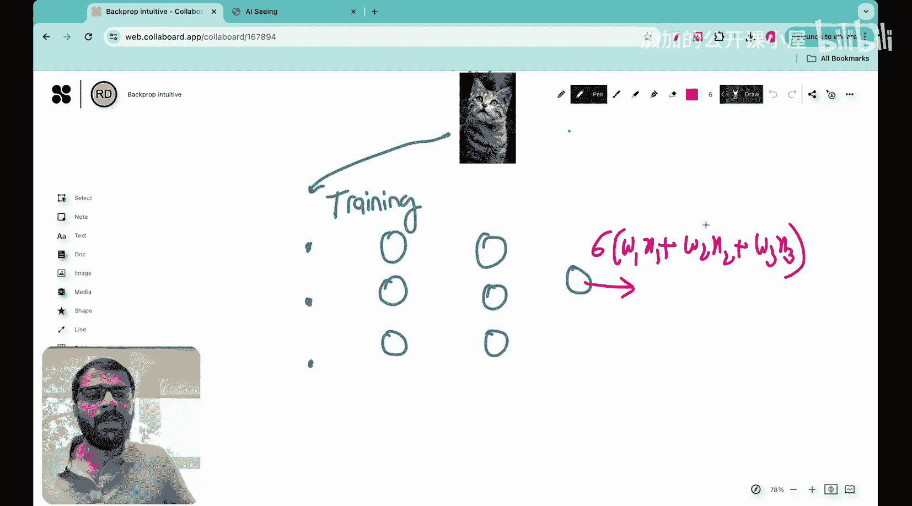

#  026：反向传播的直观理解 🧠

在本节课中，我们将学习反向传播算法，但会以一种非常直观的方式进行。我们特意安排这一独立课程，目的是避免陷入复杂的数学推导，而是真正理解该算法背后的核心思想。你可能会忘记数学公式，例如如何计算一个矩阵对另一个矩阵的导数，但一旦你对反向传播有了直观的理解，你将永远不会忘记它，并且会更加欣赏其精妙之处。本讲座深受“3Blue1Brown”频道及其教程的启发。

## 问题背景

我们面临的问题与神经网络中常见的问题相同。我们收集了猫和狗的数据，测量了三个特征：胡须长度、瞳孔直径和耳朵松软指数。现在的问题是，如果给定一组新的这三个测量值，我们能否基于这些测量值预测它是猫还是狗？我们的任务是构建一个神经网络来进行这种预测。

## 神经网络结构

我们的神经网络结构如下：输入层有3个输入 `x1`、`x2` 和 `x3`，这是第一个隐藏层，这是第二个隐藏层，这是输出层。在输出层，最终的分类结果是猫或狗。

每一层都有与之相关的权重。例如，在这一层，每个神经元（这个、这个和这个）都有三个权重。因此，这里总共有九个权重。类似地，这里也有九个权重，这里也有九个权重，而这里有三个权重。

除了这些权重，这里的每个神经元（这个、这个、这个、这个、这个、这个和这个）都有一个偏置项与之关联。这些就是通常与神经元相关的权重。

## 神经元的基本操作

正如我们已经看到的，每个神经元执行三个基本操作：
1.  **求和运算**：假设输入是 `x1`、`x2`、`x3`，权重是 `w1`、`w2`、`w3`，则执行求和运算 `z = w1*x1 + w2*x2 + w3*x3`。
2.  **添加偏置**：然后加上一个偏置项 `b`，得到 `z + b`。
3.  **应用激活函数**：在本例中，我们使用Sigmoid激活函数 `a = σ(z + b)`。

对于输出神经元，其工作方式是计算上述值，如果大于0.5，则判定为猫；如果小于0.5，则判定为狗。

## 神经网络的设计目标

当我们说想要设计一个神经网络来进行预测时，本质上意味着我们需要找到最优的权重和偏置值。让我们写下权重矩阵：
*   第一层权重：`W1`（一个3x3矩阵）
*   第二层权重：`W2`（一个3x3矩阵）
*   输出层权重：`W3`（一个3x1矩阵）
*   偏置项：`b01`、`b02`、`b03`

我们需要找到这些矩阵中每一个权重的最佳值。我们已经知道，实现这一目标的最佳方法是使用梯度下降法。

## 梯度下降与反向传播

在梯度下降中，主要目标是更新权重。对于一个特定的权重 `w_i`，其更新公式为：
`w_i_new = w_i_old - α * (∂L/∂w_i)`
其中 `α` 是学习率（步长），`∂L/∂w_i` 是损失函数 `L` 对权重 `w_i` 的梯度。

反向传播的核心作用就是帮助我们计算这个梯度：**损失函数相对于权重的梯度**。有了这个梯度，我们就可以更新权重。

今天，我们将从一个非常简单的角度来理解这个梯度。我们将观察损失函数的梯度，并了解不同神经元的权重如何影响这个梯度，从而理解反向传播算法背后的基本直觉。

## 梯度的直观意义

损失函数相对于权重的梯度 `∂L/∂W` 本身是一个矩阵。这个矩阵包含了网络中每一个权重对应的梯度值。例如：
*   对于第一层（粉色线），有9个梯度值。
*   对于第二层（橙色线），有9个梯度值。
*   对于输出层（绿色线），有3个梯度值（为简化，暂不考虑偏置项）。

这个矩阵中的每一项都代表了一个含义：**该权重发生微小变化时，损失函数会如何变化**。

举例来说，假设第一条粉色线对应的梯度值是0.1，而某条绿色线对应的梯度值是3.2。这意味着：
*   损失函数对绿色权重的变化非常敏感：即使该权重发生微小变化，损失也会发生较大改变。
*   损失函数对粉色权重的变化不太敏感。
*   这条绿色线对损失的影响是那条粉色线的32倍。

这也意味着，在梯度下降更新过程中，这个绿色权重比那个粉色权重重要得多。改变这个绿色权重能更有效地改变或降低损失函数。

`∂L/∂W` 这个矩阵给了我们一个关键信息：**损失函数对每一个权重的敏感度**。它告诉我们哪些权重对损失贡献大（需要重点更新），哪些贡献小。

## 一个具体例子

为了更具体地说明，让我们看一个简单的训练示例。这里上传了一张猫的图片作为训练样本。

这个示例有三个输入：瞳孔直径、耳朵松软指数和胡须长度。这些输入将馈送到网络的第一层，经过两个隐藏层，最终到达输出神经元。输出神经元将给出答案：`σ(w1*x1 + w2*x2 + w3*x3 + b)`。如果该值大于0.5，则预测为猫；否则预测为狗。

## 本节总结

本节课中，我们一起学习了反向传播算法的直观理解。我们回顾了神经网络的基本结构和神经元操作，明确了神经网络训练的目标是找到最优的权重和偏置。我们了解到，梯度下降法通过计算损失函数对权重的梯度来更新权重，而反向传播正是高效计算这个梯度的算法。最重要的是，我们建立了对梯度 `∂L/∂W` 的直观认识：它量化了损失函数对网络中每一个权重的敏感度，指导我们在更新时更关注那些对损失影响更大的权重。这种理解是掌握神经网络如何“学习”的关键一步。