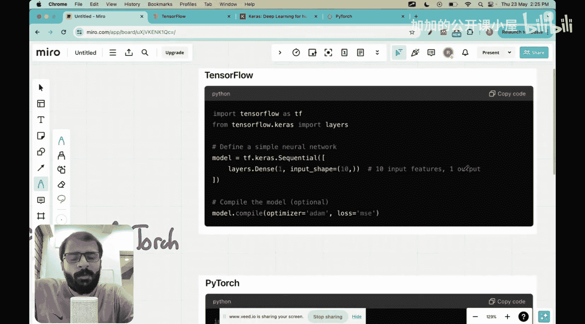
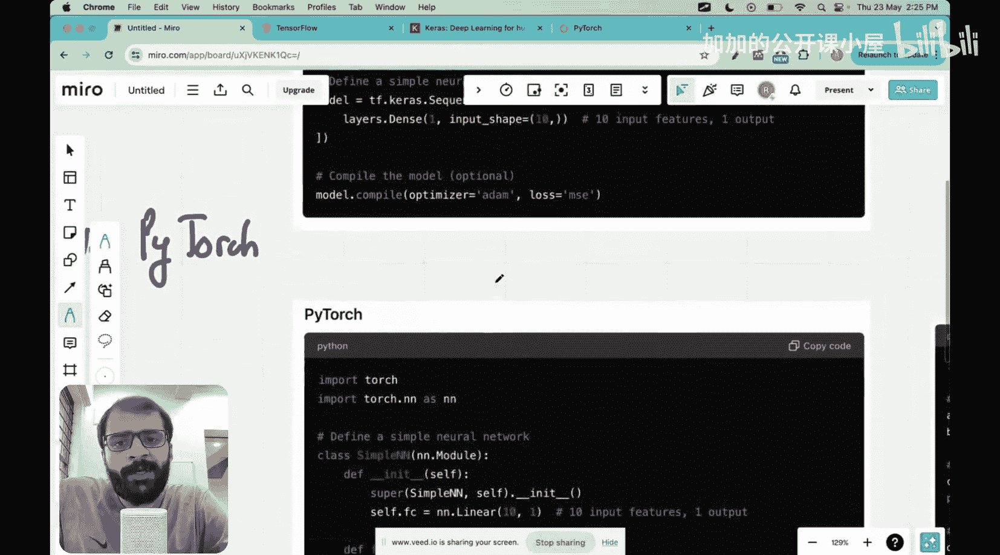
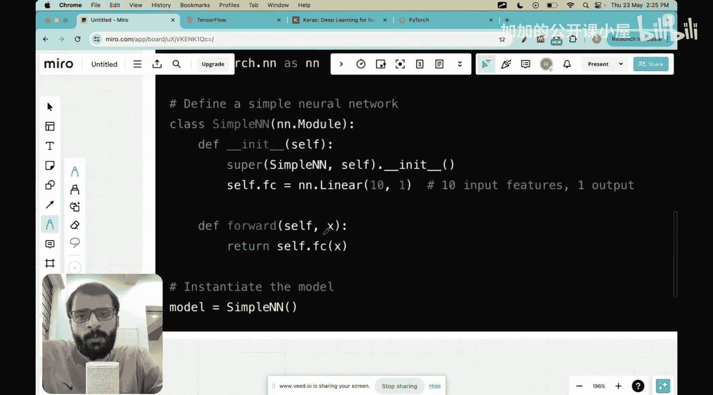
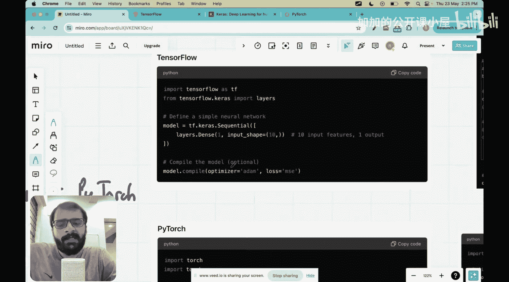
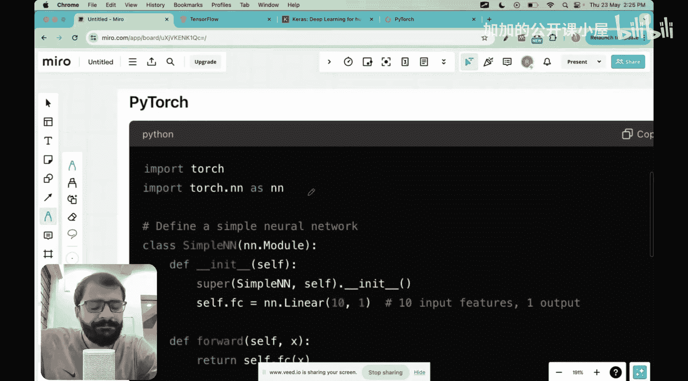
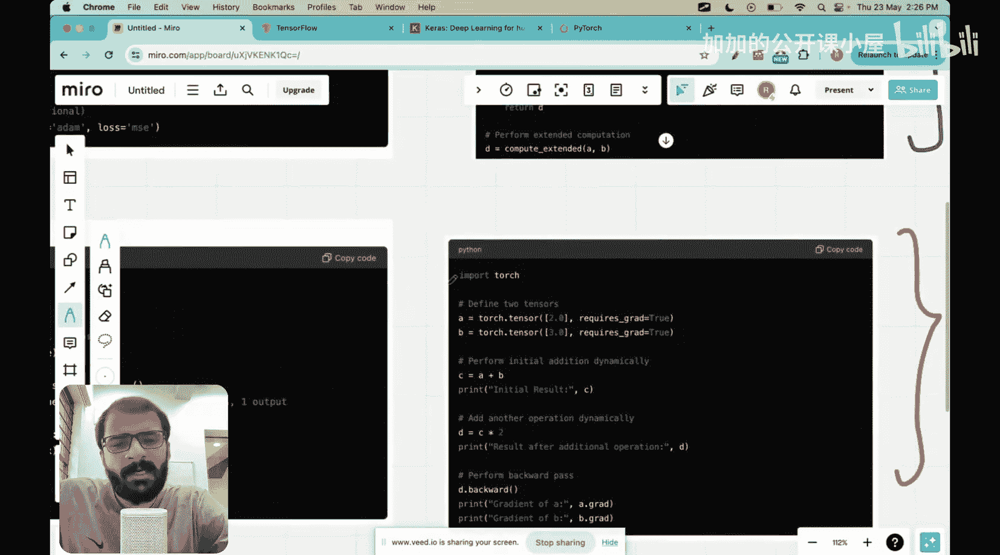
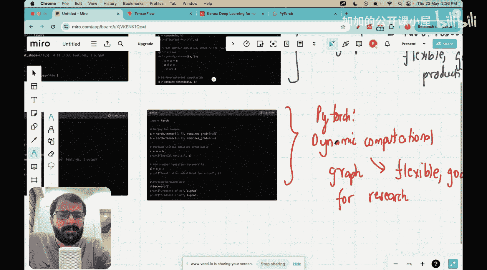
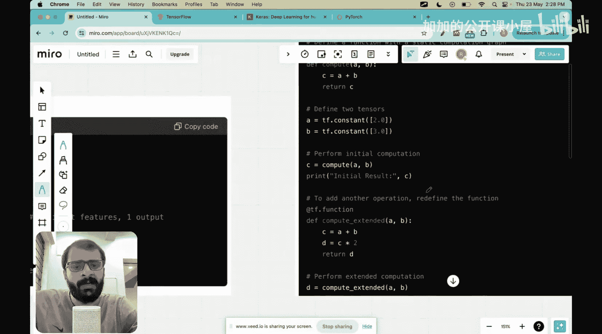
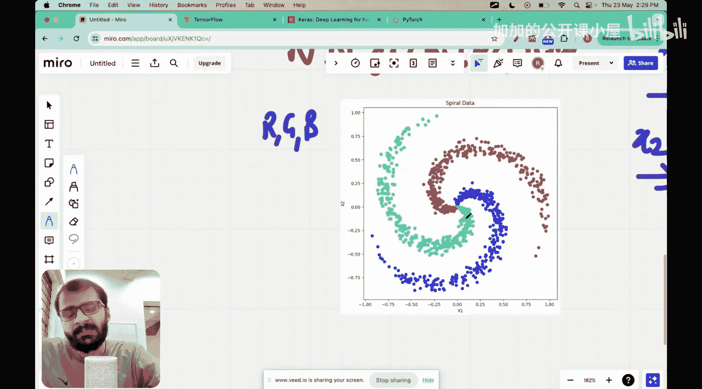

#  029：Python神经网络实践


在本节课中，我们将学习如何在Python中动手实现神经网络。我们将选取一个问题，构建神经网络架构，训练网络，获取结果，并进行测试。我们将使用一些在实践中工程师常用的标准Python库。

如果你想了解如何从零开始创建神经网络的更详细版本，我已经开始了另一个名为“从零开始神经网络”的系列，目前已有三到四个视频，我们将分解TensorFlow和Keras等库使用的命令。但在本讲座中，我将直接使用这些库的命令，因为本讲座的主要目的是展示当今实践中如何使用神经网络。如果你想获得更理论化的理解，请查看“从零开始神经网络”系列，我已将链接附在本视频中供你参考。

那么，让我们开始今天的课程。在进入问题和实际开始用Python编码之前，我想先描述一下通常在Python中编码神经网络时会听到或想到的三个框架。

以下是这三个框架。

*   **TensorFlow**：如果你访问TensorFlow网站，你会看到TensorFlow基本上是一个用于运行机器学习模型或机器学习框架的平台，由Google开发。今天使用的许多Python代码都使用TensorFlow。
*   **Keras**：Keras与TensorFlow有些不同，因为Keras就像一个API。你可以把它看作是你可以调用的函数。例如，如果你想将不同的层链接在一起以创建神经网络架构，可以使用Keras的Sequential API调用。同样，Keras使编写函数变得更容易。如果你想实现一个Dropout层，而不是从头开始编码，你只需一个命令。你还可以使用Keras接口（也称为API）非常简单地指定损失函数和梯度下降规则，而无需显式写出。
*   **PyTorch**：PyTorch也是一个机器学习框架，你可以使用Python通过PyTorch定义和运行神经网络。它由Meta（前身为Facebook）开发。

现在，PyTorch和TensorFlow之间有一个很大的区别，我将尽可能简化这个区别。

首先，让我们看看在TensorFlow和PyTorch中编写用于创建神经网络的简单代码。

例如，这里我们使用TensorFlow。你导入`tensorflow as tf`，然后记住我说过Keras已集成到TensorFlow中。因此，如果你想使用Keras中的层API，你只需要`from tensorflow.keras import layers`。然后你可以定义神经网络的层。你甚至可以导入`Sequential`。这里我们定义了一个只有10个输入特征和1个输出的神经网络。


```python
import tensorflow as tf
from tensorflow.keras import layers, Sequential

model = Sequential([
    layers.Dense(1, input_shape=(10,))
])
```





另一方面，如果我们想用PyTorch做同样的事情，实现看起来像这样。

```python
import torch
import torch.nn as nn





class SimpleNN(nn.Module):
    def __init__(self):
        super(SimpleNN, self).__init__()
        self.linear = nn.Linear(10, 1)

    def forward(self, x):
        return self.linear(x)
```







所以PyTorch遵循一种更面向对象的方法，我们定义一个类。然后我们在类中定义两个方法，`__init__`是一个特殊方法，在创建此类的实例时自动调用。然后我们定义这个神经网络的权重：10个输入特征，1个输出。第二个方法是`forward`，它实现前向传播，然后返回神经网络的输出。

因此，编写相同的神经网络有两种不同的方式：TensorFlow使用更像基于API的方法或将函数链接在一起，而PyTorch使用面向对象的编程方法。

但这两种方法之间有一个更微妙且更大的区别：TensorFlow使用称为**静态计算图**的东西，而PyTorch使用称为**动态计算图**的东西。

让我试着解释一下这些是什么意思。假设我们想计算两个函数的和。记住TensorFlow使用静态计算图，所以我们定义计算函数，然后说`c = a + b`。现在，如果你想修改这个函数中的某些内容，你需要编写一个不同的函数，比如`compute_extended`，其中`c = a + b`，然后假设我想定义另一个变量`d`，它是`c`乘以2，那就是另一个变量。所以，你不能轻易地扩展这个函数，你必须编写另一个函数。原因是因为一旦定义了这个函数，TensorFlow就会创建一个静态计算图，并且很难灵活地处理这个函数。这是描述它的最简单方式。而如果你使用PyTorch，你可以动态地更改内容，初始加法可以动态执行，其中`c = a + b`，然后你还可以动态添加另一个操作`d = c * 2`，你不需要为它定义一个单独的函数。

本质上，我想说的是，PyTorch在代码上更灵活，因为它是在代码运行时动态地在变量之间创建计算图。而TensorFlow以静态方式创建图，所以如果你想改变某些东西，那么我们需要重新定义函数本身，因此它不太灵活。



总而言之，初学者都可以使用TensorFlow和PyTorch。但请记住，TensorFlow快速、稳健，但不是很灵活。因此，如果你想尝试各种东西，想将其用于研究，不太推荐TensorFlow，但它实际上非常适合生产级或工业级的机器学习框架。另一方面，PyTorch以动态方式生成这些图，因此非常灵活。所以，如果你想自己改变东西，想使用这些框架进行研究，那么PyTorch非常好。作为初学者，你可以同时使用PyTorch和TensorFlow，事实上我鼓励你两者都用，以了解两者之间的异同。

在本视频中，我们将使用TensorFlow。我希望你已经理解了这三个框架之间的区别。现在，你可以把TensorFlow/Keras放在一个篮子里，把PyTorch放在另一个篮子里。

那么，让我们开始今天的例子。今天，我们要做的是执行一个简单的分类任务。

首先，让我向你介绍输入数据。我们的输入数据或训练数据看起来像这样。每个输入有两个属性`x1`和`x2`。所以如果你绘制它们，它看起来会是这样，并且每个输入还有一个与之关联的颜色编码。本质上，有三种颜色编码：R、G或B。所以，你取的任何点`(x1, x2)`，比如说我们取这个点，它被编码为红色；如果我们取这个点，它被编码为蓝色；如果我们取这个点，它被编码为绿色。



这也被称为螺旋数据。我们在本讲座中的目标是……