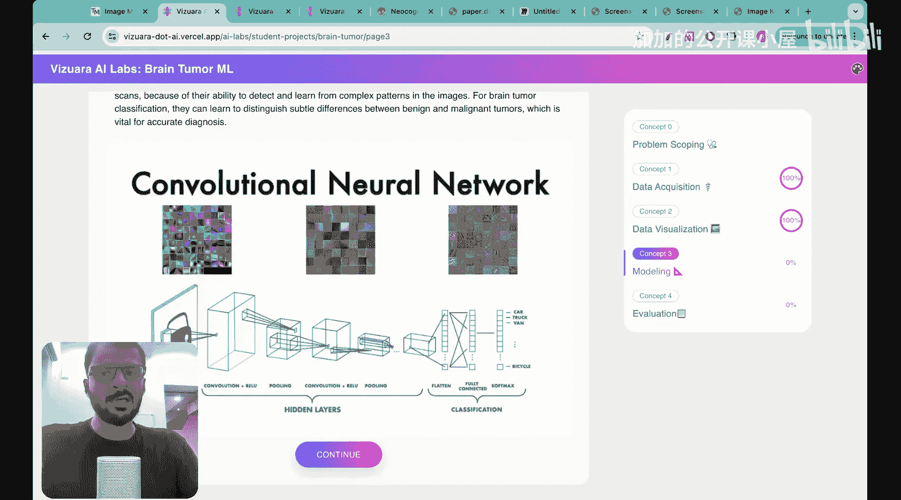
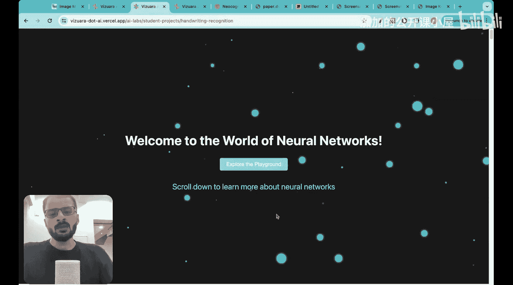
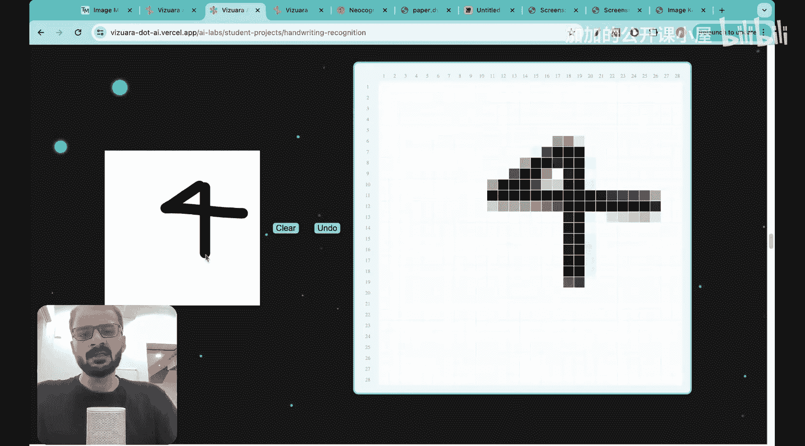
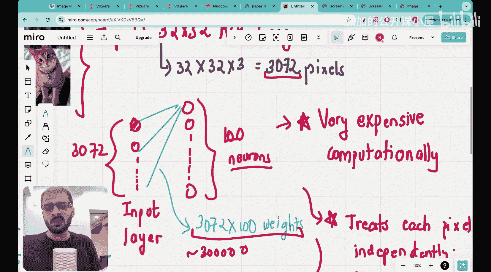

#  030：卷积神经网络（CNN）介绍 🧠

在本节课中，我们将学习卷积神经网络及其基本介绍。我们将从了解其应用开始，然后探讨为何需要专门研究这种网络，最后回顾其发展历史。

## 应用领域 📸

卷积神经网络（CNN）在图像处理领域有广泛应用。以下是几个核心应用示例。

### 猫狗图像分类

第一个应用是简单的猫狗图像分类。通过一个名为“可教机器”的界面，我们可以上传猫和狗的图片样本进行训练。训练完成后，模型需要能够正确分类新的测试图片。

以下是训练和测试的关键步骤：
*   上传10张猫和10张狗的图片作为训练数据。
*   训练模型识别图片中的模式和特征。
*   使用模型预测新图片是猫还是狗。

测试表明，即使面对与训练数据视角不同的图片，训练好的CNN模型也能以高准确率进行分类。

### 脑瘤检测

第二个应用在医疗健康领域，即脑瘤检测。模型需要根据核磁共振扫描图像，判断是否存在肿瘤（恶性）或不存在肿瘤（良性）。

以下是数据特点和模型任务：
*   **恶性图像**：通常包含明亮的白色斑点。
*   **良性图像**：看起来更均匀，没有明显的斑点。
*   **模型任务**：训练AI系统自动检测图像模式，并对新图像进行正确分类。

评估显示，训练好的神经网络能够准确预测肿瘤状态，其底层架构同样是卷积神经网络。

### 手写数字识别

第三个有趣的应用是手写数字分类。系统需要将用户手绘的像素图识别为对应的数字。

模型需要处理以下挑战：
*   将手写笔画转换为像素数据。
*   识别不同书写风格下的同一数字（例如，不同人书写“4”的方式可能不同）。
*   对任意手写数字进行准确分类。

除了上述例子，CNN在自动驾驶（识别物体、行人）、人脸识别等任何涉及图像处理的领域都发挥着核心作用。

上一节我们看到了CNN的强大应用，本节中我们来看看为什么传统的神经网络在处理图像时效率低下，从而引出对CNN的需求。

## 为何需要卷积神经网络？🤔

让我们通过一个简单的例子来理解。假设有一张32x32像素的RGB彩色猫的图片。

图像的总像素数计算如下：
`总像素数 = 宽度 × 高度 × 通道数 = 32 × 32 × 3 = 3072`

如果我们尝试使用普通的全连接前馈神经网络来处理这张图片，网络结构将面临巨大挑战。

以下是使用全连接网络处理此图像的问题：
*   **输入层**：需要3072个神经元，对应每个像素。
*   **第一个隐藏层**：假设有1000个神经元。
*   **参数量**：仅第一层就需要 `3072 × 1000 ≈ 3, 000, 000` 个权重参数。
*   **计算成本**：如果网络有多层，参数量将轻松超过百万，导致计算极其昂贵且效率低下。

这只是全连接网络不适合图像任务的原因之一。更根本的原因在于，它忽略了图像中像素之间的空间局部关联性，而CNN正是为了解决这些问题而设计的。

在了解了CNN的必要性后，最后我们来简要回顾一下这项技术是如何发展起来的。

## 卷积神经网络发展简史 📜

尽管“卷积神经网络”这个术语在过去十年才变得非常流行，但人们在这个领域的研究已经持续了40到45年。了解并承认早期研究者的贡献非常重要。

从早期的感知机模型到现代复杂的深度CNN架构，其核心思想——利用卷积操作提取局部特征——经历了长期的演变和完善，才成就了今天在计算机视觉领域的统治地位。

本节课中我们一起学习了卷积神经网络的基本概念。我们首先探索了CNN在图像分类、医疗诊断和手写识别等多个领域的实际应用。接着，我们分析了传统全连接神经网络在处理图像数据时面临的计算效率低下和忽略空间信息等问题，从而理解了CNN被提出的必要性。最后，我们简要回顾了CNN长达数十年的发展历程。在接下来的课程中，我们将深入CNN的内部机制，学习其核心组件如卷积层、池化层等是如何工作的。