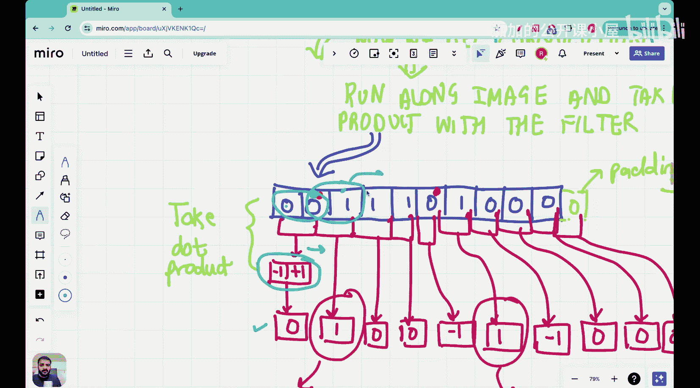

#  031：一维滤波器与卷积运算


在本节课中，我们将学习卷积神经网络中的一个核心概念：**滤波器**。我们将从一维图像入手，理解滤波器如何工作，并介绍**卷积运算**的基本原理。通过本课的学习，你将明白为什么滤波器是卷积神经网络的基础构建模块。

## 滤波器的重要性

上一节我们介绍了为什么传统的全连接神经网络不擅长处理图像数据。本节中，我们来看看卷积神经网络如何通过引入**滤波器**来解决这些问题。

传统神经网络在处理图像时，没有利用图像数据的两个关键特性：
1.  **空间局部性**：图像中属于同一物体的像素在空间上是相邻的。例如，猫的眼睛像素会彼此靠近。
2.  **平移不变性**：图像中的物体无论出现在画面的哪个位置，其类别不变。例如，猫在画面中向左或向右移动，它仍然是猫。

卷积神经网络的设计就是为了利用这两个特性，而**滤波器**正是实现这一目标的核心工具。

## 什么是滤波器？

滤波器可以理解为一种用于从数据中提取特定特征的工具。如果你使用过手机相机或Instagram的滤镜功能，那么你已经对滤波器有了直观的感受。在数学和机器学习中，滤波器是一个小型的数值矩阵（或向量），它通过一种称为**卷积**的运算在输入数据上滑动，以检测特定的模式。

## 一维图像与左边缘检测

为了理解滤波器的工作原理，我们从一个简单的一维“图像”开始。一维图像可以看作是一系列明暗交替的条纹。

以下是我们的一维图像示例，其中黑色区域用像素值`0`表示，白色区域用像素值`1`表示：
```
数据: [0, 0, 1, 1, 1, 0, 1, 0, 0, 0]
```

我们的目标是检测图像中的**左边缘**，即从黑色（`0`）到白色（`1`）的过渡位置。通过观察，我们可以发现左边缘出现在索引`2`（从`0`到`1`）和索引`5`（从`0`到`1`）的位置。现在，我们需要让计算机也能从像素数据中识别出这些边缘。

## 左边缘检测滤波器

为了检测从`0`到`1`的过渡，我们可以设计一个简单的滤波器。这个滤波器需要能对“低值到高值”的转变做出响应。

我们使用一个包含两个值的滤波器：`[-1, 1]`。这个滤波器被称为**左边缘检测滤波器**。
*   公式：`filter = [-1, 1]`
*   其原理是：当它滑过`[0, 1]`这样的序列时，点积运算`(-1)*0 + (1)*1 = 1`会得到一个高正值，表示检测到了一个左边缘。

## 卷积运算

卷积运算就是让滤波器在输入数据上滑动，并在每个位置计算滤波器与对应数据窗口的**点积**。

点积的计算方法如下：对于两个向量 `v1 = [a1, b1]` 和 `v2 = [a2, b2]`，它们的点积是 `a1*a2 + b1*b2`。

以下是卷积运算在一维图像上的逐步演示：

1.  **初始位置**：将滤波器 `[-1, 1]` 与数据的前两个元素 `[0, 0]` 对齐。
    *   计算点积：`(-1)*0 + (1)*0 = 0`
    *   结果：`0`

2.  **滑动一步**：将滤波器向右滑动一位，对齐 `[0, 1]`。
    *   计算点积：`(-1)*0 + (1)*1 = 1`
    *   结果：`1` → **检测到一个左边缘！**

3.  **继续滑动**：将滤波器对齐 `[1, 1]`。
    *   计算点积：`(-1)*1 + (1)*1 = 0`
    *   结果：`0`

4.  **重复此过程**，直到滤波器滑过整个数据序列。

将上述所有步骤的结果按顺序排列，就得到了卷积运算的**输出特征图**。

以下是完整的卷积过程图示：



## 总结

本节课中，我们一起学习了卷积神经网络的基础知识。我们首先回顾了图像数据的特性（空间局部性与平移不变性），并指出传统神经网络的不足。接着，我们引入了**滤波器**的概念，它是在数据上滑动以提取特征的小型模板。我们通过一个具体的例子——使用滤波器 `[-1, 1]` 在一维图像上检测左边缘——详细讲解了**卷积运算**的步骤。卷积运算的核心是**点积**，它量化了滤波器与局部数据的匹配程度，输出结果构成了新的特征图。


理解一维滤波器与卷积是学习更复杂的二维图像处理（如下一节课的内容）的重要基石。通过这种运算，神经网络能够有效地捕捉图像中的关键局部特征。