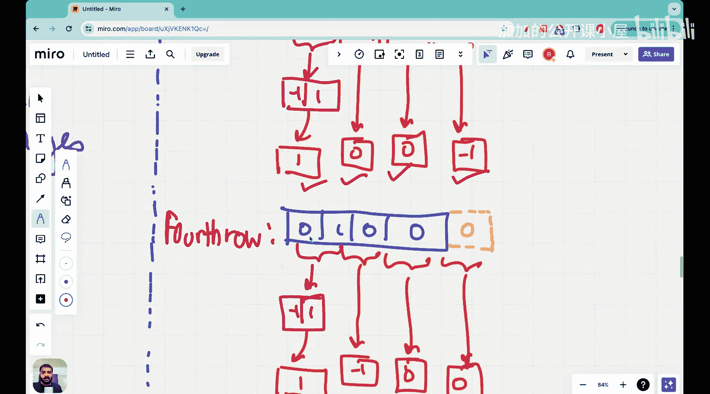

#  032：二维滤波器、通道与特征识别


在本节课中，我们将学习卷积神经网络中的二维滤波器。我们将了解如何将一维卷积的概念扩展到二维图像处理中，并学习如何使用滤波器来识别图像中的特征，例如边缘和孤立像素。

上一节我们介绍了一维滤波器的工作原理。本节中我们来看看如何将这些概念应用到更常见的二维图像上。

## 从一维到二维

我们通常处理的图像，如猫、狗的照片或手机中的图片，都是二维的。因此，将卷积操作扩展到二维空间，能让我们处理更贴近现实生活的数据。核心目标与一维情况相同：识别和量化图像中的特征。滤波器在二维图像中扮演着与一维情况相同的角色，只是滤波器的数量和维度处理需要更仔细。

## 问题定义：识别孤立像素

假设我们有一个二维图像，其中包含明亮的白色区域和黑暗的黑色区域。我们的任务是识别图像中的“孤立像素”，即一个被白色区域完全包围的黑色像素点。人类视觉可以轻松识别出下图中粉色箭头所指的这样一个像素。

然而，计算机“看到”的并非图像，而是一系列数字。对于计算机，白色区域被表示为数值 **1**，黑色区域被表示为数值 **0**。因此，上图在计算机中可能被表示为以下 **4x4** 的像素矩阵：

```
1 1 1 1
1 0 1 1
0 1 0 0
0 1 0 0
```

我们的目标是为计算机设计一套数学规则（即卷积运算和滤波器），使其能自动找出这个孤立像素。

## 二维卷积运算入门

为了便于理解，我们先从一个更简单的任务开始：检测图像中的左边缘。左边缘被定义为从黑色（0）到白色（1）的过渡区域。观察上述矩阵，我们可以发现三处这样的左边缘。

以下是执行二维卷积的步骤：

首先，我们需要选择一个合适的滤波器。为了检测从黑到白的过渡，我们使用一个简单的 **1x2** 滤波器：`[-1, 1]`。其直观意义是：`-1` 对应较暗区域，`+1` 对应较亮区域，两者的差值能突出变化。

接着，我们需要在每一行上滑动这个滤波器并进行点积运算。为了确保卷积后的输出矩阵尺寸与输入图像（4x4）保持一致，我们需要进行“填充”操作。具体做法是在每一行的末尾添加一个值为 **0** 的虚拟像素。

现在，让我们逐行进行卷积计算：

**第一行计算：**
输入行（已填充）：`[1, 1, 1, 1, 0]`
*   滤波器位置1（覆盖像素1,1）：`1*(-1) + 1*(1) = 0`
*   滤波器位置2（覆盖像素1,1）：`1*(-1) + 1*(1) = 0`
*   滤波器位置3（覆盖像素1,1）：`1*(-1) + 1*(1) = 0`
*   滤波器位置4（覆盖像素1,0）：`1*(-1) + 0*(1) = -1`
第一行输出：`[0, 0, 0, -1]`

**第二行计算：**
输入行（已填充）：`[1, 0, 1, 1, 0]`
*   位置1：`1*(-1) + 0*(1) = -1`
*   位置2：`0*(-1) + 1*(1) = 1`
*   位置3：`1*(-1) + 1*(1) = 0`
*   位置4：`1*(-1) + 0*(1) = -1`
第二行输出：`[-1, 1, 0, -1]`

**第三行计算：**
输入行（已填充）：`[0, 1, 0, 0, 0]`
*   位置1：`0*(-1) + 1*(1) = 1`
*   位置2：`1*(-1) + 0*(1) = -1`
*   位置3：`0*(-1) + 0*(1) = 0`
*   位置4：`0*(-1) + 0*(1) = 0`
第三行输出：`[1, -1, 0, 0]`

**第四行计算：**
输入行（已填充）：`[0, 1, 0, 0, 0]`
*   位置1：`0*(-1) + 1*(1) = 1`
*   位置2：`1*(-1) + 0*(1) = -1`
*   位置3：`0*(-1) + 0*(1) = 0`
*   位置4：`0*(-1) + 0*(1) = 0`
第四行输出：`[1, -1, 0, 0]`

最后，将所有行的输出结果组合起来，就得到了卷积后的特征图：

```
0  0  0 -1
-1 1  0 -1
1 -1  0  0
1 -1  0  0
```

在这个特征图中，数值为 **1** 的位置（第二行第二列）就对应了原图像中一个从黑到白的显著左边缘。通过这种方式，我们使用数学运算让计算机“识别”出了特征。

## 回到孤立像素检测

理解了基础的边缘检测后，我们可以设计更复杂的滤波器来检测“孤立像素”。这通常需要一个能感知中心像素与周围所有邻居差异的滤波器，例如一个 **3x3** 的滤波器。其核心思想是：如果中心像素是黑色（0），而周围8个像素都是白色（1），那么该点就是一个孤立像素。滤波器设计可能如下：

```
-1 -1 -1
-1  8 -1
-1 -1 -1
```

将这个滤波器与图像进行卷积运算，在孤立像素点处会得到一个很高的正响应值，从而将其标识出来。具体的计算过程与上述边缘检测示例类似，只是在二维平面上进行滑动和点积。

## 通道的概念

在实际的彩色图像中，每个像素点不止有一个数值。例如，在RGB色彩模型中，每个像素由红、绿、蓝三个通道的数值组成。因此，一个 **224x224** 的彩色图像，其数据维度是 **224 x 224 x 3**。

处理多通道图像时，我们的滤波器也需要相应的深度。对于一个三通道图像，每个滤波器本身也是一个三维体积，例如 **3x3x3**。卷积操作变为：滤波器的每个通道与输入图像的对应通道分别进行卷积，然后将所有通道的结果相加，再加上一个偏置项，最终生成一个二维的特征图。

```
# 简化示意：输入(高，宽，通道)与滤波器(高，宽，输入通道，输出通道)的卷积
output_feature_map[x, y, k] = bias[k] + sum( input[x+i, y+j, c] * filter[i, j, c, k] )
```

通过使用多个不同的滤波器，我们可以从输入图像中提取多种类型的特征，生成多个特征图，这些特征图堆叠起来就构成了新的“通道”。

## 总结

本节课中我们一起学习了二维卷积神经网络的基础知识。
*   我们首先将一维卷积的概念扩展到了二维图像，理解了计算机如何将图像视为像素矩阵。
*   通过一个检测左边缘的实例，我们详细演练了二维卷积的步骤，包括选择滤波器、进行填充以及逐行滑动计算点积。
*   我们探讨了如何利用这个原理去解决更复杂的问题，如识别孤立像素。
*   最后，我们引入了“通道”的概念，解释了如何对彩色图像（多通道输入）应用三维滤波器来提取特征，并生成新的特征图通道。



掌握这些二维卷积的基本操作，是理解现代卷积神经网络如何从图像中学习并识别复杂模式的关键第一步。