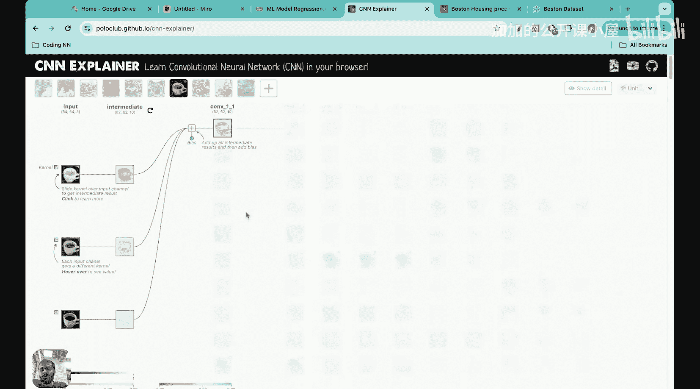

#  033：卷积神经网络中的滤波层

## 概述
在本节课中，我们将学习卷积神经网络中的一个核心组成部分——滤波层。我们将了解滤波层的构成、工作原理以及如何在实际网络中表示和计算它们。

## 回顾：滤波器基础
上一节我们介绍了二维滤波器。在此之前，我们还详细探讨了一维滤波器。本节中，我们来看看如何在卷积神经网络中表示滤波层。

在卷积神经网络中，存在不同类型的层，就像前馈神经网络中有隐藏层一样。其中一种层被称为滤波层。自然地，滤波层由滤波器组成。我们将学习这些滤波器在神经网络中的表示方法。

## 滤波层的工作原理
在神经网络中，每一层都有神经元，我们将它们堆叠起来。但在卷积神经网络中，其表示方式略有不同。

首先，让我们回顾一下上节课学到的滤波器概念。

想象有一张4x4的图像，其中包含一些白色像素和一些深色像素。

在滤波层中，我们首先要选择该层中所需的滤波器数量。例如，我选择在该特定层中使用四个滤波器。

接下来，这四个滤波器会被应用到图像上。假设每个滤波器都是2x2的尺寸。这个2x2的滤波器从图像的一个位置开始，然后在整个图像上滑动，执行卷积操作。

当一个滤波器操作时，输入是4x4的图像。但当四个这样的滤波器在这个基础图像上操作时，会产生四个4x4的图像。因此，我们实际上得到了一个维度为4x4x4的张量。这个深度被称为**通道深度**。

如果你想了解更多关于图像每个部分如何进行卷积操作的细节，请查看卷积神经网络部分的前两节课。

## 可视化卷积操作
我想向你展示一个关于卷积操作如何执行的可视化动画。

假设我们观察一个特定的滤波器。这个滤波器从一个特定位置开始，然后向右滑动，并在其经过的每个地方执行卷积操作，最终生成一个4x4的图像。因为有四个这样的滤波器，所以我们会得到一个4x4x4的张量。

让我们看看这个的可视化表示。这里你可以看到一个咖啡杯的图像。

首先，咖啡杯被分成三个通道：红色通道、绿色通道和蓝色通道。现在，请你关注红色通道，我将展示一个特定滤波器是如何应用的。

在红色通道上，应用了10个滤波器。让我们看看应用每个滤波器的结果。当我点击这里时，你会看到滤波器做了什么。你可以看到滤波器滑过图像的每个像素，然后输出一个结果。这个结果仍然保持与原始图像相同的大小。这就是滤波操作的执行方式。

如果你想看得更详细，这就是滤波操作的确切执行过程。我将光标移到左上角，然后慢慢向右移动，再向下移动，再向左移动。每当我在每个瞬间暂停时，你都可以看到正在执行的卷积操作。

滤波器像这样拖过整个图像，然后产生一个结果图像。这正是我在这里展示的：每个滤波器在图像上拖动并执行卷积操作时，都会产生一个相同大小的结果图像。因为有四个这样的滤波器，所以我们得到一个4x4x4的张量，对吗？

## 多层滤波操作
现在让我们看看在这个张量上操作的另一个滤波层。

这是我的第一个滤波层。现在让我转到第二个滤波层。观察第二个滤波层，其输入是一个4x4x4的张量。

同样，我必须决定两件事：我需要决定该层中滤波器的数量，以及每个滤波器的尺寸。

假设我决定下一层中滤波器的尺寸是2x2。但请记住，它不能仅仅是2x2，我还需要加上通道深度。因此，我在下一层构建的滤波器将是2x2x4。为什么需要添加通道深度？因为现在输入是一个张量。之前应用于图像的滤波器是二维的，但现在这是一个张量。所以，当我观察第二层的滤波器时，它肯定是一个2x2的滤波器，但它也有一个深度维度，因为它将穿过张量中堆叠的所有四个图像。

因此，下一层滤波器的维度将不仅仅是2x2，而是2x2x4。然后，这个2x2x4的滤波器将卷积整个张量。它首先从这里开始，并且也有这个深度，所以它会输出一个值。然后它移动到这里，再到这里，再到这里。这样一个2x2x4的滤波器将产生一个4x4的输出。

现在你可以看到，当一个滤波器在这个张量上操作时，由于滤波器具有与张量深度相同的深度，产生的输出是4x4的。

但在这一层，我们必须做的第二个选择是想要使用的滤波器数量。如果我们决定使用10个滤波器，那么每个滤波器都会创建一个4x4的表示。因此，该层的输出将是4x4x10。如果我们决定使用10个滤波器，就会有10个通道。

让我再重复一遍这部分。每当我们观察一个滤波层时，我们必须决定两件事：滤波器的数量和滤波器的尺寸。首先，滤波器的尺寸是2x2，但请记住，深度是固定的。滤波器的深度必须等于前一层输出的通道维度。因此，前一层输出的通道深度是4，所以这一层滤波器的深度必须是4。因此，滤波器的尺寸将是2x2x4。

这个2x2x4的滤波器将卷积整个张量，当它卷积时，将生成一个4x4的输出。我们必须做的第二个选择是滤波器的数量。如果我们决定使用10个滤波器，每个滤波器都会产生一个4x4的输出。所以，如果我们使用10个滤波器，那么输出将是4x4x10。这就是这个滤波层的输出维度。

然后我们将再次重复这个过程。请记住，如果我们要在下一个滤波层中做同样的过程，首先我们必须决定滤波器的尺寸。假设我使用3x3的尺寸。但同样，请记住，其深度是固定的，因为前一层输出有10个通道深度。所以滤波器的尺寸必须是3x3x10。假设我使用的滤波器数量是20个，那么这一层的输出将是4x4x20。

这就是滤波层在实际中的工作方式。

## 总结
本节课中，我们一起学习了卷积神经网络中滤波层的工作原理。我们了解到，滤波层需要决定两个关键参数：滤波器的尺寸（包括其深度，必须与前一层输出的通道数匹配）和滤波器的数量。每个滤波器卷积输入张量后会产生一个二维特征图，多个滤波器的输出堆叠起来就构成了新的、具有更多通道深度的输出张量。这是构建深层卷积网络的基础操作。