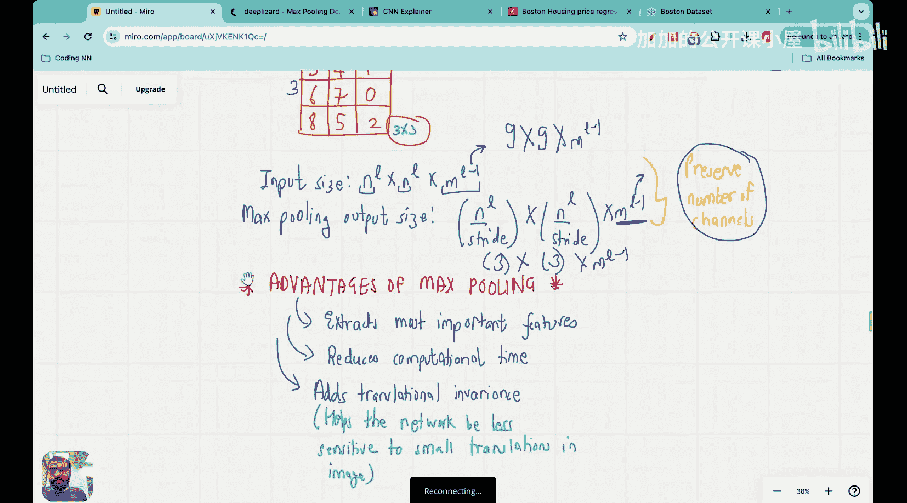

#  034：什么是卷积神经网络中的最大池化？ 🧠


在本节课中，我们将要学习卷积神经网络中的一个重要组成部分——最大池化层。我们将了解它的定义、工作原理、参数设置以及它在网络中的作用。

在上一节中，我们介绍了卷积神经网络中的过滤层。本节中，我们来看看另一个在CNN实现中常见的层：最大池化层。我们将首先理解它是什么，然后探讨为什么需要使用它。

## 什么是最大池化层？

首先需要理解的是，过滤层包含需要优化的权重值。而**最大池化层没有任何权重**。描述这个层只需要两个参数：**步长**和**尺寸**。

假设我们有一张9x9的输入图像，每个像素都有随机分配的像素值。如果我们想将此图像通过一个最大池化层，首先需要确定池化窗口的尺寸。例如，如果尺寸是3x3，意味着我们将使用一个3行3列的窗口。

其次需要确定的是步长。步长意味着在移动到下一个池化窗口之前，我们需要跳过多少步。例如，如果步长为3，意味着池化窗口每次移动会留下3个像素的间隔。

## 最大池化如何工作？

一旦指定了步长和尺寸，最大池化层的工作就非常简单。它将输入图像划分为多个不重叠（或部分重叠，取决于步长）的块。对于每个块，它只取该块内所有像素值的**最大值**，并将这个最大值作为输出图像中对应位置的像素值。

以下是最大池化操作的核心步骤：
1.  将池化窗口（例如3x3）放置在输入图像的左上角。
2.  找出该窗口覆盖区域内所有像素的最大值。
3.  将这个最大值写入输出图像的对应位置。
4.  根据设定的步长，将池化窗口向右（或向下）移动。
5.  重复步骤2-4，直到遍历完整个输入图像。

通过这个过程，输出图像的尺寸会显著缩小。如果输入尺寸是 `nL * nL * c`（其中c是通道数），使用尺寸为 `f`、步长为 `s` 的最大池化层后，输出尺寸将变为：
`(nL / s) * (nL / s) * c`

**重要提示**：最大池化层**不改变通道数**。它只改变图像的长度和宽度。

## 一个具体例子

为了更好地理解，让我们看一个具体例子。假设我们有一个4x4的输入图像，使用一个2x2的池化窗口，步长为2。

输入矩阵：
```
[ 5, 3, 2, 9 ]
[ 1, 8, 4, 6 ]
[ 7, 0, 3, 1 ]
[ 2, 5, 4, 2 ]
```

池化过程：
1.  第一个2x2块 `[5, 3; 1, 8]` 的最大值是 **8**。
2.  第二个2x2块 `[2, 9; 4, 6]` 的最大值是 **9**。
3.  第三个2x2块 `[7, 0; 2, 5]` 的最大值是 **7**。
4.  第四个2x2块 `[3, 1; 4, 2]` 的最大值是 **4**。

因此，输出矩阵是一个2x2的图像：
```
[ 8, 9 ]
[ 7, 4 ]
```

## 为什么使用最大池化？

了解了最大池化是什么之后，现在我们来探讨它在卷积神经网络中的关键作用。以下是使用最大池化层的主要优势：

1.  **特征提取与不变性**：通过取局部区域的最大值，最大池化能够提取最显著的特征（如边缘、纹理），并使其对输入图像的小幅平移、旋转更具鲁棒性。
2.  **降维与减少计算量**：最大池化显著减少了特征图的尺寸，从而大幅降低了后续层需要处理的参数数量和计算复杂度，提高了模型的效率。
3.  **防止过拟合**：通过提供一种抽象化的表示，并在一定程度上忽略细节信息，最大池化有助于模型学习更通用的特征，从而降低过拟合的风险。

## 总结



本节课中我们一起学习了卷积神经网络中的最大池化层。我们了解到，最大池化是一个没有可训练权重的操作层，它通过滑动一个固定尺寸的窗口，并取窗口内像素的最大值来对特征图进行下采样。它的核心参数是窗口尺寸和步长。最大池化的主要作用是提取关键特征、增加模型的空间不变性、减少参数数量以控制计算成本，并帮助防止过拟合。它是构建高效、鲁棒的卷积神经网络架构的重要工具之一。