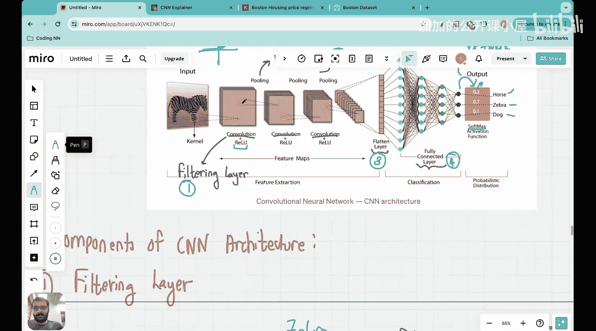

#  035：卷积神经网络架构详解 🧠

在本节课中，我们将学习卷积神经网络架构的所有内容。在过去的两次课程中，我们为理解此架构做好了准备。上一节我们介绍了最大池化层，再上一节我们介绍了滤波层。现在，我们已经准备好理解整个卷积神经网络架构及其包含的所有组件。

当你学习CNN或参加任何CNN课程时，通常会看到以这张图开始讲解。学生理解起来非常困难，因为图中包含太多内容，难以理解应该关注什么。

让我们看看这里有哪些不同的组件。这是一张斑马的图像。图中正在进行不同的操作。首先需要注意，这里写着“卷积”。这里的“卷积”指的就是滤波层。我们将复习它的含义。图中还有“池化”，这指的就是最大池化层。因此，首先应用滤波层，然后应用最大池化层，接着再次应用滤波层，再次应用最大池化层。在最后，有一个称为展平层的部分，最后是全连接层。

从组件角度来看，首先是滤波层，其次是最大池化层，第三是展平层，第四是全连接层。图中还有一些与激活函数相关的操作，但它们不能真正称为组件，因为它们是从神经网络中借鉴而来的。我会解释它们的含义。这里有ReLU激活函数，还有Softmax激活函数。这些只是非线性变换。例如，ReLU的作用是：对于x小于0，输出为0；对于x大于等于0，输出为x。因此，在进行卷积操作后，如果存在负的滤波值，它们会被置为0，而正的输出值保持不变。Softmax是必需的，因为这是一个分类问题。例如，如果有马、斑马和狗三个类别，我们想判断图像最接近这三种动物中的哪一种。如果输出显示马的概率是0.2，斑马是0.7，狗是0.1，这意味着有20%的概率是马，70%的概率是斑马，10%的概率是狗。在输出层和这些概率值之间，有一个称为Softmax的层。

本节课的主要目的是对这四大构建模块——滤波层、最大池化层、展平层和全连接层——进行一个宏观概述。让我们开始理解每一层的实际含义。

## 滤波层 🔍

本节内容基于上一讲的复习，因此复习所有这些概念将很有帮助。当你看到这样的滤波层时，请记住这里发生的是：我们有一张图像。假设这张图像通常有多个通道。让我这样开始：假设这是一张斑马图像，这是一张4x4的图像。首先做的是应用滤波器。滤波器的数量是确定的。假设滤波器大小是2x2。这个2x2的滤波器应用于这张图像，然后在整个图像上进行卷积，产生一个4x4的输出。这里有四个滤波器，因此它将产生一个4x4x4的张量。这就是滤波操作的本质。因此，每当你看一个滤波层时，问自己两个问题：第一，滤波器的大小是多少？在这个例子中是4x4。第二，我想使用多少个滤波器？在这个例子中，我们使用了四个滤波器。

让我们直观地看看这意味着什么。假设我这里有一个咖啡杯，我告诉过你滤波操作。在这一层，我问的第一个问题是：我想要多少个滤波器？我说我想要10个滤波器：1、2、3、4、5、6、7、8、9、10。很好。第二，滤波器的大小是多少？假设我想要一个2x2的滤波器。现在看看第一个滤波器做什么。当我移动到第一个滤波器时，你会看到它在图像上滑动并产生输出图像。如果我点击这里，我们实际上可以更详细地观察这个操作。让我点击这个图像。在这里你可以看到这个操作。假设我有10个滤波器，假设滤波器大小是3x3，然后你可以看到我现在用光标在这里滑动，你可以看到这里正在生成相应的输出。所以你可以看到，每个滤波器——这是一个滤波器——在整个图像上进行卷积，并生成一个与图像大小相同的输出。让我在这里播放这个动画。现在你可以看到动画正在播放。试着观察滤波器在图像上从左向右移动，以及输出在哪里移动。

这就是每个滤波器所做的：每个滤波器执行卷积操作，并产生与图像大小相同的输出。真正重要的是滤波器的数量，因为滤波器的数量将决定深度。例如，这里我使用了10个滤波器。假设输入是64x64，如果我使用10个滤波器，意味着输出是一个64x64x10的张量。这就是滤波层的输出。因此，首先总是决定滤波器的数量，其次总是决定滤波器的大小。这就是滤波层中发生的事情。

让我尝试用张量的形式来解释这一点。假设某一层的输出是4x4x4，因为有四个滤波器。现在你想再应用一个滤波层。首先，你决定滤波器的大小，这将是一个2x2x4的滤波器。因为请记住，输入大小是4x4x4，所以滤波器也必须是一个张量。滤波器将是……让我用橙色。我擦掉这个。所以在这一层，假设……是的，在这一层，假设我将使用一个2x2的滤波器，但我还需要与深度进行卷积，所以滤波器也必须具有深度4。因此，我在这里选择的滤波器是2x2x4。这个滤波器将在整个张量上进行卷积，并产生一个4x4的输出。我还必须决定滤波器的数量。所以如果在这一层我打算使用10个滤波器，每个滤波器的输出是4x4，而我使用了10个滤波器，那么最终输出将是4x4x10。

这就是当你考虑一个滤波层时发生的事情。当你考虑一个滤波层时，选择滤波器的数量，选择每个滤波器的大小，并确定输出。因此，每当你看到像这样的滤波层时，我希望你想象这个可视化层。具体来说，我希望你思考屏幕右侧的这个可视化，正在播放的动画：滤波器在悬停，然后执行卷积操作，输出正在生成。这正是正在发生的事情。这个滤波器在做什么？这里的每个滤波器都在检测一些特定的特征。这里有10个滤波器，对吧？也许这个滤波器在检测咖啡的边缘，也许这个滤波器在检测手柄的曲线形状，也许这个滤波器在检测咖啡中存在的液体纹理。这里的每个滤波器都有特定的目的，当它被训练后，它将执行识别特定特征的任务。这就是滤波层的优势：滤波层从输入图像中提取特征。

现在，除了理解滤波层，术语命名也非常重要。实际上有三件事需要确定：我们讨论过的滤波器数量，我们讨论过的滤波器大小，但还有一个需要确定的参数，那就是步长。

当滤波器在图像上操作时，如果步长等于2，输出图像的大小通常不会与输入相同。例如，当……

---

本节课中，我们一起学习了卷积神经网络架构的四大核心构建模块：滤波层、最大池化层、展平层和全连接层。我们重点回顾了滤波层的工作原理，包括如何确定滤波器数量和大小，以及其提取图像特征的核心作用。理解这些组件是掌握CNN如何工作的基础。