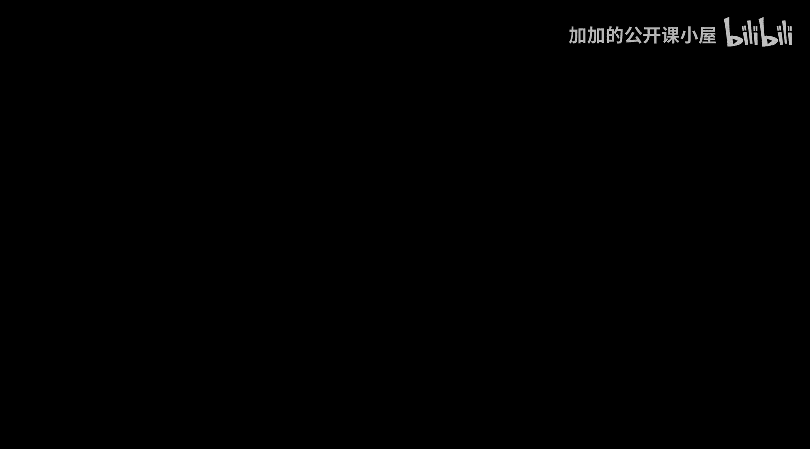

#  036：卷积神经网络中的反向传播 🔄

在本节课中，我们将学习卷积神经网络（CNN）中权重优化的核心思想，特别是反向传播算法如何应用于CNN。我们将了解CNN的架构，并解释如何通过梯度下降来更新其参数。

---

在之前的视频中，我们详细探讨了卷积神经网络的架构。我们研究了四个基本构建块：**过滤层**、**最大池化层**、**展平层**和**全连接层**。我们看到了这些构建块如何排列，形成一个看起来像这样的卷积神经网络示意图。

通常，输入图像会经过一系列层，例如一个过滤层，然后是一个池化层。过滤层也常被称为带有ReLU激活函数的卷积层。我们会多次重复“过滤-池化”的过程，直到到达展平层，最后是网络末端的全连接层。

这就是卷积神经网络的架构。我们讨论过，有两个构建块的参数需要优化。

首先，在每个过滤层或卷积层中，存在**过滤器**。过滤器的形状可能是一个张量，例如一个 `3x3x4` 的过滤器。这些过滤器携带的权重值（W1, W2等）是需要优化的参数。

池化层没有任何参数需要优化，因为它只是取输入区域的最大值。展平层同样没有参数。全连接层则具有权重和偏置，类似于传统的神经网络。

因此，需要优化参数的主要是**过滤层**（卷积层）和**全连接层**。在本讲座中，我将用变量 **W** 来表示所有这些组合参数。

我们需要优化所有参数 **W**，使得网络的输出能正确反映输入内容。例如，如果输入是斑马的图像，输出有三个类别：马、斑马和狗，那么参数 **W** 应使得斑马类别的概率最高，而马和狗的概率较低。

---

上一节我们介绍了CNN中需要优化的参数。本节中，我们来看看如何优化卷积神经网络的权重。

这不是一个深入的理论讲座，我不会展示数学计算。这将更像一个概述性讲座，旨在让你理解反向传播和梯度下降是如何实现的。和本系列一样，我会用一个实际例子来演示。

要理解卷积神经网络的权重如何优化，你需要明白，CNN本质上是一个数学函数，其形式如下：

`输出 = CNN(输入图像, 权重W)`

它接收图像作为输入，而权重就是过滤层和全连接层中的值。因此，我们需要优化这些权重。

我们遵循的策略与在传统神经网络中使用的非常相似：
1.  首先计算**损失**。损失值取决于网络的**预测值**和**真实值**。
2.  然后，计算损失相对于所有参数的**偏导数**（即梯度）。
3.  最后，使用梯度下降（或其变体，如带动量的梯度下降、Adam、RMSProp等）来迭代更新每个参数。例如，对于一个参数 `W1`，在每次迭代中我们这样更新它：

`W1 = W1 - 学习率 * (∂损失 / ∂W1)`

通过这种方式，我们最终会优化这些参数以降低损失。

---

为了执行上述优化，一个非常关键的步骤是计算损失相对于所有参数的偏导数（梯度）。

我们实施的策略实际上与神经网络完全相同：
*   **步骤一**：找到损失相对于参数的偏导数。
*   **步骤二**：通过梯度下降方法更新权重。

现在，让我们重点看看如何找到这些偏导数。为此，我们需要进行**反向传播**。

假设我想找到损失相对于某个过滤层中权重的偏导数。为此，我需要：
1.  找到损失相对于展平层输入的偏导数。
2.  然后，找到池化层输出相对于其输入的偏导数。
3.  接着，找到过滤层输出相对于其输入的偏导数。
4.  依此类推，直到到达网络的最后层。

你会发现，对于池化层和过滤层，我们需要计算两种关键的偏导数：
*   **对于池化层**：如果输入是 `x`，输出是 `z`，我们需要 `∂z / ∂x`。
*   **对于过滤层**：同样，如果输入是 `x`，输出是 `z`，我们需要 `∂z / ∂x`。

---

以下是关于计算这些偏导数的关键点：

**对于池化层（最大池化）**：我们所做的操作是取所有像素中的最大值。事实证明，求最大值算子的偏导数是相当容易的（虽然现在不深入细节，但请记住这是可行的）。

**对于过滤层（卷积）**：如果你观察过滤器，它本质上执行的是**点积**操作。过滤器在输入上滑动并进行卷积运算，其核心就是点积。因此，求过滤层输出相对于输入的偏导数，最终归结为通过这个点积求导，这完全是可行的。

除此之外，我们在神经网络中已经遇到过并知道如何求导的其他部分，例如ReLU激活函数、Softmax函数和全连接层。

因此，结合对最大池化和卷积点积的求导能力，我们实际上可以处理整个卷积神经网络架构并计算梯度。这就是为什么反向传播在CNN中完全可行，从而使得优化步骤一（计算梯度）能够成功执行。

---

本节课中，我们一起学习了卷积神经网络中权重优化的核心思想。我们回顾了CNN的架构，明确了需要优化的参数位于过滤层和全连接层。我们了解到，优化过程遵循与标准神经网络相同的模式：计算损失、通过反向传播计算梯度、然后使用梯度下降更新权重。关键在于，CNN中新增的池化层和卷积层都可以进行有效的梯度计算（池化层通过最大值算子，卷积层通过点积运算），这使得整个网络能够通过反向传播进行训练。这就是像Google的Teachable Machine这样的工具背后，CNN能够被训练来区分不同类别图像的基本原理。