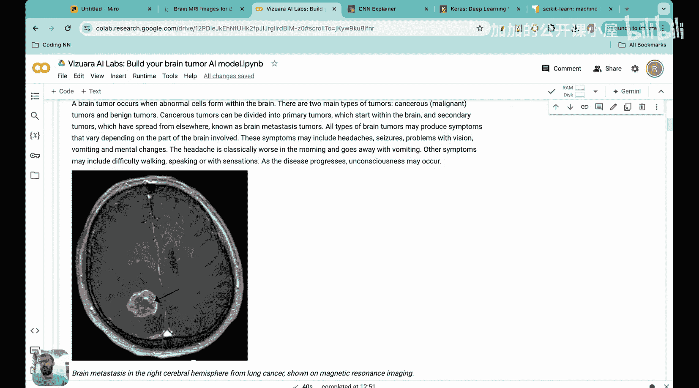
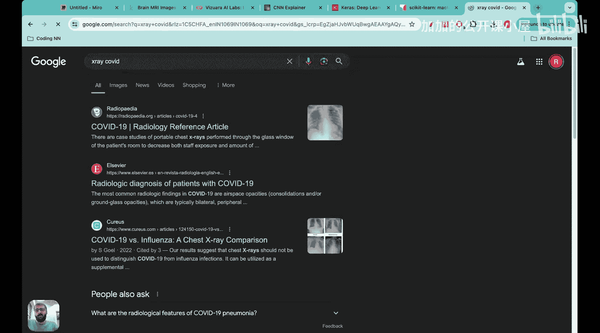
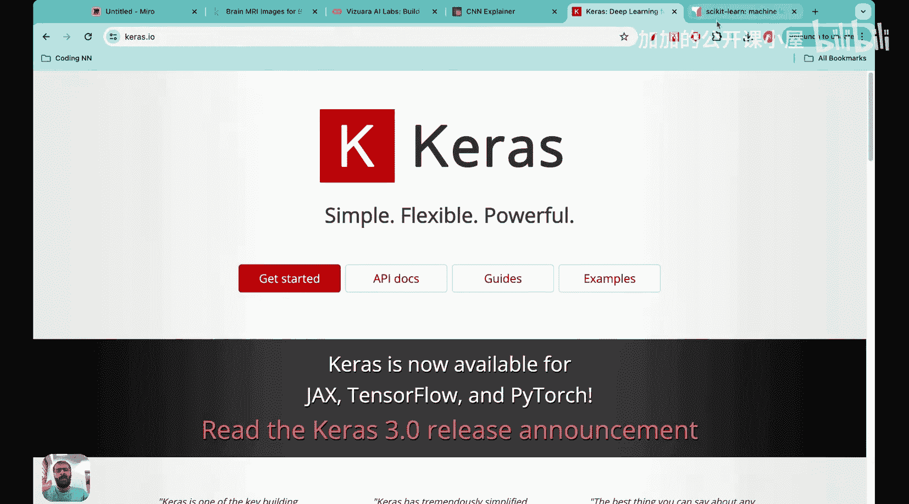
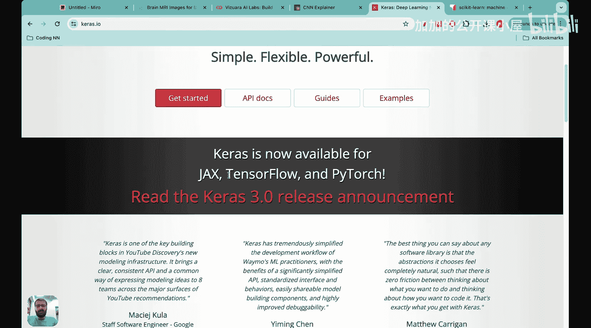
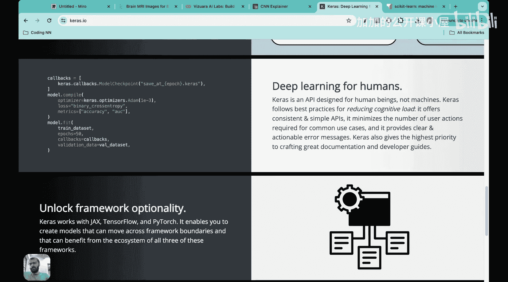
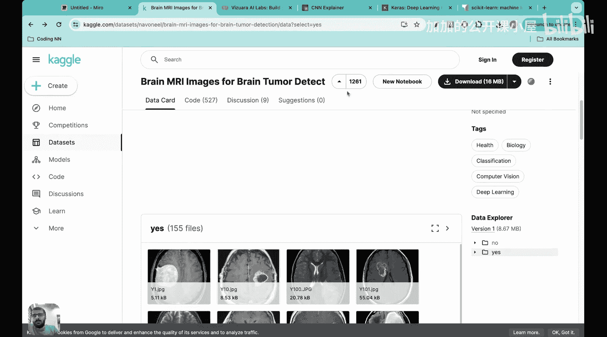

#  037：使用Python构建脑肿瘤分类CNN应用 🧠


在本节课中，我们将动手构建一个卷积神经网络模型，并将其应用于一个实际项目：开发一个能够根据MRI扫描图像判断是否存在脑肿瘤的人工智能模型。这是一个极佳的实践项目，能帮助你深入理解CNN的实际应用。

## 项目概述与目标

上一节我们介绍了课程目标，本节中我们来看看项目的具体细节和数据。

我们的目标是构建一个AI模型，它可以分析MRI扫描图像，并将其分类为“存在肿瘤”或“不存在肿瘤”。首先，让我们了解项目概览、目标以及我们将要使用的数据集。

以下是数据集的关键信息：
*   **数据来源**：数据集托管在Kaggle平台上，这是一个进行机器学习项目和竞赛的网站。
*   **数据标签**：数据集包含两个标签：“yes”（存在肿瘤）和“no”（不存在肿瘤）。
*   **数据格式**：数据集由大量黑白MRI图像的JPG文件组成。
*   **数据可靠性**：该数据集获得了社区的高度认可（例如，获得“金星”标识和大量支持），表明其可靠，适合用于本项目。

项目的最终目标是：当输入一张新的MRI图像时，我们的CNN模型能够准确预测其中是否存在脑肿瘤。此外，在本项目结束时，我们还将开发并部署一个交互式仪表盘，以便与朋友、同事分享，或将其添加到个人简历中。

## 问题背景与意义

在理解了数据集之后，我们有必要思考一下这个项目试图解决的实际问题。

脑肿瘤是指大脑内异常细胞的形成。主要分为两种类型：**恶性**和**良性**。医生通过MRI扫描来诊断。我们进行这个项目的原因是，面对海量的MRI扫描图像，医生手动逐一诊断既耗时又费力。人工智能可以在这方面提供帮助，因为它能够在极短时间内完成分类任务，这在患者数量激增（例如疫情期间分析胸部X光片）时尤其有用。

## 环境设置与包导入

现在我们已经理解了项目和目标，接下来可以进入第二步：设置环境。





在这一部分，我们将加载和导入一些必要的Python包。这里重点介绍两个主要的机器学习包及其重要性。



**Keras** 是一个高级神经网络API，它提供了丰富的库函数，使得构建和训练机器学习模型（如CNN）变得非常简单。Keras与TensorFlow深度集成，其核心优势在于通过简洁的代码（例如 `model.compile()`, `model.fit()`）快速定义和训练模型，无需从零开始编写大量底层代码。



**Scikit-learn** 是一个功能强大的机器学习库。在本项目中，它将主要用于两个便捷功能：1）使用一行代码将数据集分割为训练集和测试集；2）轻松地对标签进行**独热编码**。



当然，我们还需要一些通用包，如用于科学计算的NumPy、用于数据处理的Pandas以及用于绘图的Matplotlib。

以下是需要导入的包和模块：

```python
import keras
from keras.models import Sequential
from keras.layers import Conv2D, MaxPooling2D, Flatten, Dense, Dropout, BatchNormalization
import numpy as np
import pandas as pd
import matplotlib.pyplot as plt
from sklearn.model_selection import train_test_split
from sklearn.preprocessing import OneHotEncoder
```

## 数据加载与预处理

导入必要的包之后，下一步是加载数据并进行预处理。

数据加载的具体步骤是：从Kaggle下载数据集，然后上传到Google云端硬盘。接着，在Google Colab中挂载云端硬盘，以便访问存储在那里的数据。

数据预处理的第一步是合并图像。数据集按标签（“yes”和“no”）分别存放在两个文件夹中。我们需要先将所有图像合并到一个列表中，然后再将其分割为训练集和测试集。

具体做法是：假设“no”文件夹有500张图像，“yes”文件夹有500张图像。我们将首先把所有1000张图像路径（或图像数据）追加在一起，并创建对应的标签列表，然后再进行训练/测试分割。

---



本节课中，我们一起学习了脑肿瘤分类CNN项目的目标、背景意义，并完成了环境设置、必要库的导入，以及数据加载与预处理的第一步规划。在接下来的课程中，我们将继续完成数据读取、模型构建、训练和评估等步骤。