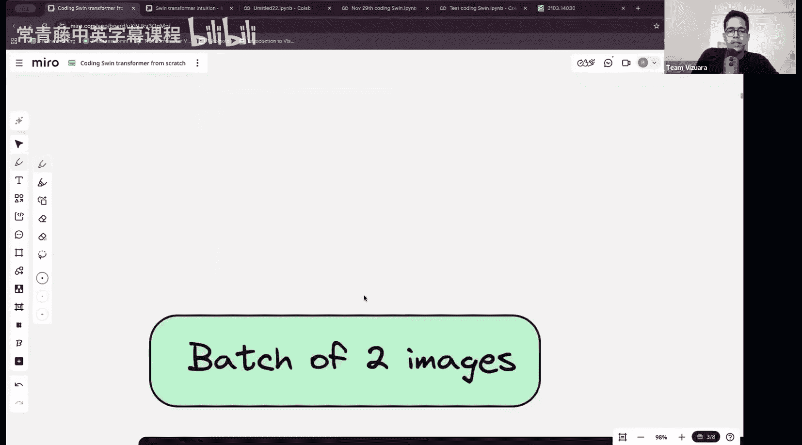
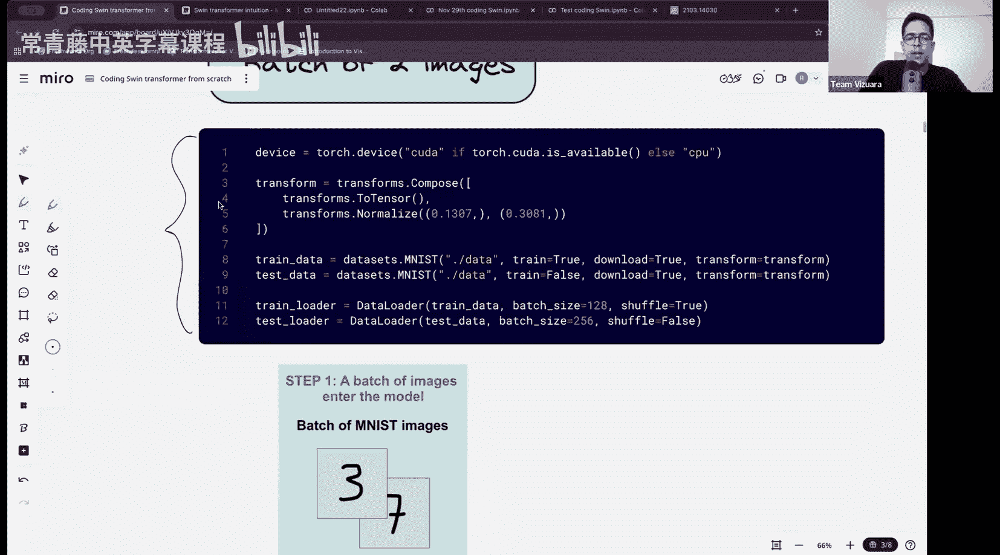
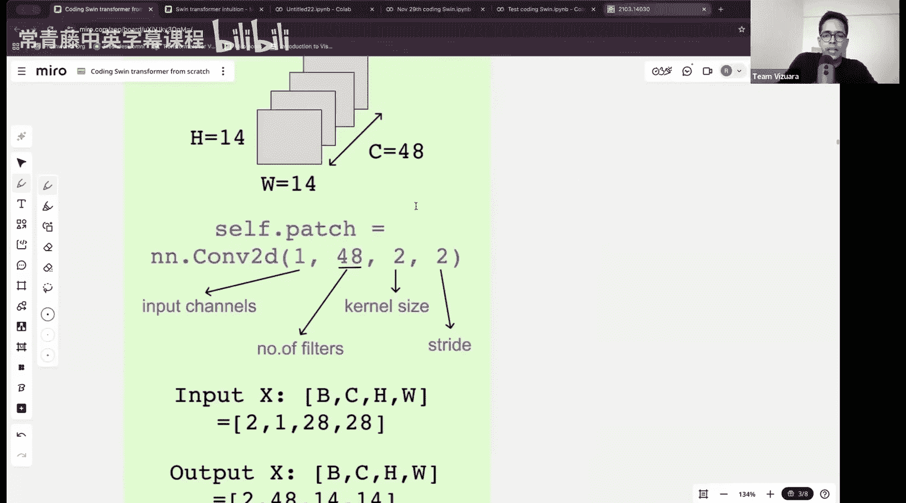
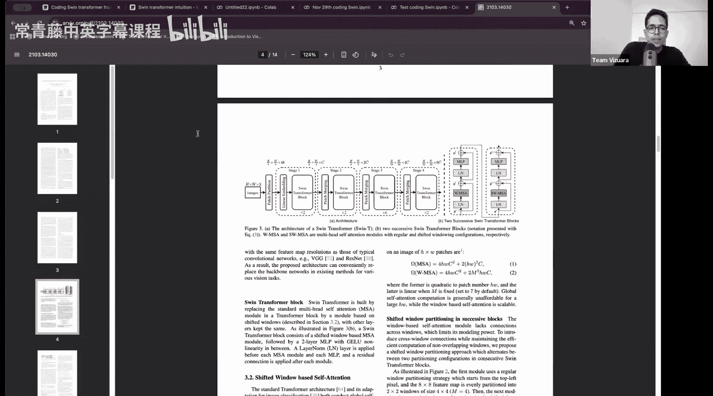
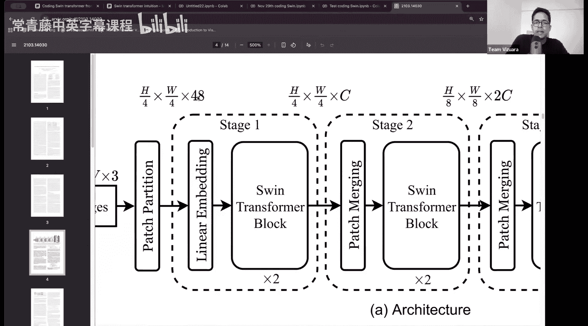

#  001：从零开始编写Swin Transformer

在本节课中，我们将从零开始编写一个Swin Transformer模型。上一节我们介绍了Swin Transformer的架构及其与Vision Transformer的区别。本节我们将专注于代码实现。

## 概述

Swin Transformer是一种通用的、基于Transformer的图像处理架构。论文中展示了它在图像分类、目标检测和语义分割等任务上的应用。本节课我们将聚焦于图像分类任务。

## 架构回顾

Swin Transformer的架构如图所示。输入图像的高度为H，宽度为W，通道数为C（例如，对于MNIST数据集，C=1）。模型首先将图像分割成不重叠的**图像块**。

以下是处理流程：
*   图像被分割成大小为2x2的块。
*   每个块通过一个线性嵌入层，将通道数从48投影到指定的嵌入维度C。
*   随后是多个重复的Swin Transformer阶段（Stage）。
*   每个阶段内部包含两种核心模块：**常规窗口Transformer块**和**移位窗口Transformer块**。

需要注意的是，图中未显示Transformer块之后的处理流程。实际上，上下文向量会经过全局平均池化层，然后才连接到分类头（一个全连接网络）。这部分结构会根据具体任务（分类、检测或分割）进行调整。

## 核心概念：注意力机制

在Swin Transformer中，注意力计算是核心。标准的注意力权重计算公式如下：
`alpha_ij = softmax( (Q_i * K_j^T) / sqrt(d) )`
其中，`alpha_ij`是查询向量`Q_i`和键向量`K_j`之间的注意力权重，`d`是向量的维度。上下文向量通过将注意力权重与值向量`V`相乘得到。

然而，Swin Transformer对此进行了修改：
*   **常规窗口多头自注意力**：在标准注意力公式的基础上，增加了一个**相对位置偏置项** `B_ij`。公式变为：
    `alpha_ij = softmax( (Q_i * K_j^T) / sqrt(d) + B_ij )`
*   **移位窗口多头自注意力**：在常规窗口注意力的基础上，引入了**掩码项** `mask_ij`。这是为了阻止属于不同窗口的图像块之间相互计算注意力。公式变为：
    `alpha_ij = softmax( (Q_i * K_j^T) / sqrt(d) + B_ij + mask_ij )`

除了注意力计算部分，Swin Transformer块的其他组件（如层归一化、多层感知机、残差连接）与标准Transformer保持一致。

## 输入处理流程

让我们以MNIST数据集为例，具体说明输入图像的处理过程。MNIST图像是单通道（黑白）的，尺寸为28x28。

单个图像的原始形状为 `(C, H, W)`，即 `(1, 28, 28)`。在批处理中，我们会增加一个批次维度`B`。假设批次大小为2，那么输入张量的形状就是 `(B, C, H, W)`，即 `(2, 1, 28, 28)`。

处理的第一步是**图像块嵌入**。这通常通过一个二维卷积层（`nn.Conv2d`）来实现。例如，可以使用以下代码：
`nn.Conv2d(in_channels=1, out_channels=48, kernel_size=2, stride=2)`
参数解释如下：
*   `in_channels=1`：输入图像的通道数（MNIST为1）。
*   `out_channels=48`：输出通道数，对应Swin Transformer架构中图像块嵌入后的通道数。
*   `kernel_size=2`：卷积核大小，决定了每个图像块的大小为2x2。
*   `stride=2`：步长为2，确保生成不重叠的图像块。

经过这个卷积操作后，输入图像被转换为图像块。原始图像在高度和宽度上分别被分割成 `H/2` 和 `W/2` 个块，因此总的图像块数量为 `(H * W) / 4`。对于28x28的MNIST图像，将得到 `(28*28)/4 = 196` 个图像块。

每个图像块的形状从 `(1, 2, 2)` 变为 `(48, 1, 1)`。这意味着空间维度被压缩，而通道维度增加到了48。这为后续的Transformer处理做好了准备。

## 总结

本节课我们一起回顾了Swin Transformer的核心架构，重点讲解了其独特的窗口注意力机制（包括常规窗口和移位窗口），并详细分析了输入图像从原始格式到图像块嵌入的整个处理流程。理解这些基础概念对于后续的代码实现至关重要。下一节，我们将开始动手编写Swin Transformer的各个模块。