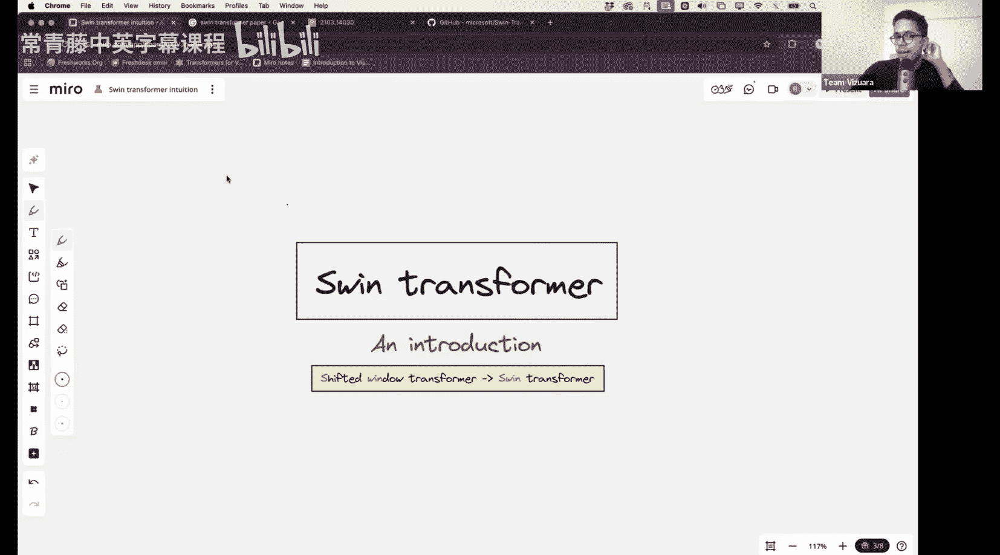
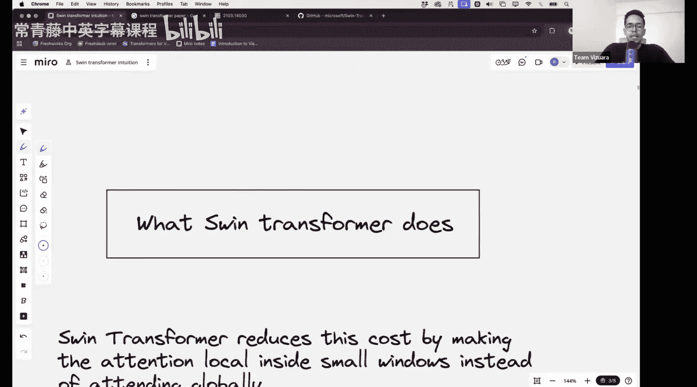

#  002：Swin Transformer 原理与代码实现

在本节课中，我们将要学习Swin Transformer架构。这是一种对之前学习的Vision Transformer和Data-efficient Image Transformer的自然扩展，旨在解决Vision Transformer在处理高分辨率图像时计算复杂度高的问题。

上一节我们介绍了Vision Transformer的基本工作原理，本节中我们来看看Swin Transformer如何通过巧妙的“窗口”和“移位”机制，在保持强大建模能力的同时，显著降低计算开销。

## 课程概述

Swin Transformer是微软亚洲研究院在2021年提出的重要工作，论文引用量超过38,000次。它首次令人信服地证明了Transformer架构可以作为通用视觉任务（如分类、检测、分割）的强大骨干网络。然而，原始论文内容非常密集，因此我们将花大量时间来深入理解其架构本身。

Swin Transformer是“Shifted Window Transformer”的缩写。它与Vision Transformer有许多相似之处，但也存在关键差异。其核心思想是将全局注意力计算限制在局部窗口内，从而将计算复杂度从**二次方**降低到**线性**。

## Vision Transformer的计算瓶颈

在深入Swin之前，让我们先回顾Vision Transformer的计算挑战。

在Vision Transformer中，一张尺寸为 `H x W`、通道数为 `C` 的图像被分割成多个不重叠的 `P x P` 大小的图像块。每个图像块被视为一个“令牌”。

*   图像块总数（即令牌数 `N`）的计算公式为：
    `N = (H / P) * (W / P)`

*   自注意力机制的核心计算是查询向量 `Q` 与键向量 `K` 的点积。其计算复杂度与 `N^2` 成正比，即 `O(N^2)`。

*   由于 `N` 与图像总像素数 `(H * W)` 成正比，因此注意力计算的复杂度实际上与**图像尺寸的平方**成正比。这意味着，如果将图像分辨率提高一倍（像素数变为4倍），计算复杂度将增加16倍（4的平方）。这种**二次方复杂度**是Vision Transformer处理高分辨率图像（如语义分割任务所需）时的主要瓶颈。

## Swin Transformer的核心思想：局部窗口注意力

Swin Transformer通过将全局注意力计算限制在**局部窗口**内来解决上述问题。

以下是其核心思路：

1.  **划分窗口**：将图像令牌均匀地划分为多个不重叠的局部窗口（例如，每个窗口包含 `M x M` 个令牌）。
2.  **窗口内自注意力**：自注意力计算仅在每个窗口内部独立进行。一个窗口内的令牌只与该窗口内的其他令牌计算注意力，而不与窗口外的令牌交互。
3.  **计算复杂度分析**：假设每个窗口有 `M^2` 个令牌，总共有 `N / M^2` 个窗口。那么，单个窗口内的注意力复杂度为 `O(M^4)`。由于窗口之间计算独立，总复杂度为 `(N / M^2) * O(M^4) = O(N * M^2)`。当窗口大小 `M` 固定时（论文中常设为7），总复杂度与令牌总数 `N` 成**线性关系**，即 `O(N)`。这相比Vision Transformer的 `O(N^2)` 是巨大的改进。

## 局部窗口的局限性及“移位窗口”解决方案

然而，仅使用固定窗口会带来一个新问题：**窗口之间缺乏信息交互**。一个窗口内的模型无法“看到”或“关注”到其他窗口的内容，这限制了模型的全局建模能力。

为了解决这个问题，Swin Transformer引入了巧妙的**移位窗口**机制。

其工作流程如下：

1.  **常规窗口划分**：在Transformer的某个层（如第 `L` 层），使用标准的均匀窗口划分方式进行窗口内自注意力计算。
2.  **移位窗口划分**：在下一层（第 `L+1` 层），将窗口划分的起点进行**偏移**（例如，向右和向下各偏移 `[M/2]` 个令牌）。这使得新的窗口由上一层中不同窗口的部分令牌组成。
3.  **促进跨窗口连接**：通过这种移位操作，上一层中相邻窗口的边界区域在下一层中被组合到了同一个新窗口中。这样，在计算新窗口的自注意力时，原本属于不同窗口的令牌之间就能建立联系，从而实现了跨窗口的信息传递。

通过交替使用常规窗口和移位窗口，Swin Transformer在保持线性计算复杂度的同时，获得了接近全局注意力的强大建模能力。

## 架构图示意

（此处应有一张Swin Transformer的架构示意图，展示其层级结构、窗口划分、移位操作以及特征图下采样过程。由于我无法直接显示图片，请参考原视频或论文中的图示以获取最直观的理解。）

该架构图通常会显示：
*   输入图像经过“Patch Partition”和“Linear Embedding”后变为令牌序列。
*   随后是多个“Stage”，每个Stage由若干Swin Transformer Block组成，并在Stage之间进行“Patch Merging”以降低分辨率、增加通道数，构建金字塔特征。
*   每个Swin Transformer Block内部包含基于窗口的多头自注意力模块和MLP模块，并配有层归一化和残差连接。
*   相邻的Block会分别采用“W-MSA”（常规窗口多头自注意力）和“SW-MSA”（移位窗口多头自注意力）。

## 关键实现细节与挑战

在下一讲的代码实现中，我们将具体面对以下几个不直观但至关重要的实现细节：

以下是几个核心挑战：

*   **移位后的高效批处理**：移位操作会导致窗口数量增加且大小不一，无法直接进行高效的批处理计算。论文中采用了**循环移位**和**掩码**的技巧，将移位后的特征图“卷回”成一个规整的矩形，并对不应产生注意力的区域进行掩码，从而在维持窗口规整形状的同时实现了等效的移位窗口注意力计算。
*   **相对位置偏置**：Swin Transformer在自注意力计算中加入了**相对位置偏置** `B`，其公式可表示为：
    `Attention(Q, K, V) = SoftMax(QK^T / sqrt(d) + B) V`
    其中 `B` 是一个可学习的参数，其维度与注意力权重的空间维度相关。它帮助模型理解窗口内令牌之间的相对位置关系。
*   **层级特征金字塔**：与Vision Transformer输出单一尺度特征不同，Swin Transformer通过“Patch Merging”操作，像CNN一样构建了多尺度特征金字塔。这使得其输出特征可以直接用于需要多尺度信息的密集预测任务（如目标检测、语义分割）。

## 总结

本节课中我们一起学习了Swin Transformer的核心原理。我们首先回顾了Vision Transformer因全局注意力导致的二次方计算复杂度问题。接着，我们深入探讨了Swin Transformer如何通过**局部窗口注意力**将复杂度降至线性，并利用**移位窗口**机制在连续的Transformer层中实现跨窗口通信，从而兼顾了计算效率和模型表达能力。我们还简要预览了实现中的关键挑战，如高效批处理和相对位置偏置。

在下一讲中，我们将把这些理论付诸实践，从零开始编写Swin Transformer的代码，亲身体验其精妙的设计与实现细节。请务必在下次课前复习本节课内容，为接下来的代码实战做好准备。