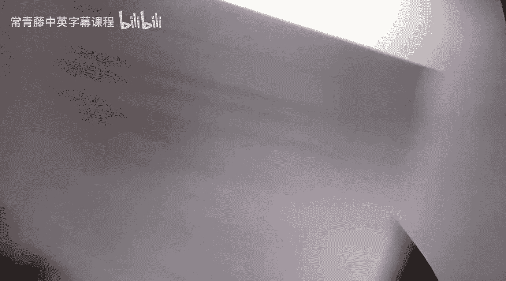
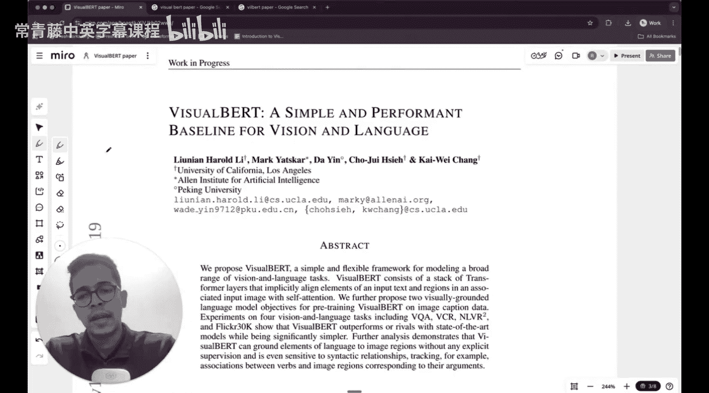

#  003：VisualBERT论文解析

在本节课中，我们将学习一篇名为VisualBERT的论文。这篇论文提出了一种用于视觉与语言任务的简单而有效的基线模型。我们将详细解析其核心思想、模型架构以及训练方法。

---

## 论文概述

VisualBERT是一个用于建模多种视觉与语言任务的简单灵活框架。它由一系列Transformer层组成，通过自注意力机制隐式地对齐输入文本中的元素与关联图像中的区域。

上一节我们介绍了多模态学习的基本概念，本节中我们来看看VisualBERT如何具体实现视觉与文本的融合。

---

## 模型架构

VisualBERT的核心思想是将文本和图像信息共同输入到一个Transformer模型中。以下是其关键组成部分：

1.  **文本输入处理**：文本首先被转换为词嵌入向量。
    *   `text_embeddings = EmbeddingLayer(text_tokens)`

2.  **图像输入处理**：图像通过一个预训练的目标检测模型（如Faster R-CNN）进行处理，提取出图像中各个区域的视觉特征。
    *   `visual_features = ObjectDetector(image)`

3.  **模态融合**：文本嵌入和视觉特征被拼接在一起，形成一个统一的输入序列，然后送入Transformer编码器。
    *   `combined_input = Concat([text_embeddings, visual_features])`
    *   `output = TransformerEncoder(combined_input)`

4.  **自注意力对齐**：在Transformer内部，自注意力机制允许文本标记和视觉区域标记之间进行交互，从而学习它们之间的对齐关系。

---

## 预训练任务

为了训练VisualBERT模型，论文提出了两种视觉基础的语言模型目标。以下是这两种预训练任务：

*   **掩码语言建模**：随机掩码掉部分文本标记，模型需要根据上下文（包括图像信息）来预测这些被掩码的标记。
*   **句子-图像预测**：给定一个句子和一张图像，模型需要判断该句子是否准确地描述了图像内容。

---

## 实验与结果

VisualBERT在多个视觉与语言任务上进行了评估，并取得了优异的表现。以下是其主要评估的数据集：

*   **VQA**：视觉问答
*   **VCR**：视觉常识推理
*   **NLVR2**：自然语言视觉推理（使用真实图像）
*   **Flickr30K**：图像描述数据集

实验结果表明，VisualBERT在保持模型结构相对简单的同时，其性能达到或超越了当时的先进模型。

---

## 总结

本节课中我们一起学习了VisualBERT论文。我们了解了它如何利用Transformer架构和自注意力机制来融合与对齐视觉和文本信息。通过两种特定的预训练任务，模型能够学习到跨模态的表示，进而在多个下游任务上取得优秀效果。这篇论文为后续的视觉-语言模型研究提供了一个清晰而强大的基线。