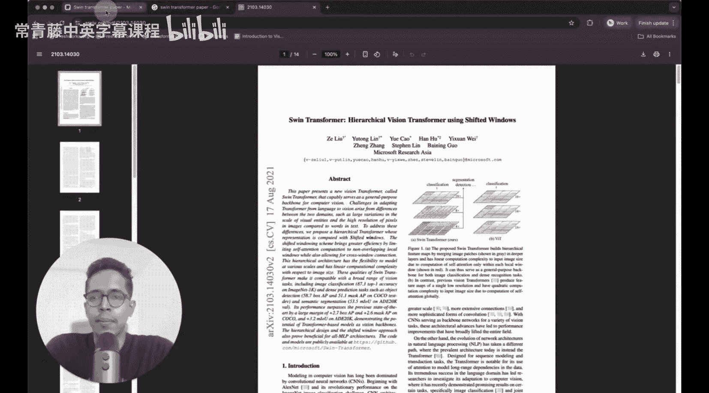
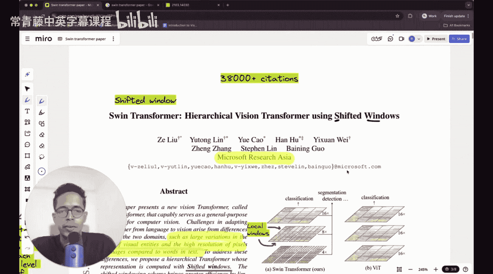

#  004：Swin Transformer论文精读 - 使用移位窗口的分层视觉Transformer

在本节课中，我们将要学习Swin Transformer这篇开创性论文。Swin Transformer提出了一种新的视觉Transformer架构，它通过引入分层设计和移位窗口机制，解决了标准视觉Transformer在处理高分辨率图像时计算复杂度高的问题，并成功地将Transformer确立为计算机视觉任务的通用骨干网络。

---

## 摘要

本文提出了一种名为Swin Transformer的新视觉Transformer，它能够作为计算机视觉的通用骨干网络。

将Transformer从语言领域适配到视觉领域所面临的挑战，源于两个领域之间的差异，例如视觉实体在尺度上的巨大变化。

---

## 引言

上一节我们介绍了论文的摘要和核心贡献。本节中，我们来看看论文的引言部分，了解研究背景和动机。

将Transformer从语言领域应用到视觉领域存在挑战。一个关键问题是视觉元素（如物体）的尺度变化很大，这与语言中固定尺度的词元不同。

视觉Transformer（ViT）通过将图像分割成固定大小的块（patch）来处理图像，然后在这些块上应用标准的Transformer。然而，ViT的注意力机制是全局的，其计算复杂度与图像块数量的平方成正比，这使得它难以处理高分辨率图像。

Swin Transformer通过两个主要思想来解决这个问题：
1.  **分层特征图**：它像卷积神经网络（CNN）一样，构建了从小到大的分层特征图。
2.  **移位窗口自注意力**：它在不重叠的局部窗口内计算自注意力，并通过在连续层之间“移位”窗口来引入跨窗口连接，从而在保持线性计算复杂度的同时获得全局建模能力。

---

## 方法

在理解了研究动机之后，我们现在深入探讨Swin Transformer的具体架构和核心组件。

### 整体架构概述

Swin Transformer的整体架构如下图所示。它首先将输入图像分割成不重叠的块（类似于ViT），然后通过多个“阶段”进行处理。每个阶段都由一个**Patch Merging**层和若干个**Swin Transformer Block**组成。

以下是架构的关键组成部分：

*   **Patch Partition**：将RGB图像分割成4x4大小的小块，每个块被展平为一个特征向量。对于一个HxWx3的图像，这将产生 (H/4) * (W/4) 个特征向量，每个向量的维度是 4*4*3 = 48。
*   **Linear Embedding**：一个线性层，将每个块的特征投影到一个任意维度（记为C）。此时的特征图尺寸为 (H/4) x (W/4) x C。
*   **Swin Transformer Blocks**：核心计算单元。每个块包含基于窗口的多头自注意力（W-MSA）或移位窗口多头自注意力（SW-MSA），以及多层感知机（MLP），中间有层归一化（LN）和残差连接。
*   **Patch Merging**：用于构建分层特征图。它将相邻的2x2小块特征合并，并将通道数增加一倍（类似于CNN中的池化或步幅卷积），从而在降低空间分辨率的同时增加特征维度。

### 基于窗口的自注意力

标准的多头自注意力（MSA）计算所有块之间的关系，其计算复杂度相对于块数量是二次方的。

为了高效建模，Swin Transformer在**不重叠的局部窗口**内计算自注意力。假设特征图被均匀划分为 M x M 个窗口，则基于窗口的自注意力（W-MSA）的复杂度为：

**公式：**
`复杂度(W-MSA) = O((HW / M^2) * (M^2 * C^2)) = O(HWC^2)`

其中，`HW`是总块数，`M^2`是每个窗口的块数。可以看到，复杂度与图像尺寸（HW）呈**线性关系**，这比全局注意力的二次方复杂度高效得多。

### 移位窗口自注意力

然而，仅在非重叠窗口内进行自注意力会限制跨窗口的信息交互。为了解决这个问题，Swin Transformer引入了**移位窗口自注意力（SW-MSA）**。

以下是其工作原理的步骤：

1.  在Swin Transformer的连续两个块中，分别使用不同的窗口划分方式。
2.  第一个块使用常规的窗口划分（从左上角开始）。
3.  第二个块将窗口网格**向左上角方向各移动 (M/2) 个块**（M是窗口大小），从而产生新的、与上一层窗口有重叠的窗口划分。
4.  这种移位操作引入了上一层不同窗口之间的连接，从而实现了跨窗口的信息传递。

移位窗口的一个实际挑战是会产生大小不一的窗口。论文采用了一种巧妙的**循环移位（cyclic shift）**和**掩码（masking）** 方法来解决：
*   将移位后的特征图进行循环填充，使其能被均匀划分。
*   在计算自注意力时，使用注意力掩码来确保只有原本相邻的块之间才能进行注意力计算，而“拼接”过来的不相邻块之间则被屏蔽。

### 相对位置偏置

在自注意力计算中，Swin Transformer加入了**相对位置偏置（Relative Position Bias）**，这比使用绝对位置嵌入效果更好。

**公式：**
`Attention(Q, K, V) = SoftMax(QK^T / sqrt(d) + B) * V`

其中，`B` 是一个可学习的矩阵，其每个元素 `B_{ij}` 表示查询块 `i` 和键块 `j` 之间的相对位置偏置。由于窗口大小固定（如7x7），可能的相对位置是有限的（例如，对于7x7窗口，有49种相对偏移），因此 `B` 是一个大小固定的可学习参数表。

---

## 实验与结果

了解了核心方法后，我们来看看作者如何通过实验验证Swin Transformer的有效性。

论文在图像分类（ImageNet）、目标检测（COCO）和语义分割（ADE20K）等多个核心视觉任务上进行了广泛的实验。

以下是主要实验结果概述：

*   **图像分类**：在ImageNet-1K数据集上，Swin Transformer取得了与最先进的卷积网络和Transformer模型相当甚至更好的精度，同时具有更高的计算效率。
*   **目标检测与实例分割**：在COCO数据集上，Swin Transformer作为骨干网络，在多种检测器框架下（如Mask R-CNN、Cascade Mask R-CNN）均大幅超越了基于ResNet的基线模型。
*   **语义分割**：在ADE20K数据集上，Swin Transformer同样展示了卓越的性能，证明了其作为通用视觉骨干网络的能力。

此外，论文还进行了详细的消融研究，验证了移位窗口、相对位置偏置等关键设计的必要性。

---

## 总结

本节课中，我们一起学习了Swin Transformer这篇重要的论文。我们了解到，Swin Transformer通过引入**分层架构**和**移位窗口自注意力**机制，成功地将Transformer的高效建模能力扩展到了视觉领域。它解决了全局自注意力计算复杂度高的问题，并能够像CNN一样生成多尺度特征图，从而在图像分类、目标检测和分割等多种任务上取得了卓越的性能，真正成为了计算机视觉的通用骨干网络。

尽管论文的表述较为凝练，但其核心思想清晰而强大。理解Swin Transformer是掌握现代视觉Transformer架构的关键一步。