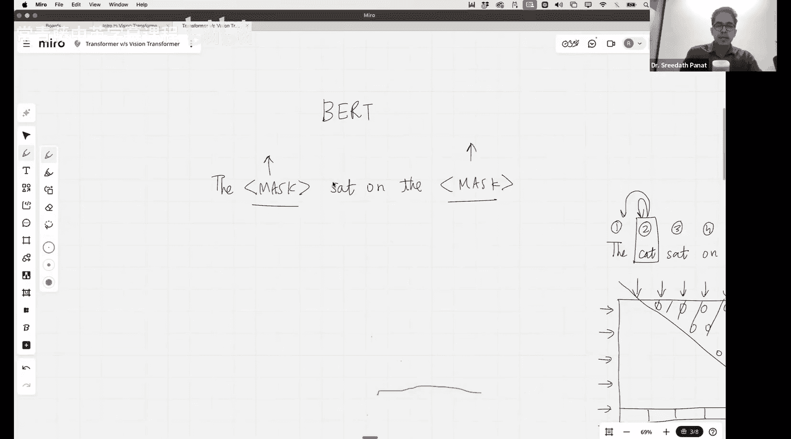
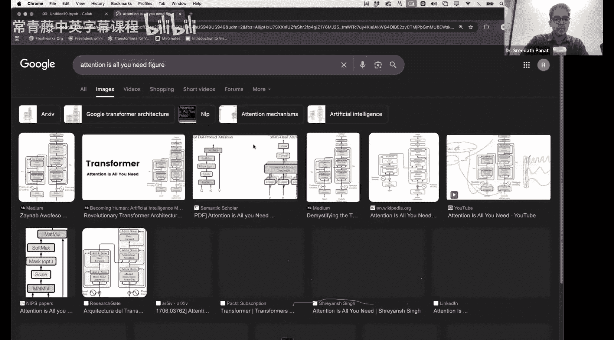
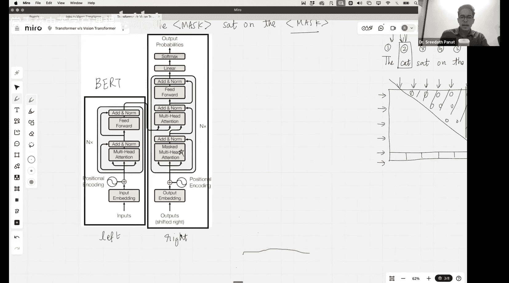

#  005：从零构建Vision Transformer与NanoVLM

在本节课中，我们将首次学习Vision Transformer。我们将理解其背后的直觉，了解它与用于文本数据的Transformer有何不同。建立直觉后，我们将从零开始编写一个Vision Transformer。我们将编写所有核心部分，并在适用时使用PyTorch库。我们还将从头开始训练它。课程结束时，如果你跟着一起编码，你将拥有一个在自己选择的数据集上构建并训练好的Vision Transformer。

## 概述

首先，我们来看看Vision Transformer的提出者。

Vision Transformer的思想由这篇论文提出，该论文最初于2020年发布，但在ICLR会议上正式发表是在2021年。这篇论文在三个月前有65,000次引用，现在已有76,000次。可以预见，几年后它将成为AI历史上被引用次数最高的论文之一。

这篇论文在“Attention Is All You Need”论文发表三年后出现，后者同样来自Google。这里需要注意的一点是，我记得在2022年，当OpenAI推出ChatGPT时，许多人在LinkedIn等平台上评论说Google在AI领域做得不多。但Google一直在AI领域做了大量工作，只是其中许多成果不一定在消费级产品领域，而是在研究领域。他们发表了许多出色的论文，并且Google内部不同的AI团队至今仍在不断产出新成果。

这篇论文的标题是“一张图片值16x16个词”。他们提出将Transformer架构用于图像分类任务。在他们的架构中，与“Attention Is All You Need”论文中提出的原始Transformer架构相比，只有非常少的改动或修改。

这是一篇内容密集但写得非常好的论文。如果你有兴趣，可以在我们的YouTube频道上观看一篇长达三个半小时的讲座视频，专门解读这篇Vision Transformer论文。但今天，我们不会详细讲解这篇论文，而是重点探讨Vision Transformer与我们在本系列中一直在研究的文本Transformer有何不同。我们想看看关键差异在哪里，相似之处又在哪里。

## 文本Transformer的工作原理

一个用于文本的Transformer工作原理如下：你有一个以提示形式输入的文本。然后，这个输入被**分词**，基本上就是将句子分割成一个个**词元**。你可以将词元想象成单词，但词元也可以是单词、子词等。接着，每个词元被转换成一个**向量**。如果是一个类似GPT-2的小型架构，向量维度是768，所以每个向量都位于一个768维的空间中。

因此，我们输入GPT的每个句子都会被转换成n个词元，每个词元又会被转换成768维的向量。对于每个词元，我们会添加一个称为**位置编码**的东西，这在之前的课程中讨论过。

但是，基于文本的Transformer和Vision Transformer之间的主要区别出现在计算注意力的部分。

## 文本Transformer中的注意力机制

在基于文本的Transformer中，我们使用一种称为**掩码自注意力**的机制。我们已经讨论过为什么要进行这种掩码。假设我们有一个句子：“The cat sat on the mat.” 如果我们把句子分成单词，这里有一、二、三、四、五、六个词元。这意味着有六个查询和六个键。

我们构建一个称为**注意力权重矩阵**的东西。你会有六个查询（沿着行）：The, cat, sat, on, the, mat。你会有六个键（沿着列）：The, cat, sat, on, the, mat。

我们在上一讲中讨论过掩码自注意力和多头自注意力。在掩码中，我们阻止当前查询关注未来的键。例如，如果“cat”是当前正在查看的查询，那么“cat”只能关注它自己和“The”，而不能关注“sat”、“on”、“the”、“mat”。我们这样做的原因是因为我们试图完成的任务——GPT试图完成的任务是**下一个词预测**。在下一个词预测中，你的当前查询不应该关注那些尚未出现的、属于未来的键。

为了实现这一点，我们构建了一个**上三角掩码**。它看起来像这样，在注意力权重矩阵中，这些元素都是零。所以，只有最后一个查询，即对应于“mat”的查询，会关注所有的键，因为在“mat”之后没有更多的查询了。因此，“mat”这个查询将有六个键可以关注。这就是我们在上一讲中讨论的内容。

## BERT模型中的注意力

但你也应该知道，GPT并不是唯一利用Transformer的现代架构。还有一个非常著名的架构叫做**BERT**。在BERT架构中，他们试图做的不是句子预测。

在BERT模型中，他们会输入一个像这样的句子：“The [MASK] sat on the [MASK].” 在BERT中，他们也利用了Transformer架构。他们不是试图做下一个词预测，而是输入句子，并试图预测这些掩码词元的值。

那么，在这种情况下，我们需要掩码注意力吗？我们应该使用像上一讲中GPT用于下一个词预测那样的因果自注意力吗？在这种情况下，我们会使用带掩码的注意力还是不带掩码的注意力？大多数人回答“不带掩码”，这是正确的。

因为在这种情况下，你不是试图预测下一个词，而是试图获取句子的完整上下文。这意味着，如果你掩码了当前查询和未来键之间的注意力，你将无法获得完整的上下文。这也是为什么，如果你打开“Attention Is All You Need”这篇论文（注意，这篇论文与GPT无关），你会看到这个架构图。

请看图的左侧部分和右侧部分。告诉我，你在哪里找到了掩码自注意力？是在左侧还是右侧？它在右侧。右侧有“掩码多头注意力”。左侧则没有掩码。

这意味着，哪个是GPT，哪个是BERT？是左侧还是右侧？本质上，这个Transformer架构同时包含编码器和解码器。但在BERT模型中，他们只使用了左侧部分。所以掩码多头注意力不存在。输入嵌入通过注意力层，再通过Transformer块，每个Transformer块包含一个**不带掩码的多头注意力**和一个**前馈多层感知机**，这个过程重复多次。

## 总结

本节课中，我们一起学习了Vision Transformer的起源及其与文本Transformer的核心区别。我们回顾了文本Transformer的工作原理，特别是GPT中使用的掩码自注意力机制，以及BERT中使用的非掩码自注意力机制。理解这些基础是至关重要的，因为Vision Transformer借鉴了这些思想，并将其应用于图像数据。在下一节中，我们将深入探讨Vision Transformer如何将图像转换成类似于文本词元的序列，并开始动手构建我们自己的模型。