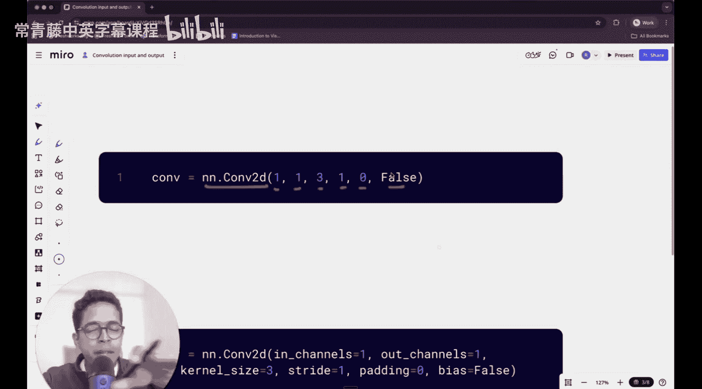
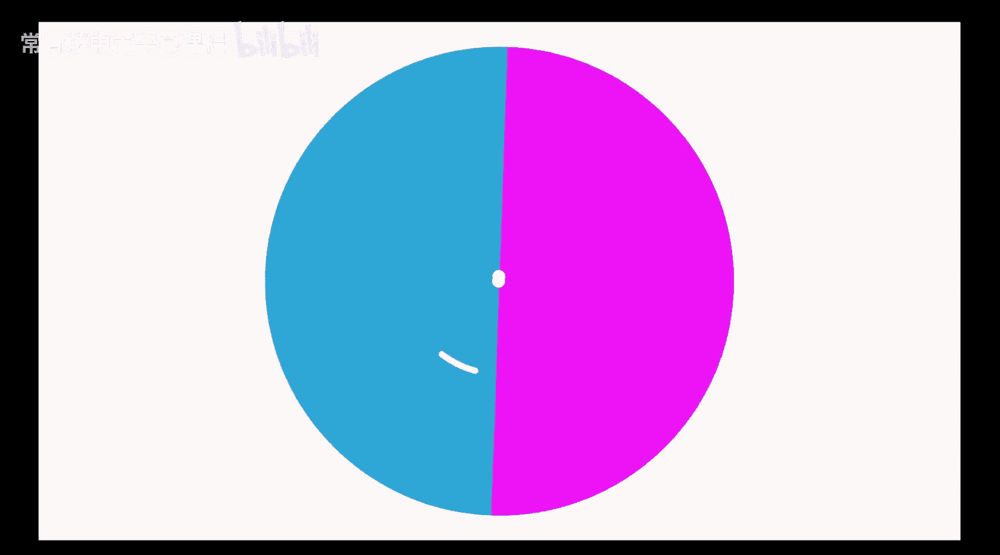
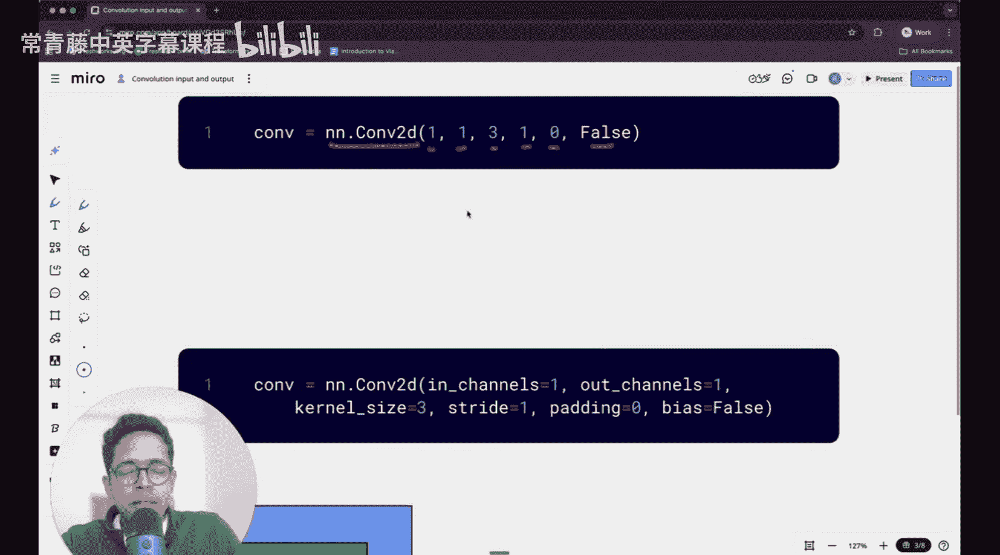
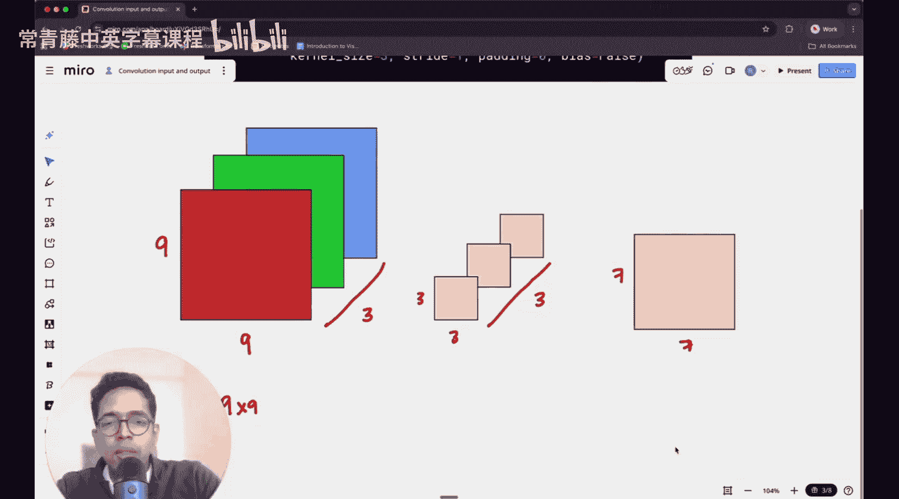
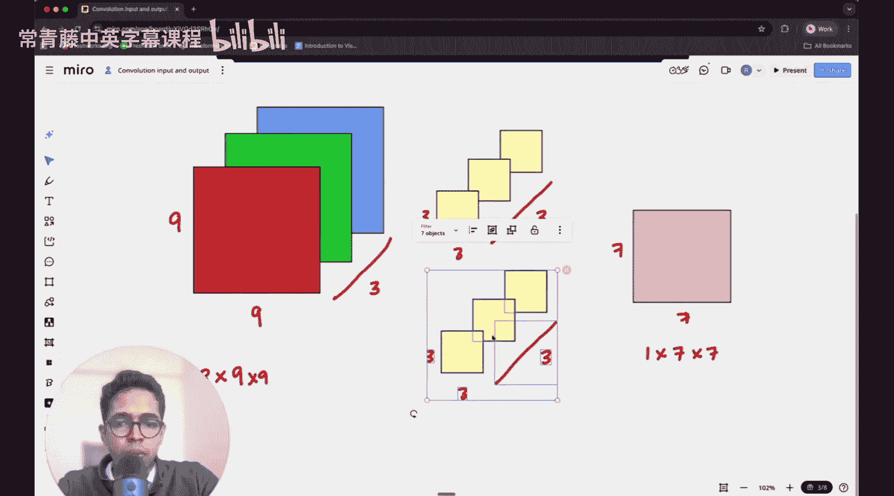
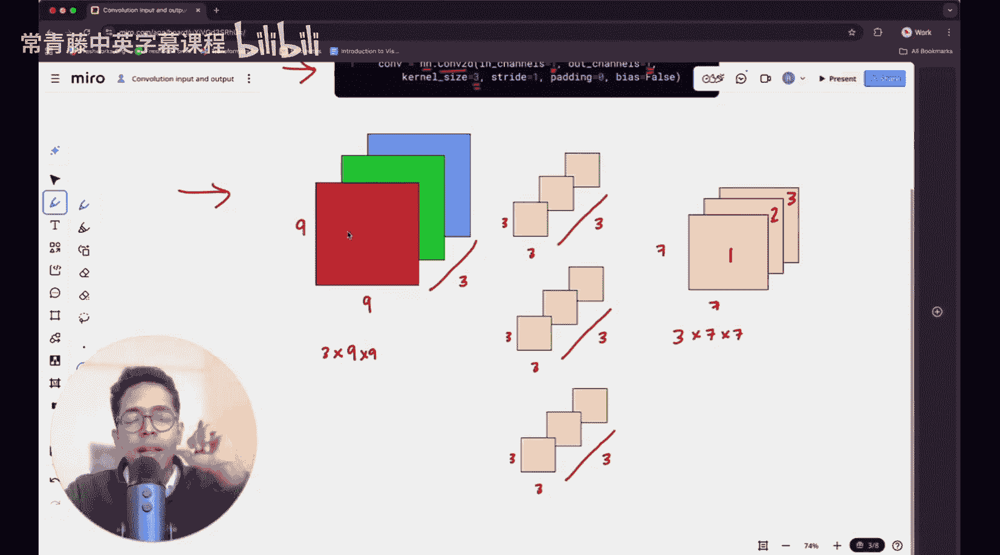

#  006：二维卷积的输入、输出与滤波器维度

在本节课中，我们将深入探讨二维卷积操作，特别是PyTorch中`nn.Conv2d`函数的输入、输出维度以及滤波器的工作原理。理解这些概念对于构建和优化卷积神经网络至关重要。

上一节我们介绍了卷积神经网络的基本概念，本节中我们来看看二维卷积的具体维度计算。





## 输入与输出维度解析




首先，我们来看一个典型的二维卷积定义：
```python
nn.Conv2d(in_channels=3, out_channels=64, kernel_size=3, stride=1, padding=0, bias=False)
```
以下是各参数的含义：
*   `in_channels`：输入数据的通道数。
*   `out_channels`：输出数据的通道数，也等于滤波器的数量。
*   `kernel_size`：滤波器（卷积核）的空间尺寸。
*   `stride`：卷积操作的步长。
*   `padding`：在输入数据边缘填充的像素数。
*   `bias`：是否使用偏置项。

## 维度计算示例


让我们通过一个具体例子来理解维度如何变化。


假设我们有一张输入图像，其尺寸为 `9 x 9` 像素，并且有3个颜色通道（RGB）。因此，输入张量的形状为 `(3, 9, 9)`。

我们使用一个 `3 x 3` 的滤波器进行卷积，步长`stride=1`，无填充`padding=0`。

**输出空间尺寸计算：**
输出宽度 = `(输入宽度 - 滤波器宽度 + 2 * 填充) / 步长 + 1`
输出高度 = `(输入高度 - 滤波器高度 + 2 * 填充) / 步长 + 1`

代入数值：
输出宽度 = `(9 - 3 + 2*0) / 1 + 1 = 7`
输出高度 = `(9 - 3 + 2*0) / 1 + 1 = 7`

因此，输出的空间尺寸为 `7 x 7`。

**输出通道数：**
输出通道数完全由 `out_channels` 参数决定，它等于我们使用的**滤波器数量**。
*   如果 `out_channels=1`，则无论输入有多少通道，输出都只有1个通道。这是因为单个滤波器会跨所有输入通道进行计算，并将结果求和，最终生成一个单通道的特征图。
*   如果 `out_channels=N`，则我们使用了N个独立的滤波器。每个滤波器都会独立地在输入上滑动，生成一个对应的输出通道。因此，最终会得到N个通道的输出。

在我们的例子中，如果设置 `out_channels=64`，那么输出张量的形状将是 `(64, 7, 7)`。



## 滤波器结构与可学习参数


理解滤波器结构是计算参数数量的关键。

每个滤波器本身是一个多维张量。其维度为：
`(in_channels, kernel_height, kernel_width)`

对于我们的例子（`in_channels=3, kernel_size=3`），**一个**滤波器的形状是 `(3, 3, 3)`，它包含 `3 * 3 * 3 = 27` 个可学习的权重参数。

**总参数数量计算：**
总参数数 = `out_channels * (in_channels * kernel_height * kernel_width)`



如果 `bias=True`，则每个输出通道还会增加一个偏置参数：
总参数数 = `out_channels * (in_channels * kernel_height * kernel_width + 1)`

在我们的例子中（`out_channels=64, in_channels=3, kernel_size=3, bias=False`）：
总参数数 = `64 * (3 * 3 * 3) = 64 * 27 = 1728`

这意味着该卷积层有1728个权重值会在训练过程中被优化。


## 总结


本节课中我们一起学习了二维卷积的核心维度概念。
*   输入维度由 `(in_channels, H_in, W_in)` 定义。
*   输出维度由 `(out_channels, H_out, W_out)` 定义，其中空间尺寸 `H_out` 和 `W_out` 由输入尺寸、滤波器尺寸、步长和填充共同决定。
*   `out_channels` 直接决定了滤波器的数量。
*   每个滤波器是一个 `(in_channels, kernel_height, kernel_width)` 的张量。
*   整个卷积层的可学习参数总数可以通过 `out_channels * in_channels * kernel_height * kernel_width`（无偏置时）快速计算。



清晰理解这些关系，是设计、调试和优化卷积神经网络架构的基础。