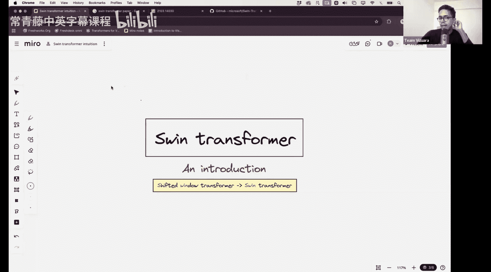
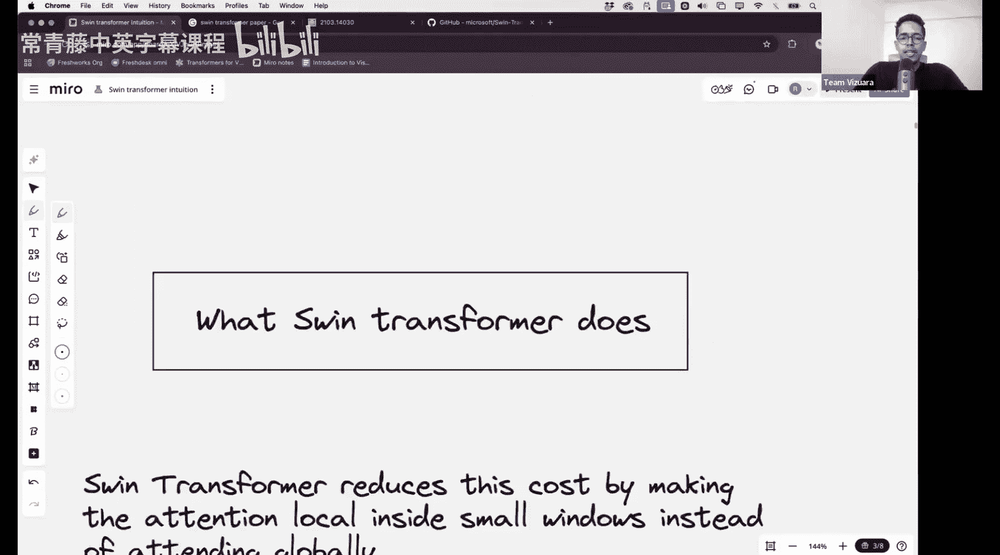

#  007：Swin Transformer简介 🏗️

在本节课中，我们将要学习Swin Transformer架构。这是一种对之前学习的Vision Transformer和Data-efficient Image Transformer的自然扩展，旨在解决高分辨率图像处理中的计算效率问题。

## 概述

Swin Transformer是“Shifted Window Transformer”的简称。它由微软亚洲研究院团队于2021年提出，论文已获得约38，000次引用。该架构首次令人信服地证明了Transformer可以作为通用图像任务（如分类、检测、分割）的强大骨干网络。然而，其原始论文内容较为密集，因此我们将花时间深入理解其架构本身。

上一节我们回顾了Vision Transformer的基本流程，本节中我们来看看Swin Transformer如何对其进行改进。

## Vision Transformer的回顾与挑战

在Vision Transformer中，处理流程可简要概括如下：
1.  输入图像尺寸为 `H x W x C`（高 x 宽 x 通道数）。
2.  图像被分割成不重叠的 `P x P` 大小的图像块。
3.  每个图像块被视为一个令牌（Token），并被展平。因此，令牌总数 `N` 为：
    `N = (H / P) * (W / P)`
4.  添加一个分类令牌（CLS Token）和位置编码。
5.  整个令牌序列输入到Transformer编码器中。
6.  最终，分类令牌的上下文向量被送入MLP分类头进行图像分类。

Data-efficient Image Transformer在此基础上引入了额外的蒸馏令牌（Distillation Token），用于从教师模型的预测中学习。

尽管Vision Transformer性能卓越，但它存在一个关键的计算问题：自注意力机制的复杂度。

## 自注意力的计算复杂度问题

自注意力机制的核心计算涉及查询（Query）和键（Key）的点积：`Q · K^T`。

以下是其复杂度分析：
*   假设有 `N` 个令牌。
*   每个查询需要与所有 `N` 个键进行计算。
*   因此，计算复杂度与 `N^2` 成正比，即 **O(N^2)**。

由于 `N` 与图像总像素数 `H * W` 成正比，这意味着：
*   如果将图像分辨率（像素总数）提高至2倍，`N` 大约变为2倍。
*   但注意力计算复杂度将增加至原来的 **4倍**（即 `2^2`）。
*   这种**二次方复杂度**使得Vision Transformer在处理需要高分辨率图像的任务（如语义分割）时面临巨大挑战。

## Swin Transformer的核心思想：局部窗口注意力

为了解决二次方复杂度问题，Swin Transformer提出了**局部窗口注意力**机制。

其核心思想是：
*   不再让图像中的所有令牌进行全局交互。
*   而是将图像划分为多个不重叠的**局部窗口**。
*   自注意力计算**仅在每个窗口内部**独立进行。

例如，一个 `2x2` 的令牌窗口内，只有这4个令牌之间会计算注意力。

以下是这种设计带来的优势：
*   **线性复杂度**：对于一个有 `M` 个令牌的窗口，其内部注意力复杂度为 `O(M^2)`。如果将图像均匀划分为大小固定的窗口，那么总计算复杂度与图像中的窗口数量呈线性关系，从而实现了相对于图像分辨率的近似线性复杂度。
*   **效率提升**：这显著降低了在高分辨率图像上的计算开销。

然而，仅使用固定窗口会带来一个新问题：**窗口之间缺乏信息交互**。这限制了模型建立长距离依赖关系的能力。

## 解决方案：窗口移位（Shifted Window）

为了解决窗口间信息隔离的问题，Swin Transformer在连续的Transformer块中采用了**窗口移位**策略。

其工作原理如下：
1.  在第一个块中，使用常规的窗口划分方式计算局部窗口注意力。
2.  在下一个块中，将窗口**向对角线方向移动**（例如，移动 `(窗口大小/2)` 个像素）。
3.  这种移位产生了新的、与上一层窗口重叠的新窗口。
4.  在新窗口内再次计算注意力。

通过这种巧妙的移位，上一层中不同窗口的令牌在下一层就有机会在同一个新窗口内进行交互。这在不引入额外计算复杂度的前提下，实现了跨窗口的信息流通，从而能够构建全局的上下文信息。

## 架构图示意

（注：此处应有一张展示Swin Transformer层级结构、窗口划分及移位机制的示意图。图中通常会显示特征图尺寸逐渐减小、通道数增加的金字塔结构，以及相邻层之间窗口的偏移。）

## 总结

本节课中我们一起学习了Swin Transformer的核心理念。我们首先回顾了Vision Transformer及其存在的二次方计算复杂度问题。接着，我们探讨了Swin Transformer如何通过**局部窗口注意力**将复杂度降低至线性级别。最后，我们介绍了**窗口移位**这一关键技巧，它确保了在保持计算效率的同时，模型仍能捕获跨窗口的全局依赖关系。Swin Transformer通过这种层次化、移位窗口的设计，为Transformer在视觉任务中处理高分辨率图像铺平了道路。

在下节课中，我们将动手从零开始实现Swin Transformer，深入其代码细节。由于实现中有一些不直观的部分，请务必在课前复习本节课的内容。