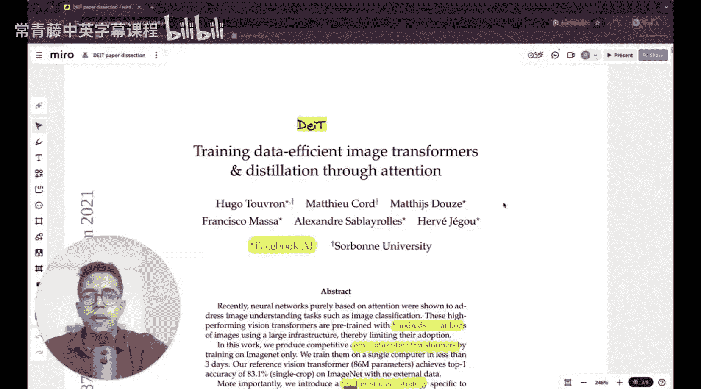
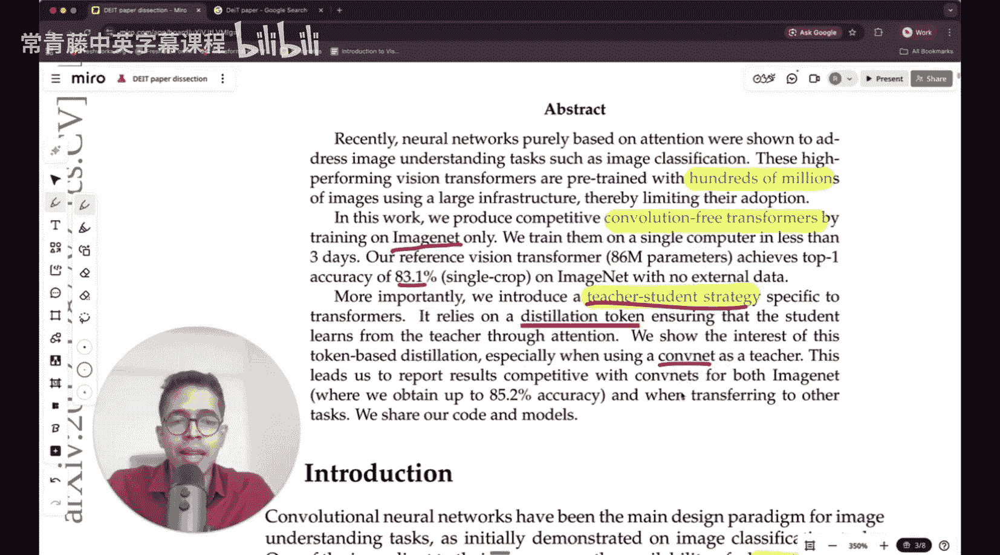

#  008：剖析DeiT论文 - 数据高效的图像Transformer

在本节课中，我们将一起学习一篇名为《Training data-efficient image transformers & distillation through attention》的重要论文，即DeiT。这篇论文的核心贡献在于，它提出了一种方法，使得Vision Transformer模型能够在相对较小的数据集（如ImageNet-1K）上高效训练，而无需依赖海量专有数据。我们将深入探讨其提出的知识蒸馏策略和“蒸馏令牌”这一关键概念。

上一节我们介绍了Vision Transformer及其对海量数据的依赖。本节中，我们来看看DeiT论文如何解决这个问题。

## 论文背景与动机

这篇论文来自Facebook AI Research。先前基于纯注意力机制的神经网络（即Vision Transformer）已被证明能处理图像分类等任务。然而，这些高性能的Vision Transformer需要使用数亿张图像进行预训练，并依赖大规模计算基础设施，这限制了其广泛应用。

本工作的目标是，仅使用ImageNet数据集，在一台计算机上三天内训练出具有竞争力的、无卷积的Transformer模型。更重要的是，论文引入了一种针对Transformer的师生策略，该策略依赖于一个“蒸馏令牌”，使学生模型能够通过注意力机制向教师模型学习。

## 核心方法：知识蒸馏与蒸馏令牌

DeiT的核心创新在于其训练策略，而非模型架构本身。其模型架构与标准的Vision Transformer基本相同。

以下是其引入的关键组件：

1.  **教师-学生框架**：使用一个预先训练好的、性能更强的模型（教师）来指导一个较小的模型（学生）进行训练。在DeiT中，教师模型可以是大型卷积神经网络（如RegNet）或大型Vision Transformer。
2.  **蒸馏令牌**：这是DeiT最核心的创新点。在输入序列中，除了Vision Transformer原有的**分类令牌**（`[CLS]` token）外，额外添加一个**蒸馏令牌**（`[DIST]` token）。
    *   公式表示输入序列：`[CLS] + 图像块序列 + [DIST]`
    *   在Transformer的编码过程中，这个蒸馏令牌会通过自注意力机制与分类令牌及所有图像块令牌进行交互，并专门学习模仿教师模型的输出。
3.  **蒸馏损失**：训练学生模型时，损失函数由两部分组成：
    *   **标准交叉熵损失**：基于学生模型自身分类令牌的预测结果与真实标签计算。
    *   **蒸馏损失**：基于学生模型蒸馏令牌的预测结果与教师模型预测的“软标签”（经过温度参数T调整的概率分布）计算。
    *   代码概念表示总损失：`Loss = λ * CE_Loss(student_cls, hard_label) + (1-λ) * KL_Div_Loss(student_dist, teacher_soft_label)`

上一节我们介绍了DeiT的核心训练机制。本节中，我们来看看这种方法带来的具体优势。

## 主要优势与结果

通过上述方法，DeiT取得了以下关键成果：

*   **数据高效性**：仅使用ImageNet-1K（约130万张图像）进行训练，无需JFT-300M等超大规模私有数据集。
*   **训练高效性**：在一台机器上，用不到3天时间即可完成训练。
*   **高性能**：一个拥有8600万参数的DeiT模型，在ImageNet上达到了83.1%的Top-1准确率。
*   **蒸馏的有效性**：论文表明，当使用卷积神经网络（CNN）作为教师时，这种基于令牌的蒸馏方法尤其有效，使得Transformer模型能够达到与卷积网络相竞争的性能。

## 总结

本节课中我们一起学习了DeiT论文。这篇论文的核心贡献是提出了一种数据高效的Vision Transformer训练方案。它通过引入一个额外的“蒸馏令牌”和创新的师生蒸馏策略，使模型能够从小型公开数据集中有效学习，并快速完成训练。这项工作极大地降低了Vision Transformer的应用门槛，并为后续的模型压缩和知识迁移研究提供了重要思路。理解DeiT的蒸馏机制，对于掌握如何让大模型指导小模型、以及如何设计高效的训练目标至关重要。