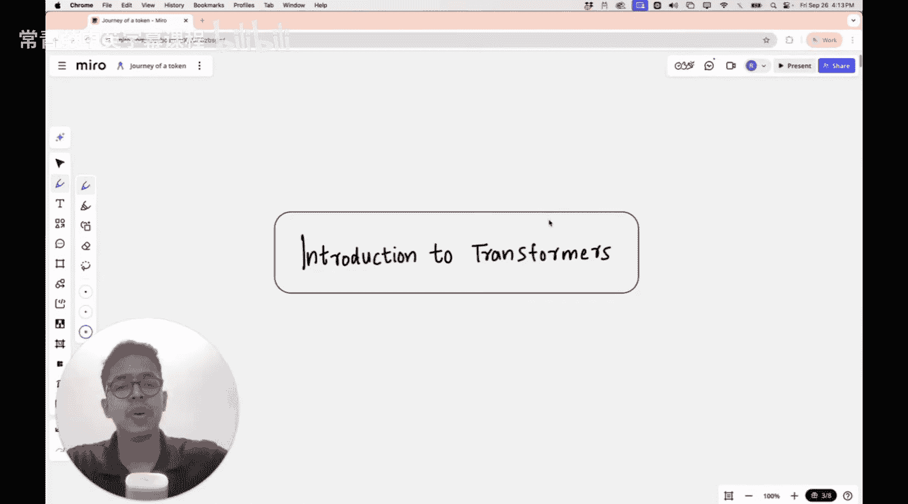
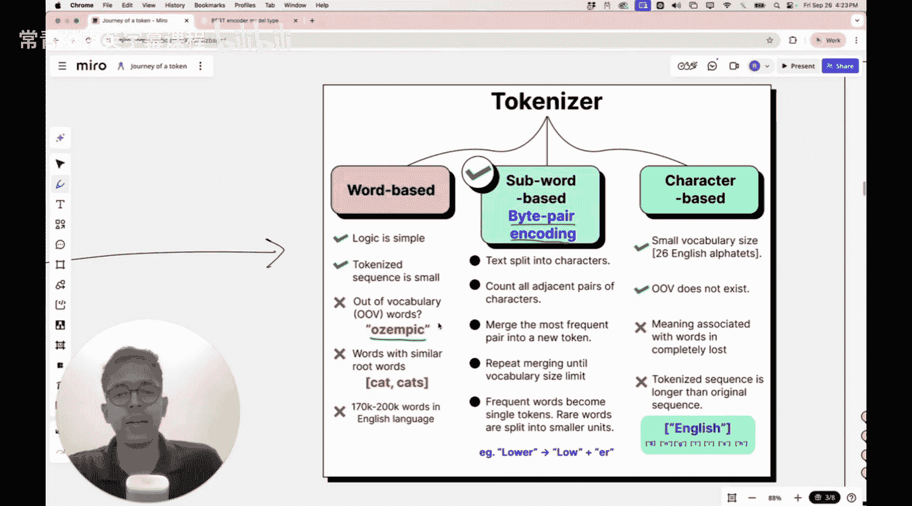

#  009：Transformer架构精讲

在本节课中，我们将深入学习Transformer的实际架构。我们将从大型语言模型的角度出发，探讨其核心工作原理。虽然本讲聚焦于语言模型，但所学知识将直接应用于未来课程中讨论的视觉Transformer。



## 概述


上一节我们讨论了为何需要Transformer来捕获图像中的长距离依赖关系，这是CNN难以做到的。本节中，我们将深入探讨Transformer的实际架构。

## Transformer架构总览

以下是Transformer架构中最著名的示意图，它出自2017年发表的革命性论文《Attention Is All You Need》。该论文首次提出了自注意力机制，彻底改变了自然语言处理领域。


此架构图包含编码器和解码器两部分。编码器用于如BERT等模型，而解码器则用于如GPT等模型。本节课，我们将重点讲解**仅解码器架构**，因为理解它就能理解GPT或ChatGPT类模型的工作原理。

然而，原图对初学者不够友好，包含大量术语和连接箭头。因此，我将使用一个修改过的简化版示意图，分步讲解解码器架构。

## 大型语言模型的核心任务

大型语言模型的核心任务是**下一个词预测**。例如，给定输入“The cat sat on the”，模型会预测下一个词（如“mat”），然后将预测词加入输入序列，继续预测下一个词，如此迭代生成完整段落。

为了理解Transformer如何完成此任务，我们将架构分为三个主要部分：
1.  **输入处理部分**
2.  **Transformer块（核心处理部分）**
3.  **输出生成部分**

我们将按顺序逐一讲解。首先，让我们聚焦于输入部分。

## 输入处理部分详解

现在，我们仅关注架构图中的输入部分。此部分主要完成以下工作：



输入句子“The cat sat on the”首先需要被转换成模型能处理的形式。这个过程主要涉及三个步骤。

### 1. 分词

首先，输入句子被分割成更小的单元，称为**词元**。为简化理解，我们可以将每个词视为一个词元。

以下是分词结果示例：
*   The
*   cat
*   sat
*   on
*   the

这样，我们得到了5个词元。为了追踪Transformer内部的处理流程，我们将重点关注第二个词元：“cat”。

**关于分词技术的补充说明：**
实际应用中，分词并非简单按空格分割单词。常用的一种方法是**字节对编码**。简单的按单词分词会遇到问题，例如遇到新词（如药品名“Ozympic”）时，模型无法识别。BPE等更高级的分词方法可以更好地处理未知词汇和子词单元。

### 2. 词元嵌入

分词后，每个词元（如“cat”）需要被转换为一个数值向量，这个过程称为**词元嵌入**。你可以将其理解为在一个高维语义空间中为每个词找到一个坐标。

例如，`“cat” -> [0.2, -0.5, 0.7, ...]`（一个长度为`d_model`的向量）。

在代码中，这通常通过一个嵌入查找表实现：
```python
# 假设 vocab_size 是词表大小，d_model 是嵌入维度
token_embedding_layer = nn.Embedding(vocab_size, d_model)
# token_ids 是分词后词元对应的索引序列
token_embeddings = token_embedding_layer(token_ids)
```

### 3. 位置编码

由于Transformer本身不像RNN那样能感知序列顺序，我们需要额外添加**位置编码**来为词元注入其在序列中位置的信息。

位置编码向量与词元嵌入向量维度相同（`d_model`）。两者会直接相加。
```python
# 假设 position_embeddings 是计算好的位置编码矩阵
combined_embeddings = token_embeddings + position_embeddings
```

相加后的结果就是最终输入Transformer块的表示向量，它同时包含了词的语义信息及其在句子中的位置信息。

## 总结

本节课我们一起学习了Transformer架构的输入处理部分。我们了解到，一个输入句子需要经过**分词**、**词元嵌入**和**位置编码**三个关键步骤，才能转换为包含丰富语义和位置信息的数值向量，供后续的Transformer核心块进行处理。


下一节，我们将进入Transformer的核心——**Transformer块**，深入剖析自注意力机制等模块是如何工作的。