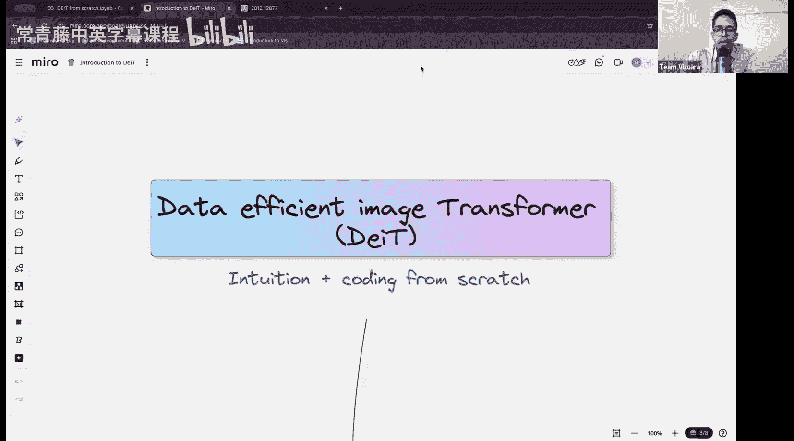
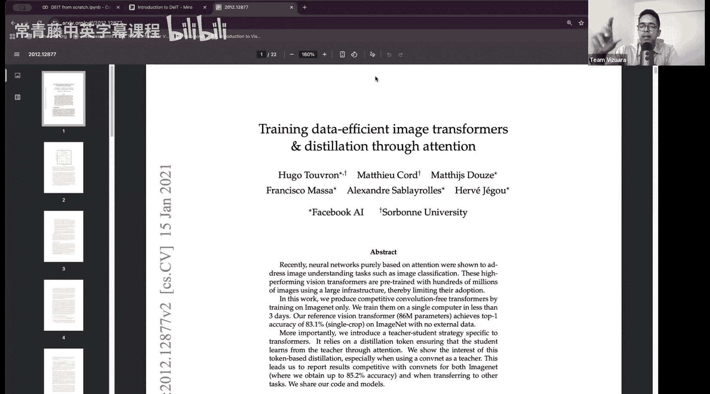
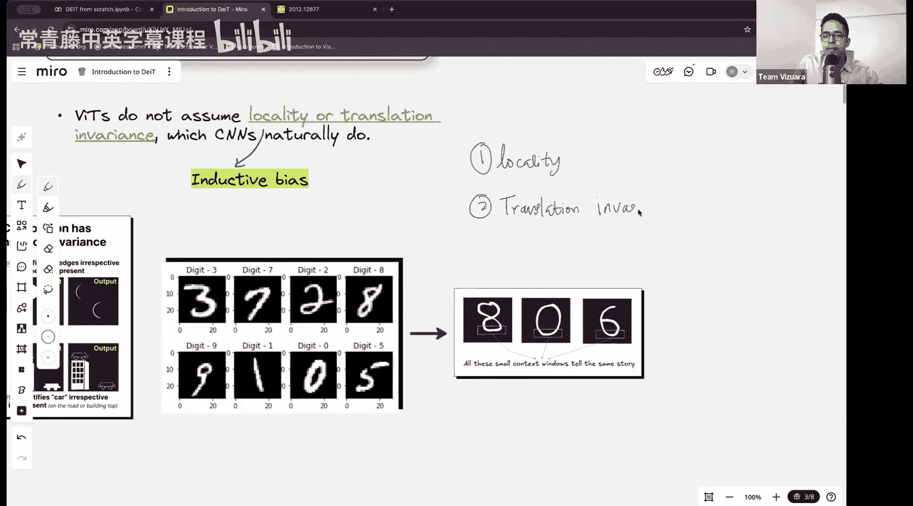
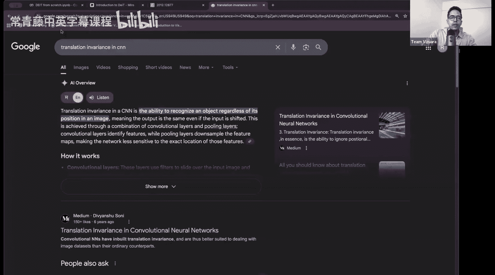
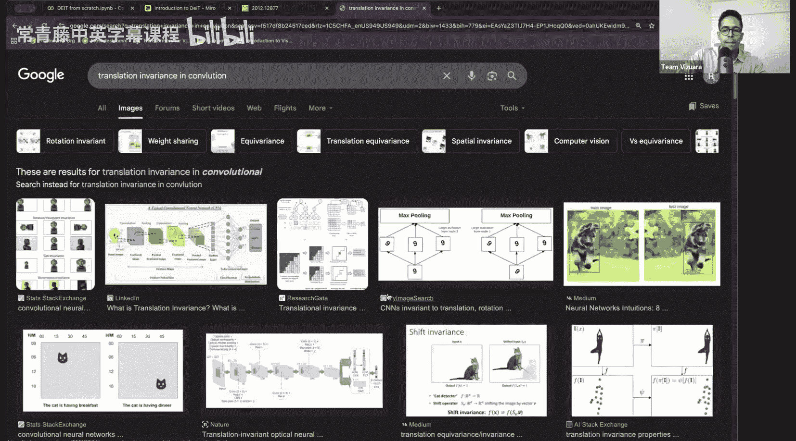
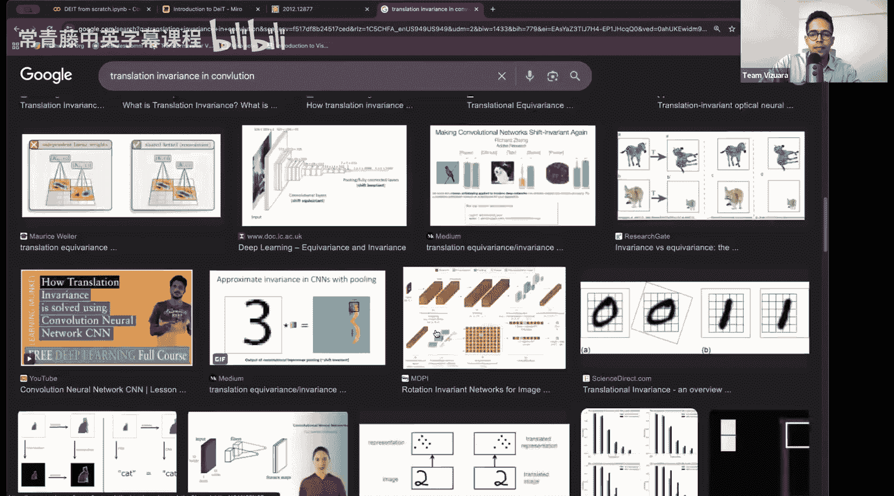
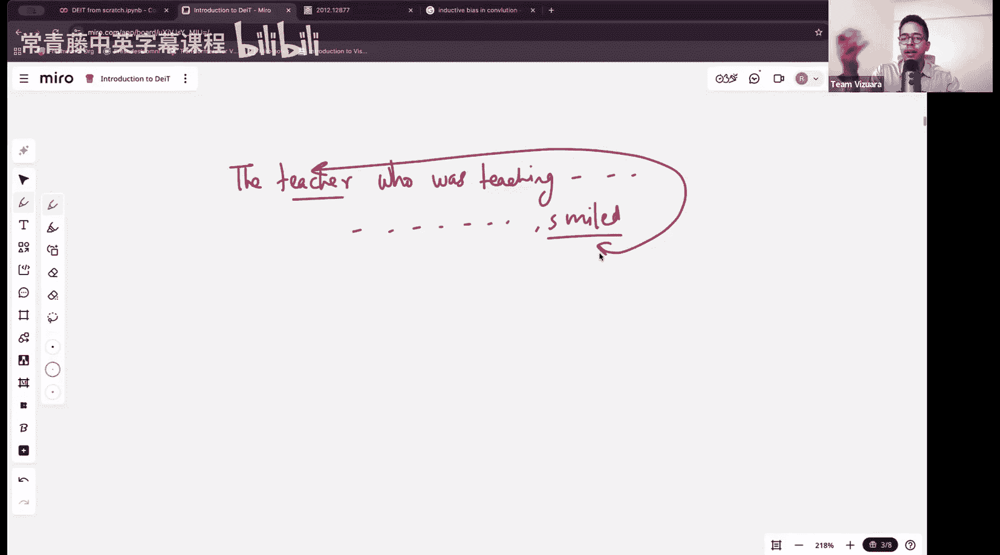
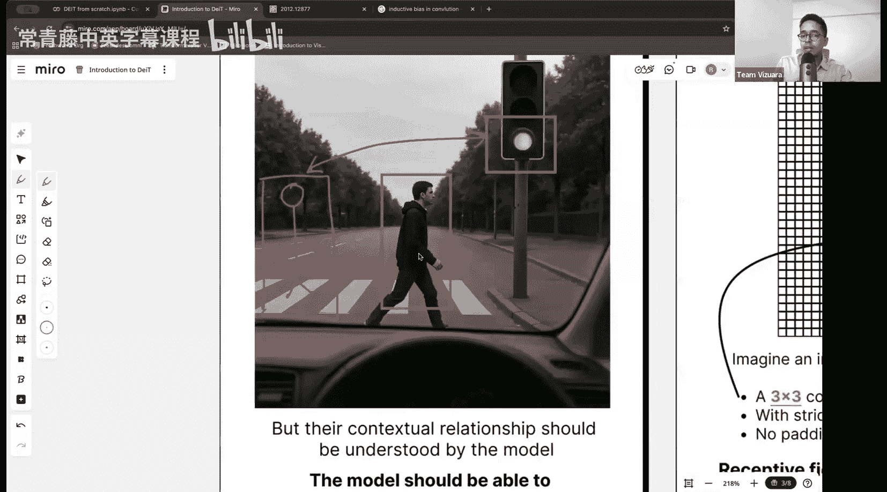
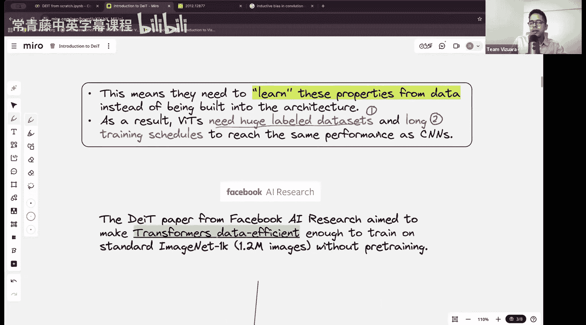

#  010：从零开始编码数据高效图像Transformer (DeiT)

在本节课中，我们将学习数据高效图像Transformer。首先，我们将理解该模型背后的核心思想，以及它与哪些模型最为相似。在第二部分，我们将从零开始构建一个DeiT模型。

## 概述

我们已经介绍过Vision Transformer。本节课的优点是，如果你理解并正确编码过Vision Transformer，那么学习DeiT会感到非常熟悉，因为两者有95%的内容是相似的。然而，DeiT做了一些惊人的改进，使其在训练效率上相比Vision Transformer有了显著提升。

## 数据高效图像Transformer (DeiT) 简介

这篇论文大约发表于2021年，由Facebook AI Research发布。论文标题是“训练数据高效图像Transformer”。DeiT是为图像设计的，它利用了Transformer架构，并引入了一些新概念。



该论文引入的一个主要思想是**蒸馏**。你可能听说过深度学习中的教师-学生模型概念。今天我们将详细探讨什么是教师-学生模型，这个概念也被称为**知识蒸馏**，以及DeiT如何利用知识蒸馏来取得比Vision Transformer好得多的效果。

## Vision Transformer的挑战

回想一下Vision Transformer，它的主要问题有：
1.  **需要海量数据**：训练基础Vision Transformer模型使用了包含3亿张图像的JFT数据集。但JFT数据集并非公开可用，它是谷歌的内部数据。
2.  **参数量巨大**：当时最先进的Vision Transformer模型大约有6亿个参数。
3.  **计算成本高昂**：训练需要多天时间并使用多个GPU。



尽管存在这些问题，但使用所有这些资源训练出的Vision Transformer在当时达到了最先进的水平，甚至超越了卷积神经网络在计算机视觉领域的长期主导地位。

## 从CNN到Transformer的转变

从大约2012年到2020/2021年，卷积神经网络在深度学习和计算机视觉领域占据主导地位。然而，当Vision Transformer在2020年左右被引入后，Transformer架构开始流行起来。

我们讨论DeiT的原因是，在了解了Vision Transformer的工作原理后，它是逻辑上的下一步发展。

CNN有一些固有的优势，主要是**归纳偏置**。两个最著名的归纳偏置是：
*   **局部性**：特征在局部区域内存在。
*   **平移不变性/等变性**：无论特征在图像二维空间中的哪个位置，CNN都能捕捉到它。

卷积运算本质上做了一些假设：它假设特征是局部存在的，并且无论特征位于哪个局部区域，都可以用某种类型的滤波器检测到。

然而，这并不总是好事。例如，在自动驾驶场景中，一个行人正在闯红灯过马路。行人的像素位置和红灯的像素位置在图像中可能相距很远，但在当前语境下，这两组像素高度相关。需要一个**全局注意力机制**，无论像素在图像中的距离如何，都能从完整上下文中提取有意义的信息，这样自动驾驶汽车才不会因为看到绿灯就撞上行人。

这正是人们热衷于将Transformer架构引入图像处理的原因。在Transformer中，只要在上下文窗口内，输入句子的长度并不重要。一个著名的例子是：“The teacher who was teaching a difficult concept to the students smiled.” 这里，“smiled”这个动作是由“teacher”执行的，尽管这两个词在句子中相距很远，但注意力机制应该能学习到它们之间的高度相关性。

同样的概念适用于图像。当你将图像转换为图像块，再将图像块转换为令牌时，无论图像块之间的物理距离有多远，模型都可以学习到相隔很远的图像块之间的关系。这就是推动基于Transformer的架构发展的原因。

但问题在于，如前所述，Vision Transformer需要海量的数据和计算资源。






## DeiT的核心改进：知识蒸馏





DeiT通过引入**知识蒸馏**来解决Vision Transformer对大数据集的依赖问题。其核心思想是使用一个预先训练好的、性能强大的模型作为“教师”，来指导一个较小的“学生”模型（即DeiT）进行训练。学生模型不仅学习来自真实标签的监督信号，还学习模仿教师模型的“软标签”（即概率分布），从而获得更丰富、更平滑的学习信号，提高数据利用效率和最终性能。

---

上一节我们介绍了DeiT的背景和核心思想，本节中我们来看看如何从零开始构建一个DeiT模型。以下是构建DeiT模型的关键步骤。

### 模型架构组件

1.  **图像分块与线性投影**：将输入图像分割成固定大小的非重叠图像块，然后将每个图像块展平并通过一个线性层投影到模型维度。
    ```python
    # 伪代码示例
    patches = image_to_patches(image, patch_size) # 形状: [batch, num_patches, patch_dim]
    projected_patches = linear_projection(patches) # 形状: [batch, num_patches, d_model]
    ```

2.  **可学习的分类令牌**：在投影后的图像块序列前添加一个可学习的`[CLS]`令牌。这个令牌的最终输出将用于图像分类。
    ```python
    cls_token = learnable_parameter([1, 1, d_model])
    token_sequence = concatenate([cls_token, projected_patches], dim=1)
    ```

3.  **位置编码**：为序列中的每个令牌（包括`[CLS]`令牌和所有图像块令牌）添加可学习的位置编码，以注入空间位置信息。
    ```python
    position_embeddings = learnable_parameter([1, num_patches+1, d_model])
    token_sequence += position_embeddings
    ```

4.  **Transformer编码器层**：堆叠多个标准的Transformer编码器层。每一层都包含多头自注意力机制和前馈神经网络。
    ```python
    # 单个编码器层结构
    class TransformerEncoderLayer(nn.Module):
        def __init__(self, d_model, nhead, dim_feedforward):
            super().__init__()
            self.self_attn = MultiheadAttention(d_model, nhead)
            self.linear1 = nn.Linear(d_model, dim_feedforward)
            self.linear2 = nn.Linear(dim_feedforward, d_model)
            self.norm1 = nn.LayerNorm(d_model)
            self.norm2 = nn.LayerNorm(d_model)
        def forward(self, x):
            # 多头自注意力 + 残差连接 & 层归一化
            x = self.norm1(x + self.self_attn(x, x, x))
            # 前馈网络 + 残差连接 & 层归一化
            x = self.norm2(x + self.linear2(F.gelu(self.linear1(x))))
            return x
    ```

5.  **分类头**：从最终Transformer编码器输出的`[CLS]`令牌表示中，通过一个层归一化层和一个线性分类器得到最终的分类logits。
    ```python
    cls_output = token_sequence[:, 0, :] # 提取CLS令牌
    cls_output = layer_norm(cls_output)
    logits = classifier(cls_output) # 形状: [batch, num_classes]
    ```

### 知识蒸馏的实现

DeiT的关键创新在于训练过程中同时使用真实标签和教师模型的预测进行监督。

1.  **准备教师模型**：使用一个在大型数据集上预训练好的CNN作为教师模型。
2.  **计算损失**：总损失是**真实标签的交叉熵损失**和**蒸馏损失**的加权和。
    *   **真实损失**：学生模型预测与真实硬标签之间的交叉熵损失。
    *   **蒸馏损失**：学生模型预测与教师模型输出的**软标签**之间的交叉熵损失。软标签是教师模型logits经过温度缩放后的概率分布。
    ```python
    # 伪代码示例
    # 学生和教师模型的输出
    student_logits = model(images)
    teacher_logits = teacher_model(images).detach() # 不更新教师模型参数
    
    # 真实标签损失
    loss_hard = CrossEntropyLoss(student_logits, true_labels)
    
    # 蒸馏损失（带温度缩放）
    temperature = 3.0
    soft_targets = F.softmax(teacher_logits / temperature, dim=-1)
    student_probs = F.log_softmax(student_logits / temperature, dim=-1)
    loss_soft = KLDivLoss(student_probs, soft_targets) * (temperature ** 2)
    
    # 总损失
    total_loss = alpha * loss_hard + (1 - alpha) * loss_soft
    ```
    其中，`alpha`是平衡两种损失的权重系数。



---

## 总结





本节课中我们一起学习了数据高效图像Transformer。我们首先探讨了Vision Transformer面临的挑战，即对海量数据和计算的依赖。接着，我们介绍了DeiT如何通过引入**知识蒸馏**技术，利用一个强大的教师模型来指导较小的学生模型训练，从而显著提高了数据利用效率和训练效果。最后，我们概述了从零开始构建DeiT模型的核心步骤，包括图像分块、Transformer编码器以及关键的蒸馏损失计算。DeiT展示了如何将Transformer架构高效地应用于视觉任务，为后续更多视觉Transformer模型的发展奠定了基础。