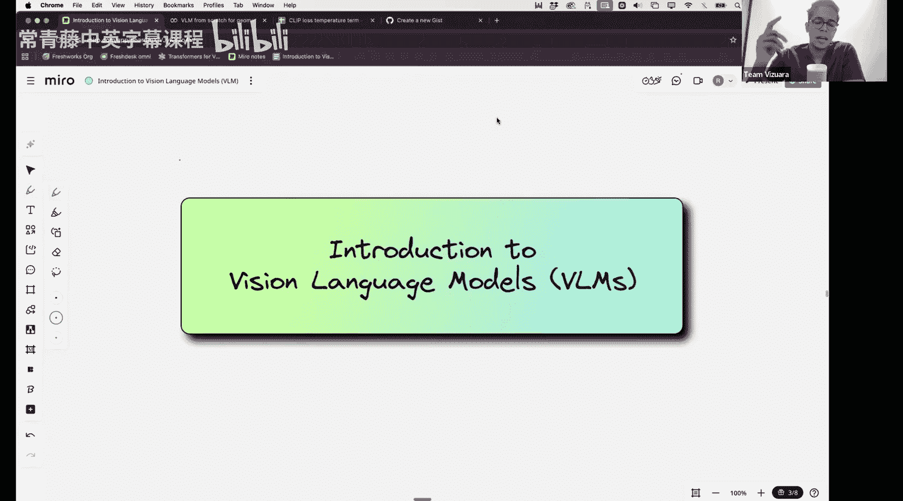
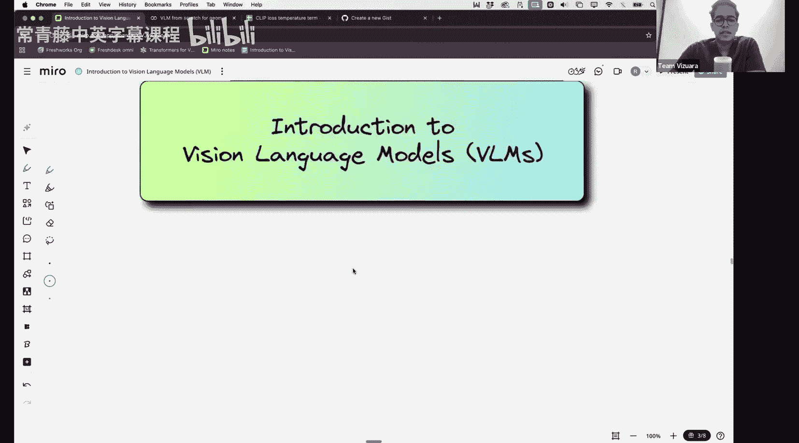
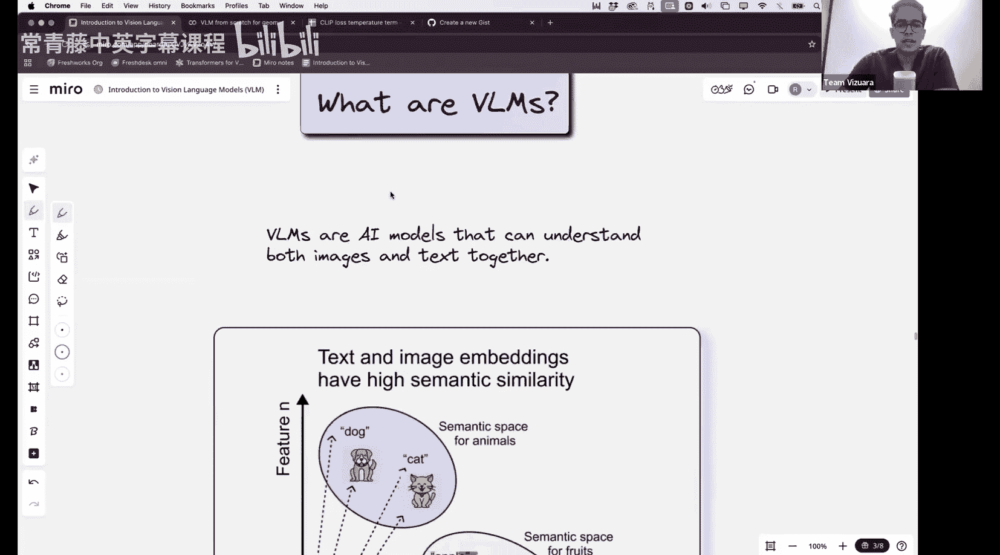
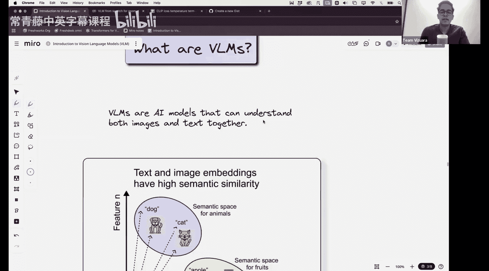
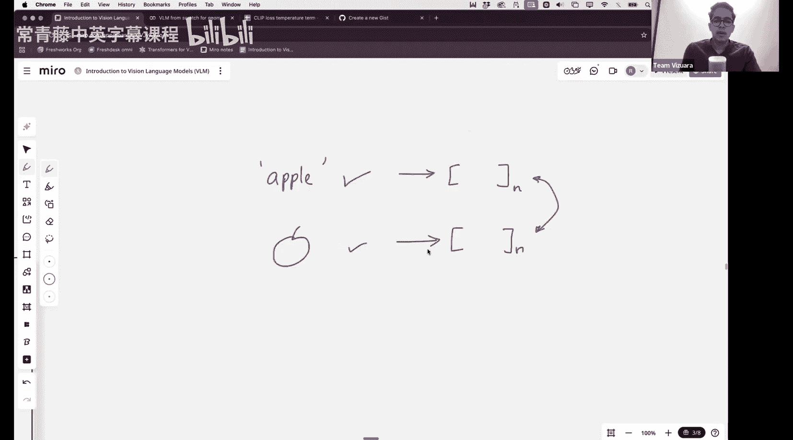
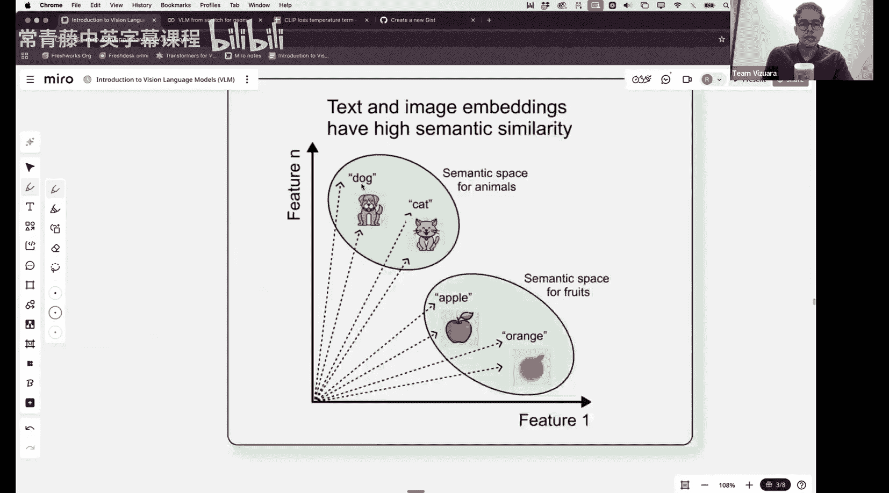
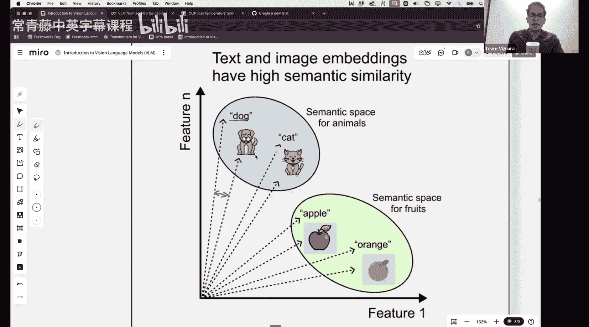
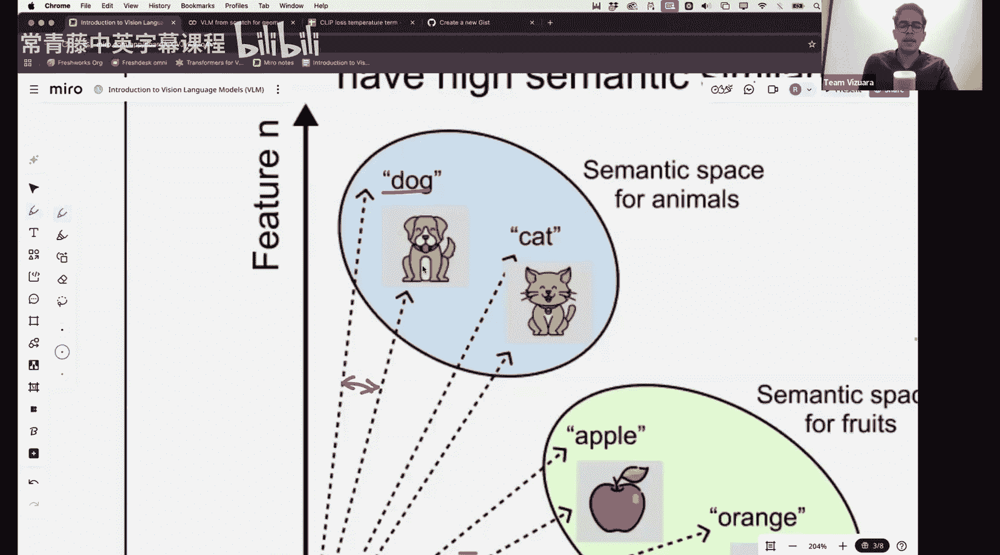
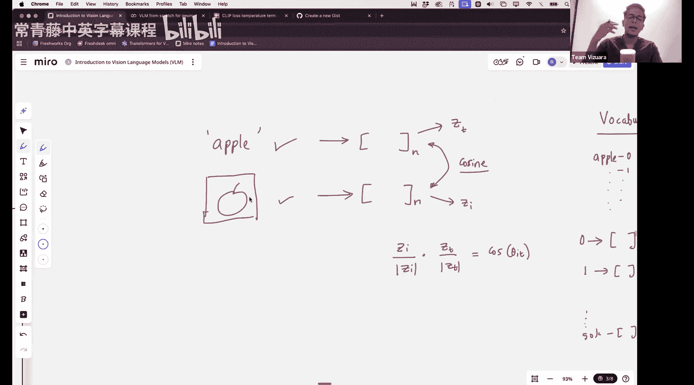

#  011：从零构建NanoVLM

## 概述

在本节课中，我们将学习视觉语言模型的基本概念，并了解如何从零开始构建一个名为NanoVLM的简化模型。我们将探讨如何将文本和图像这两种不同的模态数据，转换为同一语义空间中的向量表示，并让它们相互理解。

上一节我们介绍了视觉Transformer的构建，其中的一些思想将有助于理解本节的架构。

## 什么是视觉语言模型？

视觉语言模型是一种能够同时处理文本和图像数据的模型。

理想情况下，VLM应该能够处理文本和图像数据。

例如，当我们写下单词“苹果”，或者展示一张苹果的图片时，人类大脑会以类似的方式处理这两种信息，它们在我们脑海中都指向“苹果”这个概念。

那么，VLM应该如何理解“苹果”这个词和一张苹果的图片代表的是同一个事物呢？我们可以从多种角度思考，但最简单的思考方式之一是借鉴我们在大型语言模型中表示文本的方法。

## 核心思想：共享语义空间

在大型语言模型中，每个词元都被表示为一个数学上的多维向量。

我们可以在这里应用类似的想法：**将“苹果”这个词转换为一个N维向量，同时也将苹果的图片转换为一个相同维度的向量**。然后，找出如何使这两种表示彼此接近或相似。

下图很好地捕捉了这个核心思想。

文本“狗”的向量和图像“狗”的向量应该非常相似。理想情况下，它们应该彼此接近，因为这是一个多维语义空间。当你将一个向量指向该空间的某个区域时，它就具有特定的含义。通常，你可以认为对应动物的向量指向语义空间中的动物区域，而对应水果（如苹果、橙子）的向量指向空间中的另一个方向。

但我们希望的是，文本“狗”的向量和图像“狗”的向量是相同的。

## 如何量化向量相似性？

在本课程中我们已经多次讨论过，如果两个向量维度相同，我们如何量化它们之间的相似性？

我们可以使用**余弦相似度**。具体来说，我们可以计算点积。如果这两个向量是单位向量，那么点积就等于余弦相似度。

假设我们称文本的向量为 **Z_T**，图像的向量为 **Z_I**。如果它们不是单位向量，我们可以先除以各自的模长，再计算点积。

**公式**：`相似度 = (Z_I · Z_T) / (||Z_I|| * ||Z_T||) = cos(θ)`

其中，θ 是图像表示和文本表示之间的夹角。

如果向量非常相似，它们之间的夹角将接近零，那么 cos(0) = 1。如果向量完全不相似，它们将是正交的，那么 cos(90°) 将接近 0。这就是基本思想。

## 文本如何转换为向量？

我们已经学习了在大型语言模型中将文本转换为向量的一种方法。

具体是如何做的呢？以下是关键步骤：

首先，我们需要一个包含所有可能词元的**词汇表**。为简化起见，假设每个单词是一个词元，那么词汇表将包含所有可能的单词。每个单词都有一个ID（例如，0，1，...）。像GPT-3这样的模型，其词汇表大约有50,000个词元。

每个词元都关联一个向量。词元ID 0 有一个关联向量，词元ID 1 也有一个关联向量，以此类推。这个向量的维度取决于你的模型，例如，某些模型的向量是768维。

当你输入一个句子如“Apple is red”时，首先将其分割成词元并找到对应的词元ID。然后，查询词汇表，获取每个词元ID对应的向量。这样，我们就得到了每个词元的向量表示。

此外，我们还添加了**位置编码**。第一个词元对应位置0，第二个对应位置1，依此类推。我们将位置编码加到词元向量上，得到最终的输入向量表示。

然后，所有这些向量会通过**多头注意力机制**，为每个输入词元生成一个上下文向量，该上下文向量与输入向量具有相同的维度（例如768维）。

这就是我们为文本输入生成向量关联的过程。

## 图像如何转换为向量？

文本到向量的转换我们已经熟悉，那么图像如何转换为向量呢？

从上一节关于视觉Transformer的内容中，你已经知道了一种方法：**将图像分割成多个图块，每个图块被转换为一个向量（即一个词元）**。然后，同样添加位置编码，再通过Transformer编码器生成最终的上下文向量。

另一种方法是，你可以将图像通过一个**卷积神经网络**（不包含注意力机制）。图像最初可能是 `32 x 32 x 3` 的维度（即宽32、高32、3个颜色通道）。当图像通过每个卷积层时，空间维度（宽和高）会逐渐缩小，而通道数会增加。

这个过程最终可以将整张图像的信息压缩或表示为一系列特征向量。

## 构建NanoVLM的蓝图

理解了文本和图像如何分别转换为向量后，构建NanoVLM的蓝图就清晰了：

1.  **文本编码器**：使用一个简化的小型Transformer或类似结构，将输入文本转换为一个向量序列。
2.  **图像编码器**：使用一个简化的小型CNN或视觉Transformer，将输入图像转换为一个向量序列。
3.  **共享语义空间投影**：设计一个投影层（通常是线性层），确保文本编码器和图像编码器输出的向量被映射到**相同维度的共享语义空间**中。
4.  **对齐目标**：在训练时，我们的目标是让匹配的（文本，图像）对的向量表示尽可能相似（余弦相似度接近1），而不匹配的对的向量表示尽可能不相似（余弦相似度接近0）。这通常通过对比学习损失函数（如InfoNCE损失）来实现。

通过这种方式，模型学会了在同一个向量空间中理解文本和图像的含义，从而实现跨模态的理解和检索。

## 总结

本节课中，我们一起学习了视觉语言模型的核心思想。我们探讨了如何通过将文本和图像映射到同一共享语义空间中的向量，并使用余弦相似度来衡量它们的关联。我们回顾了文本通过词嵌入和位置编码转换为向量的过程，以及图像通过分块或卷积神经网络转换为向量的方法。这些概念为我们从零开始构建一个简化的NanoVLM模型奠定了坚实的基础。在接下来的实践中，我们将把这些理论付诸实施。