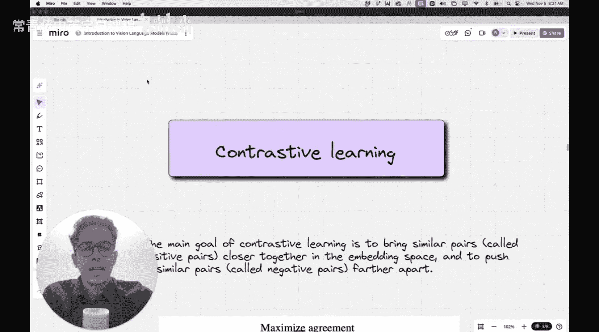
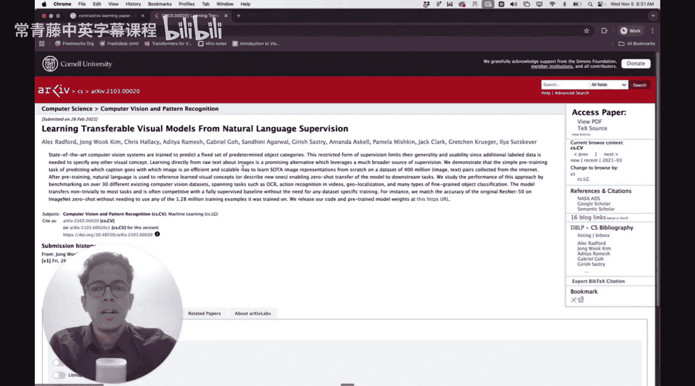
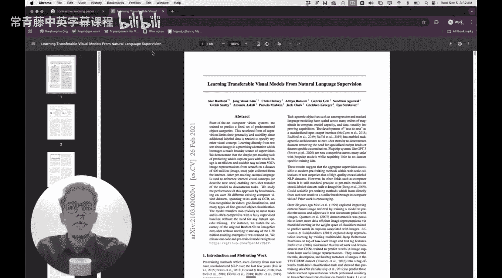
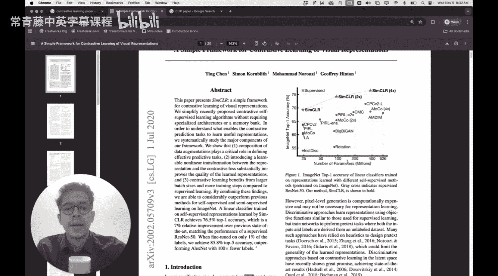
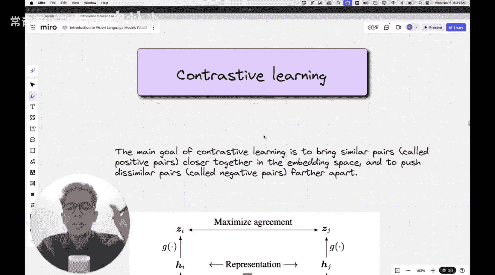
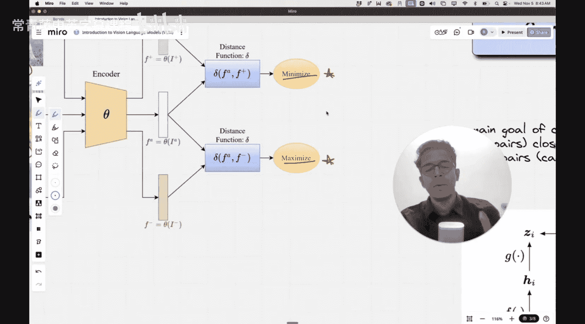
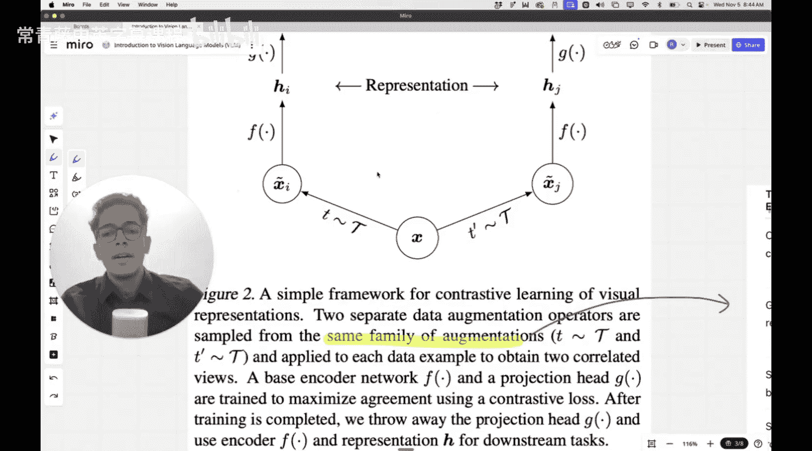

#  012：视觉语言模型的对比学习 🎯

在本节课中，我们将要学习对比学习（Contrastive Learning）的核心概念，并了解它为何在像CLIP这样的视觉语言模型中至关重要。我们将从对比学习的基本思想开始，逐步深入到其在多模态模型中的应用。







在上一讲中，我们介绍了视觉语言模型（VLM）的基础架构。本节中，我们来看看如何通过对比学习来训练这些模型，使其能够理解图像和文本之间的关联。

## 对比学习的重要性




CLIP模型是OpenAI提出的一个著名视觉语言模型，它成功应用了对比学习的思想。这篇论文被广泛引用。然而，对比学习在图像领域的流行，则是由另一篇更早的论文所推动的。该论文为图像-文本数据或纯图像数据集引入了一个简单的对比学习框架，并彻底改变了该领域的实现方式。

## 视觉语言模型回顾

在深入对比学习之前，我们先简要回顾上一讲的内容。一个基础的视觉语言模型通常包含以下部分：
*   一个用于处理图像的**图像编码器**。
*   一个用于处理文本的**文本编码器**。
*   一个可选的**融合模块**，用于结合图像和文本的嵌入表示。

融合模块可以是Transformer架构本身，例如对拼接后的图像和文本嵌入进行联合注意力计算，或者使用交叉注意力机制。其目标是让图像和文本的向量表示在同一个“联合嵌入空间”中对齐。在这个空间中，语义相似的图像和文本（例如“一只快乐的狗跑向相机”的图片和文字）对应的向量会非常接近，它们的余弦相似度会很高。

## 什么是对比学习？🤔

对比学习的核心思想非常简单：**最大化正样本对之间的相似性，同时最小化负样本对之间的相似性**。

为了理解这个概念，我们可以看一个例子。假设我们有一张狗的图片作为“锚点”（Anchor）。通过对这张图片进行一些变换（如转为黑白、旋转、裁剪），我们可以得到它的“正样本”。这些变换后的图片与原始锚点图片构成**正样本对**。而数据集中其他不同内容的图片（例如猫或汽车的图片）则与锚点图片构成**负样本对**。

我们的目标是训练模型，使得：
*   锚点图片与其正样本在嵌入空间中的距离**尽可能小**（相似度高）。
*   锚点图片与负样本在嵌入空间中的距离**尽可能大**（相似度低）。

以下是论文中提到的一些常见图像变换方式，用于创建正样本：
*   裁剪和调整大小
*   水平翻转
*   转换为灰度（黑白）
*   颜色抖动
*   旋转
*   随机遮挡（Cutout）
*   添加高斯噪声

通过这种方式，模型无需人工标注的精细标签，就能学习到数据中强大的、具有不变性的特征表示。

## 对比损失函数

为了实现上述目标，我们需要一个专门的损失函数，即**对比损失**。其核心公式可以简化为以下思想：

对于一个锚点样本 **x**，其正样本为 **x⁺**，负样本集合为 **{x⁻}**。模型通过编码器 **f(·)** 将样本映射为向量。对比损失鼓励以下关系：

**相似度( f(x), f(x⁺) ) >> 相似度( f(x), f(x⁻) )**




其中，相似度通常使用余弦相似度或点积来计算。一个具体的、广泛使用的实现是**InfoNCE损失**（归一化温度标度交叉熵损失），其公式如下：

```
L = -log( exp(sim(q, k⁺) / τ) / Σ_{i=0}^{K} [ exp(sim(q, k_i) / τ) ] )
```

其中：
*   `q` 是锚点样本的查询向量。
*   `k⁺` 是正样本的键向量。
*   `k_i` 包括正样本和 `K` 个负样本的键向量。
*   `sim()` 是相似度函数（如点积）。
*   `τ` 是一个温度参数，用于调节分布的尖锐程度。

这个损失函数本质上是一个交叉熵损失，目的是在给定查询 `q` 时，从一批样本中正确识别出正样本 `k⁺`。

## 对比学习在CLIP中的应用




CLIP模型将对比学习的思想应用到了图像-文本对数据上。它的训练过程非常直观：
1.  一个批次中包含 `N` 个真实的图像-文本对。
2.  图像编码器和文本编码器分别处理图像和文本，得到 `N` 个图像向量和 `N` 个文本向量。
3.  计算所有图像向量和文本向量两两之间的相似度，形成一个 `N x N` 的矩阵。
4.  矩阵的对角线位置代表了正确的（正样本）图像-文本对，其余位置都是负样本对。
5.  训练目标就是最大化对角线上的相似度（正样本），同时最小化非对角线上的相似度（负样本）。这通过对称的交叉熵损失来实现。

通过在海量的互联网图像-文本对上进行这种对比训练，CLIP学会了将任意图像和文本映射到一个共享的语义空间，从而实现了强大的零样本（Zero-Shot）分类和检索能力。

## 总结



本节课中我们一起学习了对比学习。我们从其**最大化正样本相似性、最小化负样本相似性**的核心目标出发，回顾了它在视觉语言模型（如CLIP）中的关键作用。我们了解了如何通过图像变换构造正样本对，并介绍了实现对比学习目标的**InfoNCE损失函数**。最后，我们看到了CLIP如何巧妙地将这一框架应用于海量图像-文本数据，从而学习到一个通用的、对齐的多模态表示空间。对比学习是一种强大的自监督学习范式，它使模型能够从数据本身的结构中学习，减少了对大量人工标注的依赖。