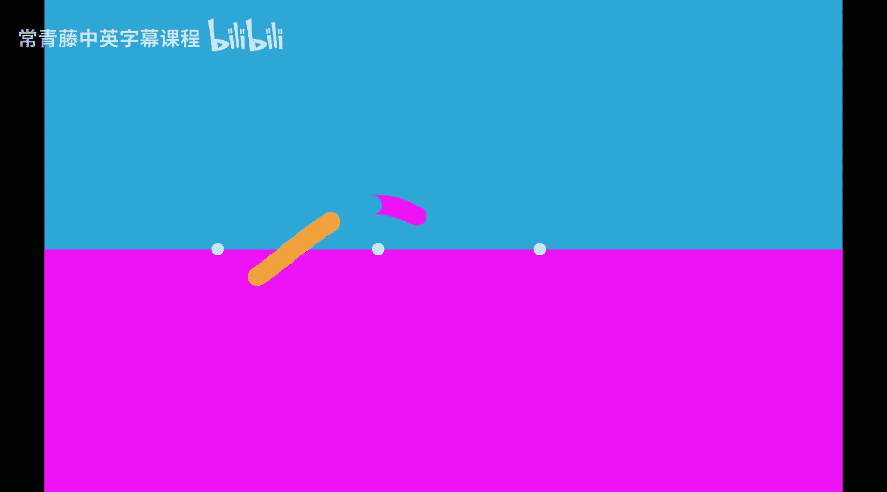
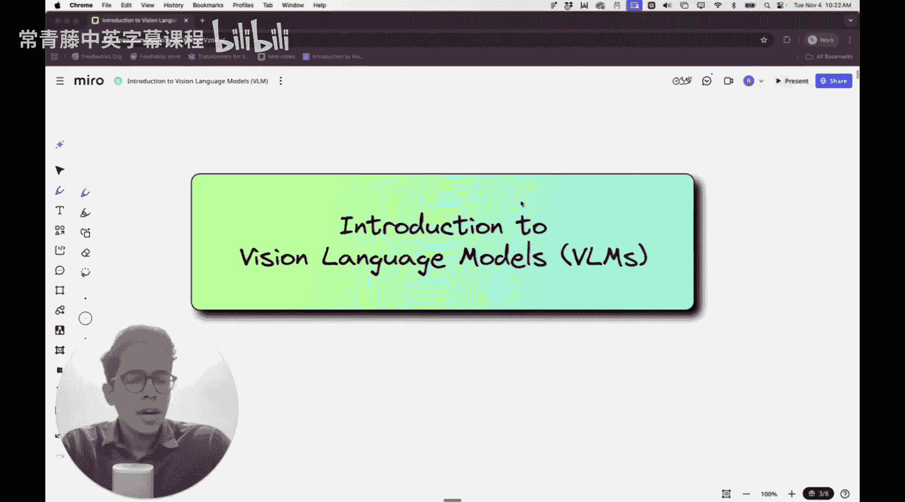
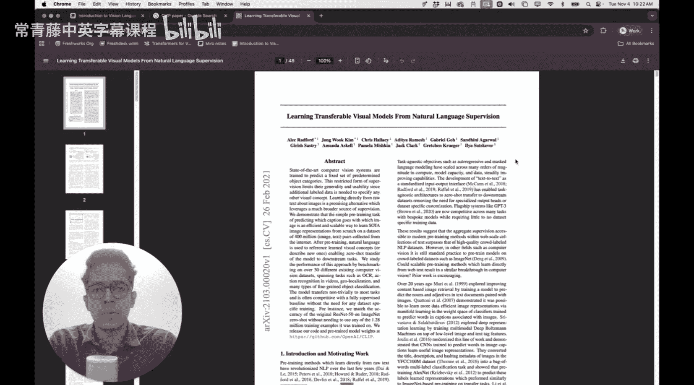
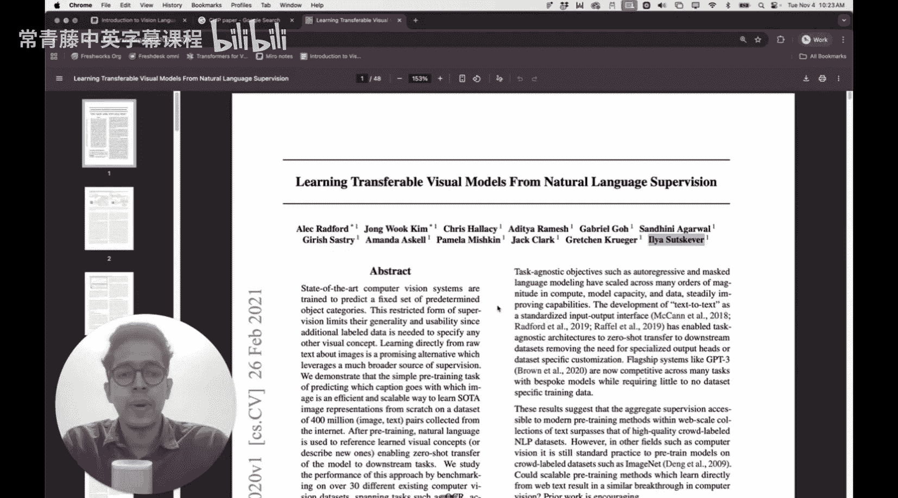
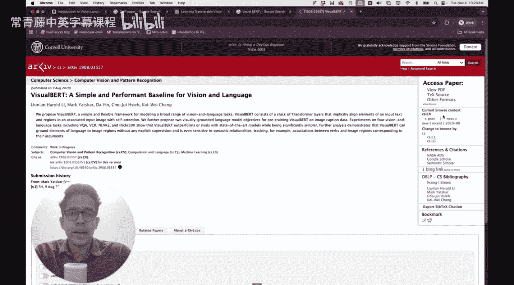
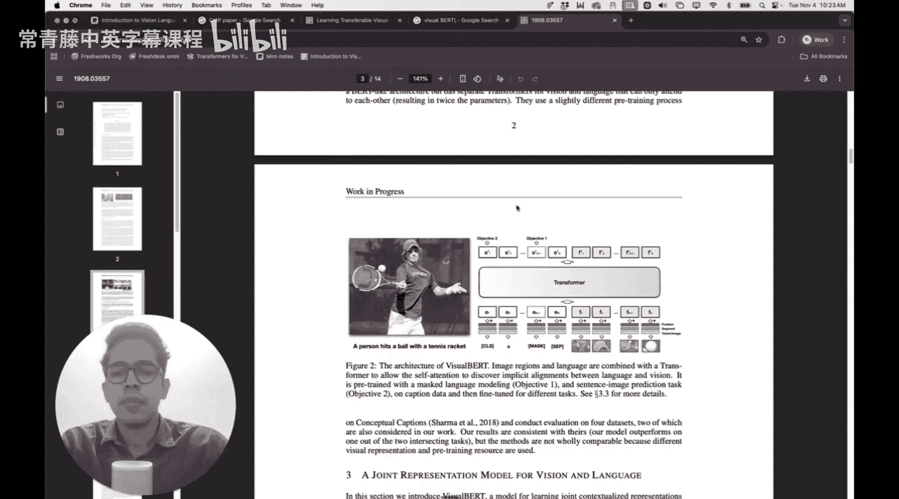
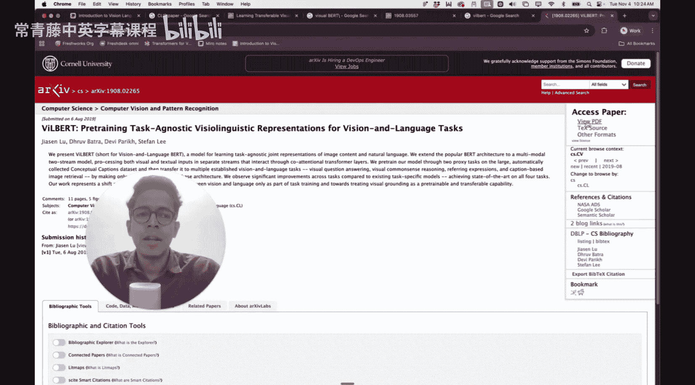
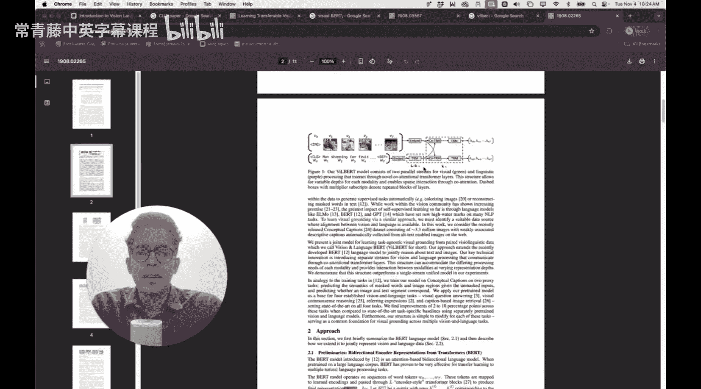
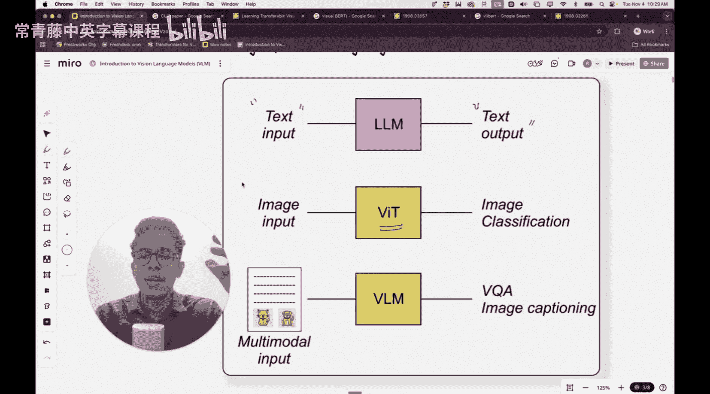

#  013：视觉语言模型（VLM）入门 🖼️📖

在本节课中，我们将首次在本系列中探讨多模态大语言模型。具体来说，我们将介绍如何将大语言模型的应用背景从纯文本数据扩展到包含视觉数据，其中最简单的视觉数据就是图像。

上一节我们详细介绍了视觉Transformer。我们讨论的那个特定架构的唯一缺点是它无法处理文本。我们通过将图像转换为图像块，再将图像块标记化，然后利用这些标记进行图像分类，这依赖于分类标记。

在视觉语言模型中，其架构允许你同时创建基于文本的数据和基于图像的数据的嵌入表示。现实世界中的大多数数据集都是多模态的，意味着存在不同的模态，例如音频、文本、视觉等。视觉本身可以是图像，也可以是视频（视频被转换为帧）。任务范围可以从图像描述到视觉问答，即根据特定图像内容向模型提问，模型需要作出回应。在所有这类情况下，视觉语言模型都非常有用。

现在，VLM是一个非常宽泛的术语，并不特指某一种架构。当我们通常说“视觉Transformer”时，我们倾向于想到谷歌论文中提出的那个特定架构。但对于视觉语言模型，当我们谈论VLM时，存在许多不同的架构。当然，有些论文引用率高，有些引用率低，但并没有一个单一的架构能专门定义什么是VLM。在今天的课程中，我们将了解视觉语言模型的一些基础知识，以及它如何构成一个多模态LLM。

## 著名的视觉语言模型论文 📄

以下是几篇著名的视觉语言模型论文。

*   **CLIP论文**：由OpenAI提出。这篇论文引入了对比学习的思想。虽然对比学习作为一个概念在CLIP论文之前就已提出，但该论文利用对比学习思想构建了一个视觉语言模型。这是一篇稍长的论文，算上附录共48页。作者之一是Elias Sa scver，他曾是OpenAI的成员。
*   **VisualBERT论文**：该论文对BERT架构进行了扩展。BERT架构主要用于文本，而这篇论文展示了如何将非常相似的BERT架构扩展到从图像中学习表示。他们提出了这个架构。我不会深入细节，但会说明当你同时有输入文本和输入图像时，视觉语言模型可能是什么样子。这篇论文大约有2500次引用。
*   **ViLBERT论文**：这篇论文可以看作是VisualBERT的扩展。两篇论文大约同时发表。他们使用了类似交叉注意力的机制。具体来说，他们独立地对视觉流和文本流应用注意力机制，但不同之处在于，图像流的查询关注文本流中的键和值，而文本流的查询关注图像流中的键和值。

如果你不完全理解所有这些术语的含义，请不要担心。我的目的不是吓唬你，只是想向你展示存在多种不同的架构，所有这些都属于不同类型的视觉语言模型。因此，当你听到“视觉语言模型”这个术语时，不要立即想到某个具体的模型架构，它可以指代许多不同的东西。相反，应该思考它能完成什么任务：它可以接收文本数据、图像数据并执行某些操作，而且它也可以是针对特定任务的。

## 视觉语言模型的核心思想 💡

现在，让我们从宏观上看看VLM背后的思想，以及它试图实现什么。

基本思想如下：假设我写下单词“苹果”，或者向你展示一张苹果的图片。这两件事表达的是同一个意思。当你在大脑中形成苹果的图像时，这个图像可以是通过阅读“苹果”这个文本形成的，也可以是通过观看苹果的图片形成的。归根结底，这个文本和这张图片在你的大脑中是以非常相似的方式表示的。

我们不知道大脑究竟如何精确表示文本和图像，但视觉语言模型背后的基本思想是：如果我们将文本转换为标记（即向量），同样地，如果我们也能够将图像转换为标记（即向量），那么对应于“苹果”文本的向量和对应于苹果图像的向量应该具有非常高的相似性，即非常高的余弦相似度或语义相似度。

这个想法在下图中得到了很好的展示。请看这张图，我绘制了两个坐标轴（当然我只能绘制这么多）。假设这是一个n维空间，这就是为什么我在第二个坐标轴上标注了“特征1”和“特征n”。

现在，这里有一组向量。这个向量对应于狗的图像的嵌入表示，这个向量对应于狗的文本的嵌入表示。因此，“狗”这个文本被转换成一个嵌入向量，“狗”这个图像也被转换成一个嵌入向量。理想情况下，这两个嵌入向量在这个空间中应该彼此接近。

同样的情况也适用于“猫”，其文本嵌入和图像嵌入在相同的维度空间中应该具有非常高的相似性。理想情况下，向量的模长应该大致相似，余弦相似度也应该很高。如果你有“苹果”的文本和苹果的图像，它们也应该具有良好的相似性。对于“橘子”也是如此。

现在，如果你观察所有这些向量，所有这些都是从水果的文本或图像创建的嵌入表示。因此，所有这些嵌入表示总体上应该指向一个代表水果的语义空间，这就是我通过这个绿色椭圆向你展示的。

而这四个向量是从这些动物的图像或文本创建的。因此，这四个嵌入表示总体上应该指向一个代表动物的语义空间，用这个蓝色椭圆表示。

因此，文本嵌入和图像嵌入应该以某种方式捕捉相同的含义，前提是我们认为这两个嵌入属于相同的维度空间。我们可以称之为共享特征空间。

## 与之前模型的对比 🔄

在通常的AI设置中，特别是我们在课程中到目前为止讨论的内容，我们研究了大语言模型，并且只考虑了基于文本的输入。我们试图进行下一个词的预测，因此下一个词预测的目标得以实现。

输入是文本，文本被标记化，然后标记化的文本用于构建注意力权重矩阵，最后注意力权重矩阵用于创建下一个词可能是什么的概率分布，输出是一个文本（基本上是从你的词典或词汇表中选取的一个标记）。

在上一讲中，我们讨论了视觉Transformer。在视觉Transformer中，输入是一张图像，我们通过创建图像块将图像转换为标记。每个图像块是图像的一部分，这些图像块是不重叠的。每个图像块的尺寸大约是16x16（取决于具体的架构）。我们在上一讲中也从头开始编写了一个视觉Transformer的代码，其中图像块尺寸是7x7，图像尺寸是28x28，因此每张图像被转换为16个图像块。这些图像块加上一个分类标记都被转换。

## 总结 📝

本节课中，我们一起学习了视觉语言模型的基础知识。我们了解到VLM是一个宽泛的术语，涵盖多种能够同时处理文本和图像输入的架构。其核心思想是在一个共享的特征空间中，让相同语义的文本嵌入和图像嵌入彼此接近。我们还回顾了几篇重要的VLM论文，并将VLM与之前学习的纯文本LLM和视觉Transformer进行了对比，明确了VLM在多模态任务中的定位和作用。