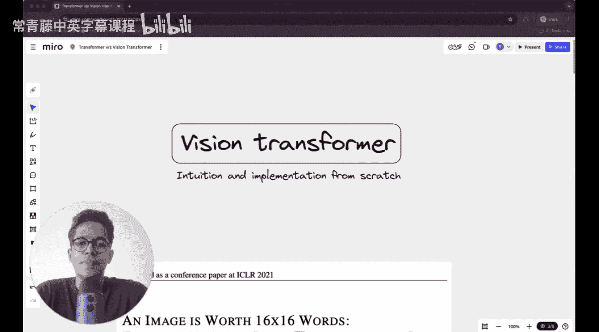
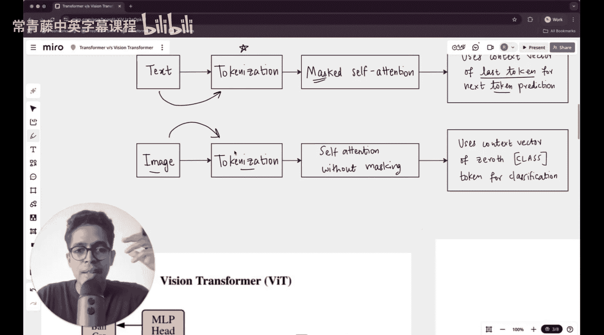

#  015：从零构建视觉Transformer (ViT) - 直觉与代码

在本节课中，我们将学习Transformer架构如何处理视觉输入。我们将深入理解视觉Transformer (ViT) 背后的核心思想，并从头开始用Python实现它。这是本系列课程中首次探讨图像作为Transformer的输入。

## 概述

到目前为止，我们已经探讨了Transformer的工作原理、注意力机制，以及单个token在大语言模型中的旅程。我们了解了Transformer如何处理基于文本的数据。现在，我们将看到当输入是图像时，它是如何工作的。本节课将聚焦于一篇著名论文提出的视觉Transformer。首先，我们将理解Transformer处理视觉数据的直觉，然后完全从零开始用Python实现一个视觉Transformer。

## 视觉Transformer的诞生

这篇题为《An Image is Worth 16x16 Words》的论文提出了视觉Transformer。这篇论文同样来自谷歌。原始Transformer论文《Attention Is All You Need》也出自谷歌。这清楚地表明谷歌在人工智能领域进行了大量开创性研究。

这篇论文所做的是在原始Transformer架构上进行极小的修改，从而扩展了其能力。他们想探究视觉Transformer的能力与卷积神经网络相比如何。卷积运算非常擅长捕捉图像中的二维特征，因为卷积滤波器本身就是二维的。但Transformer处理token的方式并非如此，因为token是序列，然后添加了位置嵌入，因此二维位置信息默认并不可用。虽然它可以被视为可训练参数，但默认情况下Transformer无法直接获取。卷积神经网络因卷积滤波器而享有的许多优势，在基于Transformer的架构中并不存在。这篇论文实际上讨论了所有这些内容，并指出对CNN的依赖并非必要，尤其是在拥有大规模数据集时。他们表明，对于大规模模型，视觉Transformer在计算上甚至比卷积神经网络更高效。这篇论文写得非常出色，我曾在另一个系列中对其进行过详细解读，强烈推荐大家查阅。

事实上，过去我曾做过一讲关于从零开始编写Transformer的课程，但那个课程的背景非常不同，它不属于“多模态LLM中的Transformer”系列。而现在这个背景非常完美，因为我们已经讨论了Transformer的所有相关内容，现在我们已经准备好完全理解图像是如何被处理的。

## 文本与图像处理的差异

首先，我们来理解Transformer处理文本和图像的差异。

在文本处理中，你有一个句子，它被分词成token。这些token本质上是向量。在这些向量上，你还添加了位置嵌入。分词过程负责将文本转换为token，然后将token转换为输入嵌入。通过添加位置嵌入，初始的文本嵌入被转换为输入嵌入。

在像GPT这样的模型中，有一种称为**掩码自注意力**的机制。之所以需要这种掩码，是因为正如我们在系列早期讨论过的，如果你试图预测下一个词，当前的查询不应该看到未来的token，即当前查询不应该关注未来的token。例如，如果我们有一个句子“The cat sat on the mat”，如果GPT将其视为下一个词预测任务，并且输入只有“The cat sat on”，那么最后两个词是不可用的，需要被预测。给定这四个词，GPT必须预测下一个词，给定输入的前四个词加上预测出的一个词，它可以预测再下一个词。观察生成的上下文向量，每个词（或token）都会有一个关联的上下文向量。用于预测下一个词的是最后一个token（例如“on”）的上下文向量。

在构建上下文向量时，如果我们的查询是“on”，那么序列中的所有词（“The”、“cat”、“sat”、“on”）都是键。实际上，如果看整个句子（包括输入和预测），有很多键。但关键是，查询不应该关注那些未来将要出现的键。因此，“on”应该只关注“The”、“cat”、“sat”和“on”本身。“sat”应该只关注“The”和“cat”。因为“on”只有在“sat”之后才会出现。为了预测下一个词，当前查询无法关注未来的token，这就是所谓的掩码自注意力，我们在上一讲中详细讨论过。

这种掩码是GPT类架构的重要特征，它是一个生成模型，旨在生成文本。这种掩码在BERT中并不需要，尽管BERT有不同类型的掩码。BERT是双向编码器，它有一个掩码token，任务是预测这个掩码token的值。为了构建上下文向量，注意力会关注序列中的每一个token，而不仅仅是之前的token，因为这里的目的是预测下一个词。

现在思考一下这个下一个词预测任务，它本质上是一个softmax分布。如果你的词典有5万个词或token，你将得到一个类似这样的softmax分布。其中一个token可能具有最高的概率。这几乎就像一个分类任务，类别数量是5万。如果是10分类任务，你会有一个跨越10个不同类别的概率分布；如果是5万分类任务，你会有一个跨越5万个类别的softmax概率分布。这正是GPT中发生的情况，因为它有一个特定的词典大小。GPT只需要说出词典中可用的5万个token中哪一个最有可能成为下一个token。这与分类任务非常相似。

## 视觉Transformer的任务

那么视觉Transformer做什么呢？视觉Transformer做的事情非常相似。

它输入一张图像，然后对图像进行分词。我将详细说明这种分词具体是如何发生的。想象一下，你以某种方式将图像转换成一堆token，token就是向量，就像你将文本输入句子转换成token一样，那些token也是向量。

但在图像中，你的任务不是预测下一个token。你不是试图预测下一个词或任何类似的东西。你不是在预测...

视觉Transformer的主要任务是**图像分类**。它输入图像，输出一个类别标签。其核心思想是将图像分割成固定大小的块（例如16x16像素），将这些块线性投影成向量（即“图像token”），然后像处理文本token序列一样，将这些向量序列输入到标准的Transformer编码器中。最后，使用一个特殊的“[CLS]” token的表示来进行分类预测。

## 总结

本节课中，我们一起学习了视觉Transformer的基本概念。我们了解了其诞生的背景，以及它如何将处理序列的Transformer架构应用于图像分类任务。核心在于将图像视为一系列“视觉token”的序列。下一节，我们将深入探讨如何具体实现这种图像到token的转换，并开始动手编写代码。