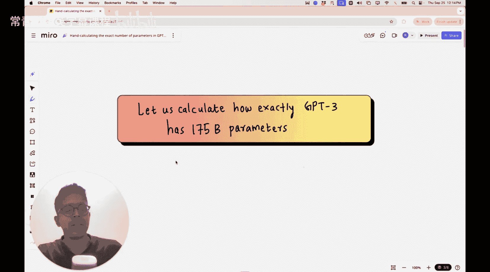
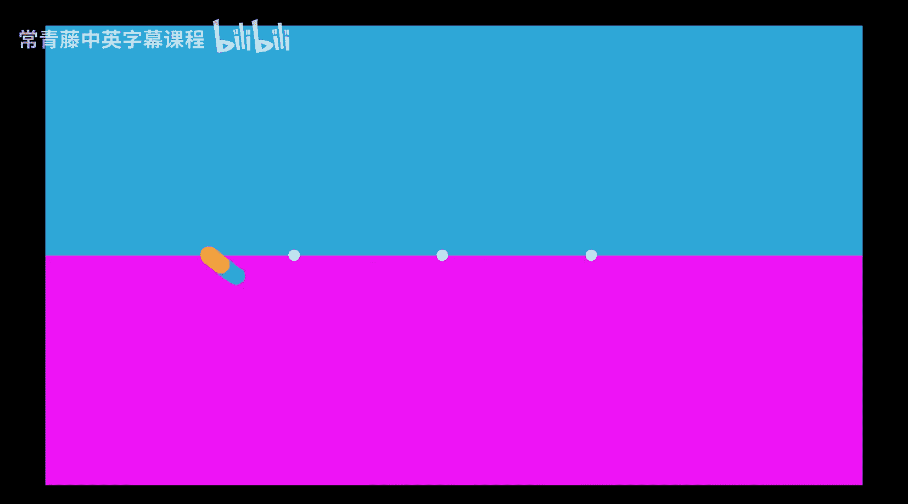
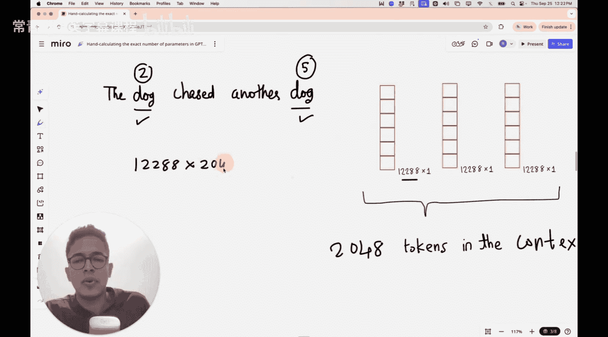

#  016：手动计算GPT-3的1750亿参数

在本节课中，我们将学习一项非常具体的任务：手动计算GPT-3模型是如何达到总计1750亿个参数的。这个练习将帮助我们深入理解大型语言模型（LLM）的架构本身，并让我们清楚地了解这些参数是如何在架构内部分布的：有多少在神经网络的输入部分，有多少在Transformer层中，又有多少在输出部分。

如果你不了解大型语言模型的架构，我强烈建议你先观看至少一个详细解释架构的视频。因为在本课中，我不会深入讲解Transformer架构的所有细节，那会使课程变得冗长。相反，我会假设你对大型语言模型架构和Transformer块有基本的了解。然后，我将逐步引导你如何精确计算这些参数。

如果你忘记了LLM架构的具体样子，也不用担心，我会提供一个简短的回顾来帮你复习。

现在你可能会想，GPT-3的架构与基于视觉的任务有何关联？我解释这个内容的原因，是希望你能将本节课获得的直觉，同样应用到学习和理解视觉与Transformer结合的案例中。这就是我引入本节课的原因。

## 架构概览

首先，让我们看看LLM的整体架构图。

这是整体的图形架构。看到多个模块不必担心，我会将其划分为有意义的几个部分。

我们可以将整个LLM架构分为三个模块：
1.  第一个模块是处理输入的部分。你提供一个输入或提示，然后对这个输入进行一些处理，包括分词和位置嵌入。我会解释这些含义，但请先记住这个概念。
2.  然后是Transformer块，其中包含两个层归一化（图中两个蓝色块），在两个位置有Dropout操作，还有一个前馈神经网络，以及核心组件——多头注意力机制。
3.  最后一个模块是输出块，大型语言模型在这里进行下一个词的最终预测，它包含一个归一化层和一个输出层。

在GPT-3架构中，这个Transformer块会串联重复96次。这是你会听到数字“96”的第一个地方。第二个你会听到“96”的地方是多头注意力机制内部头的数量，即并行有96个头。这两个“96”是不同的数字，请不要混淆。

我们的目标是计算这1750亿个参数是如何分布在这些模块以及各个子模块中的。让我们尝试计算一下。

## GPT-3 175B 架构规格

一个拥有1750亿参数的GPT-3模型具有以下架构规格：
*   它有 **96层**。这意味着有 **96个Transformer块** 串联在一起。
*   每个**词元**（可以是一个词或子词）由一个 **12,288维** 的向量表示。
*   在每个Transformer层中，最重要的组件之一是**多头注意力机制**。每个多头注意力机制有 **96个头**。
*   在这些多头注意力机制内部，每个头负责处理输入词元维度的 **1/96**。这意味着 `12288 / 96 = 128`。因此，词元在这些注意力头内部不是以12,288维空间表示，而是在每个单独的注意力头中以128维空间表示，然后它们被拼接回一起，重新构成12,288维的词元。
*   此外，还有一个**前馈神经网络**。它的作用是将经过变换的12,288维词元，投影到一个维度扩大4倍的空间（即 `12288 * 4 = 49152` 维），然后再投影回来。稍后计算参数时我会解释具体的数字，现在只是介绍架构相关的数字。
*   模型有一个**词表**，大小为 **50,257**。这意味着词表中存在这么多独特的词元。每个词元由一个12,288维的向量表示。
*   **上下文长度**，即可以输入GPT-3架构的词元数量，是 **2048**。

以上就是GPT-3 175B模型的一般架构规格。基于这些信息，让我们尝试计算参数数量，最终所有这些数字加起来应该等于1750亿。

## 参数计算：输入部分

### 词表嵌入参数

如前所述，输入词元是一个12,288维的向量。词表包含50,257个这样的词元。每个词元向量中的每个数字都是需要训练的参数，以便为每个词元获得良好的表示。

因此，词表中的参数数量为：
`词表大小 * 词元维度 = 50,257 * 12,288`

计算这个数字：
`50,257 * 12,288 = 617,550,000` （约6.1755亿）

所以，在我们的**输入嵌入**中，有大约 **6.1755亿** 个参数。

### 位置嵌入参数

我们的上下文窗口大小是2048个词元。每个词元当然是12,288维的向量。但我们不会直接使用从词表中取出的词元值，而是在其上添加一个**位置嵌入**。

为什么位置嵌入很重要？例如，在句子“The dog chased another dog”中，“dog”这个词出现了两次，但第一次出现在位置2，第二次出现在位置5。因此，这两个“dog”的表示方式应该有所不同，这就是为什么需要为输入嵌入添加位置信息。

你需要的位置嵌入向量的数量，等于上下文窗口中的词元数量，即2048个。

因此，位置嵌入的参数数量为：
`上下文长度 * 词元维度 = 2,048 * 12,288`

计算这个数字：
`2,048 * 12,288 = 25,165,824` （约2516万）

所以，在**位置嵌入**中，有大约 **2517万** 个参数。

---

上一节我们计算了输入部分（词表嵌入和位置嵌入）的参数。接下来，我们将深入Transformer块内部，看看参数是如何在多头注意力机制和前馈神经网络中分布的。