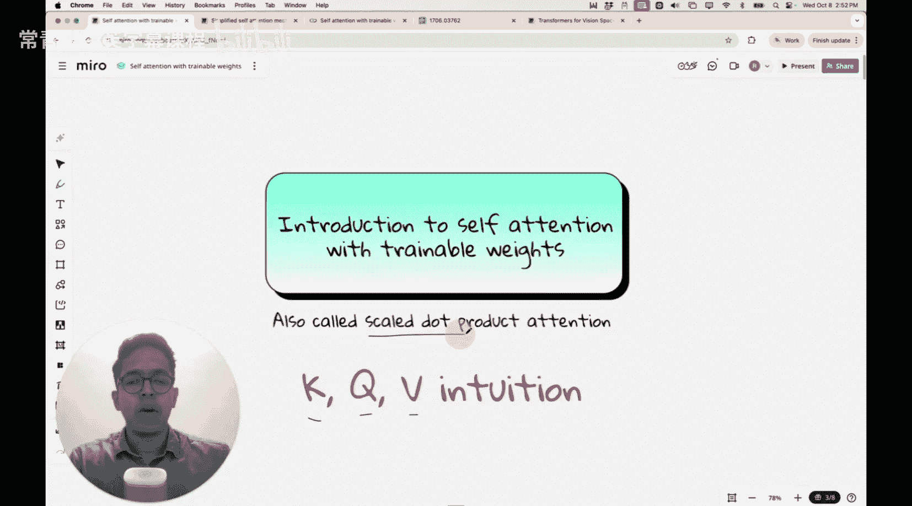
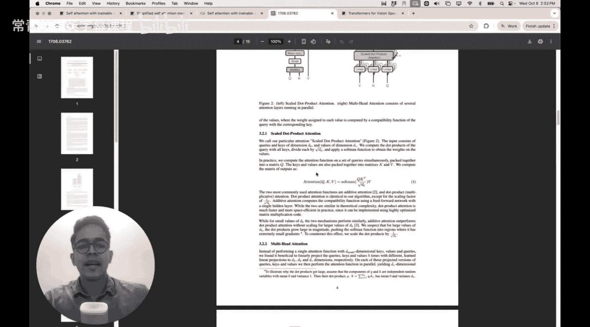
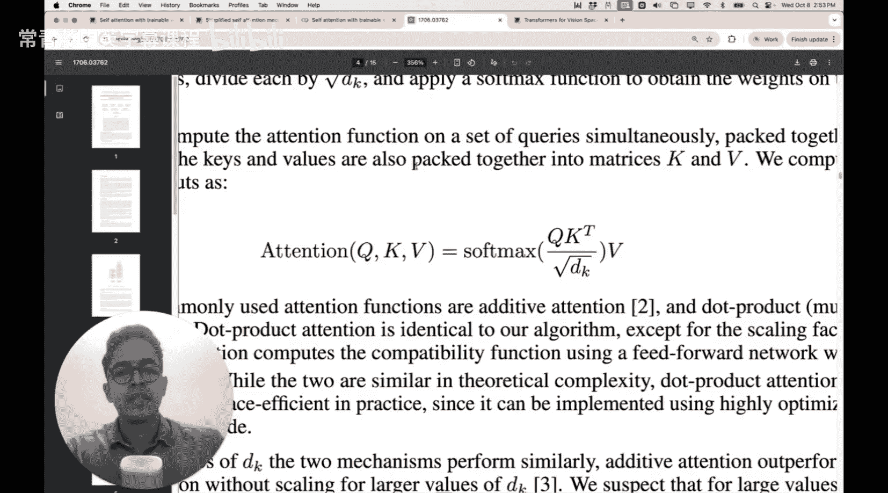
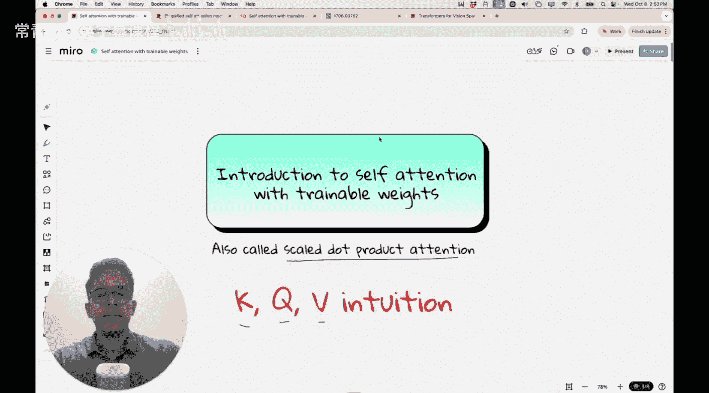
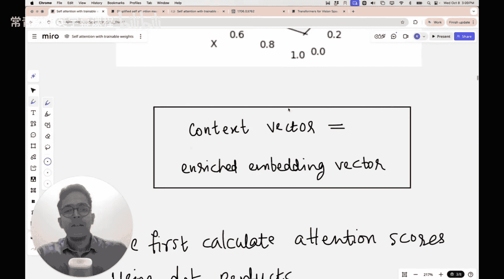

#  020：可训练权重的自注意力机制

在本节课中，我们将深入学习自注意力机制。与上一讲我们通过向量点积实现简化版自注意力不同，这次我们将实现带有可训练权重的自注意力机制。这里所说的可训练权重，特指与键（Key）、查询（Query）和值（Value）相关的权重矩阵。这些术语在大语言模型（LLM）的语境中非常常见，因此，本节课旨在帮助你深入理解键、查询和值的概念。像GPT这样的大语言模型所使用的自注意力机制，也称为**缩放点积注意力**。

通过今天的学习，你将理解“注意力就是你所需要的一切”这篇论文中提到的这个公式背后的直觉。

现在这个公式可能看起来有些令人生畏，但请放心，在本节课结束时，你将从直觉层面很好地理解这个公式究竟在表达什么。

那么，让我们开始今天的课程。

## 课程回顾与背景

首先，让我们回顾一下本课程到目前为止讨论的内容。在上一讲中，我们讨论了简化的自注意力机制，通过使用词向量嵌入之间的点积来构建注意力分数。在那之前，我们从2014年引入的Bahdanau注意力开始讨论。

我们知道，Bahdanau注意力主要用于神经机器翻译的编码器-解码器架构中。在解码器中，每一个隐藏状态都可以访问编码器中的每一个隐藏状态。这些H1、H2、H3是编码器的隐藏状态，在引入注意力机制之前，解码器无法访问所有这些状态。由于注意力机制，解码器不再仅仅依赖于编码器输出的单个上下文向量，而是可以依赖于每一个隐藏状态，并构建解码器应对每个隐藏状态给予的相对重要性。这样，就减轻了最终上下文向量的压力。

如果你不记得循环神经网络中的编码器-解码器架构，也不必担心，这对今天的课程并不重要，我只是想做一个简要的回顾。如果你真的想了解Bahdanau注意力在2014年神经机器翻译背景下的出现，可以回顾我们讨论RNN如何从编码器-解码器架构开始，最终引入注意力机制的那一讲。

## 自注意力机制的目标

然而，在自注意力机制中，我们尝试做的事情有所不同。我们有一个输入序列，例如“Dream big and work for it”。我们想要为输入序列中的每个标记（token）构建对应的上下文向量。为简化起见，我们现在认为每个标记是一个单词，尽管在像GPT这样的模型中，它使用字节对编码，所以一个单词不一定是一个标记，可能包含字符和子词。

在这个序列中，我们有六个标记。对于每一个标记，我们都想生成一个对应的上下文向量。如果这是在神经机器翻译任务的编码器-解码器架构中，我们只会在序列末尾、编码器输出处产生一个上下文向量，并希望该上下文向量能嵌入序列中的所有信息。但随着自注意力机制的出现，我们不再需要这样做。我们可以计算序列中的每个单词应该“关注”或“注意”同一序列中的每个单词的程度，这就是“自注意力”这个名字的由来。

## 简化自注意力回顾

在今天的课程中，我们将把这些标记视为三维向量，以便于绘图。在上一讲中，我们以简化的方式实现了自注意力。我们有输入和嵌入向量，例如“Dream”、“big”、“and”、“work”、“for”、“it”。这是“Dream”的原始输入嵌入向量，这是“big”的嵌入向量，等等。

为了计算“Dream”应该给予“big”多少注意力，或者“work”应该给予“big”多少注意力，我们取了这两个向量之间的点积，并根据这些点积的大小构建了注意力分数。因此，如果有六个单词，并且我们将“big”视为查询（即我们当前正在查看的标记），我们可以构建六个注意力分数：一个在“big”和“Dream”之间，一个在“big”和它自身之间，一个在“big”和“and”之间，依此类推。

这些注意力分数没有归一化。我们在上一讲中讨论过，我们使用softmax函数对这些注意力分数进行归一化，使得对应于任何查询的六个注意力分数之和为一。因此，如果我们考虑查询是“big”，将会有六个对应于每个键的注意力分数。假设它们是0.1, 0.2, 0.2, 0.1, 0.3, 0.1。这些数字加起来等于1。

你可以将这些视为百分比。对于句子“Dream big and work for it”，这意味着“big”应该给予“Dream”10%的注意力，“big”应该给予自身20%的注意力，“big”应该给予“and”20%的注意力，等等。通过拥有这些归一化的注意力分数，我们可以直观地了解每个查询对同一序列中每个键的关注百分比。因此，注意力分数的归一化产生了所谓的**注意力权重**，这些由softmax计算得出的数字就是注意力权重。

为了构建上下文向量，我们将原始输入向量与对应的注意力权重相乘，然后将它们相加。例如，对于单词“big”，我们取注意力矩阵中对应于“big”查询的那一行权重，对输入向量进行加权求和，就得到了“big”的上下文向量。如果我们将这个上下文向量绘制出来，这就是我们在上一讲结束时得到的“big”标记的上下文向量。

## 引入可训练权重

但你可能已经注意到一件事：我们知道在大语言模型中，训练模型是至关重要的。然而，在这个注意力计算、这个自注意力计算中，没有涉及任何训练。没有可训练的权重。点积只是在我们已有的向量之间进行，标记化后我们有了对应于标记的向量，之后就没有更多可训练的权重参与了。我们只是通过点积得到注意力分数，然后使用softmax进行归一化得到注意力权重，然后取对应于任何给定查询的键的加权和，得到该特定查询的上下文向量。这就是我们在上一讲中所做的。

如果你真的想花些时间了解简化的自注意力，并且你是第一次观看本系列课程，请返回上一讲，花些时间学习简化的自注意力，以便更好地理解我们为什么对构建上下文向量感兴趣。简单来说，上下文向量非常重要，因为它嵌入了更好的含义，因此它更加丰富。

---

**本节课总结**

在本节课中，我们一起回顾了自注意力机制的基本目标，并与早期的Bahdanau注意力进行了对比。我们重点分析了上一讲中简化的自注意力实现，它通过点积和softmax归一化来计算注意力权重，并以此构建上下文向量。同时，我们指出了该简化版本的关键局限：**缺乏可训练的权重**。这为我们下一讲引入键（K）、查询（Q）、值（V）矩阵以及可训练的缩放点积注意力公式做好了铺垫。