#  021：自注意力机制简介与简化实现

在本节课中，我们将首次深入探讨自注意力机制的核心概念。为了简化理解，我们将考虑一个没有可训练权重的自注意力机制，并解释其含义。首先，我们将理解什么是自注意力，以及如何计算注意力分数以获得上下文向量。我们还将通过代码实现来加深数值层面的理解。

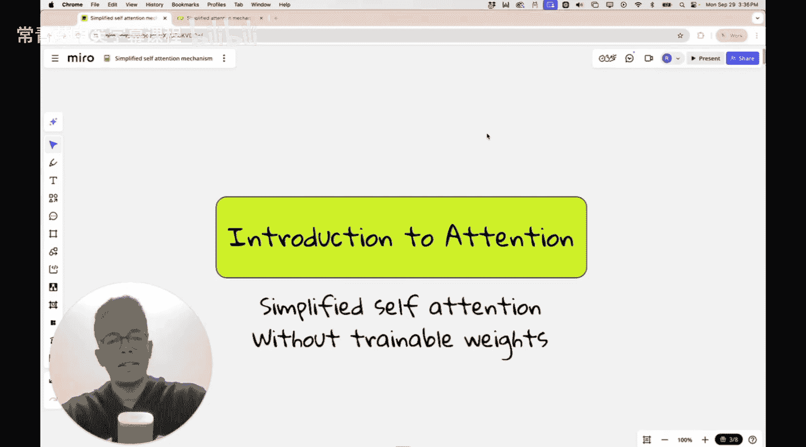


## 回顾：RNN与长距离依赖问题

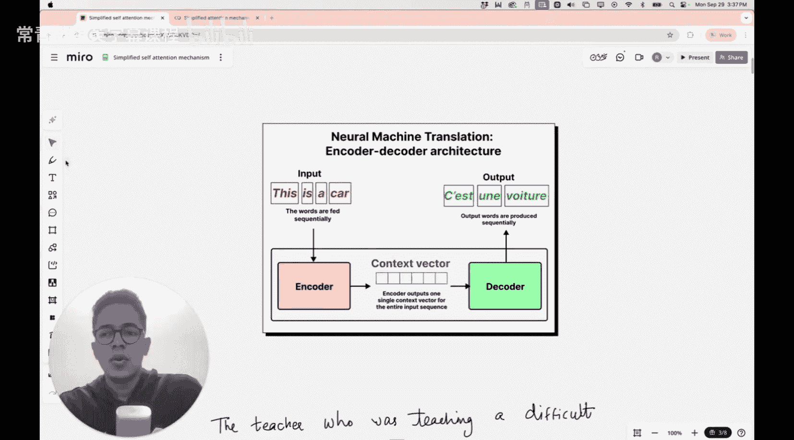

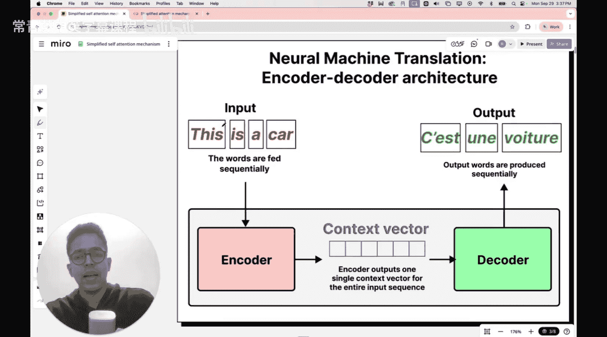

在上一节关于神经机器翻译的讲座中，我们讨论了使用编码器-解码器架构的模型。我们以一个短句翻译为例：输入英文句子“This is a car”，编码器输出一个上下文向量，该向量承载了整个输入序列的含义。然后，这个上下文向量作为解码器的输入，解码器输出对应的法语句子。

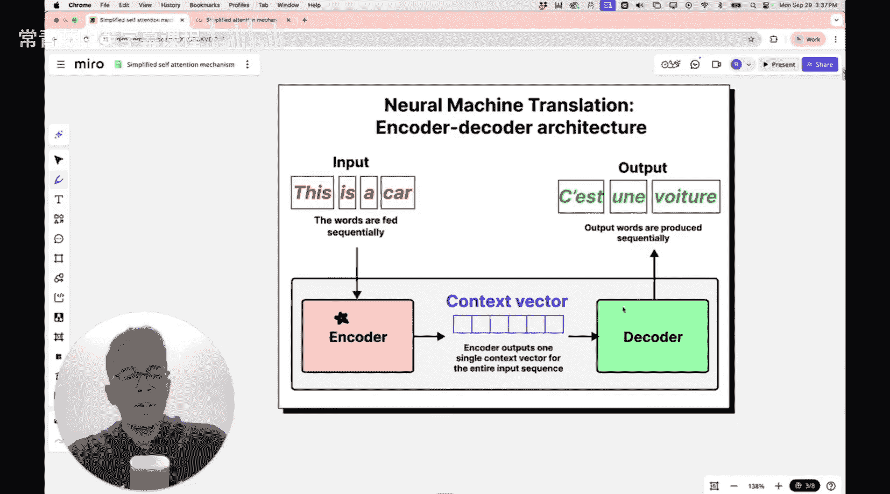

然而，这种模型在处理长距离依赖时存在困难。什么是长距离依赖？

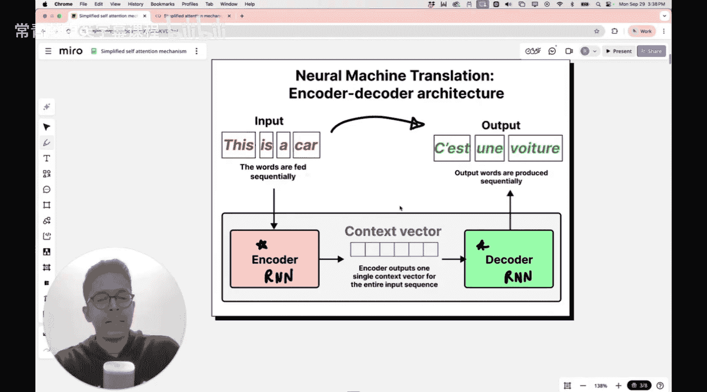

考虑一个更长的句子：“The teacher who was teaching a difficult concept to the students smiled.”。在这个句子中，“teacher”一词在开头，“smiled”在结尾。从逻辑上看，“smiled”这个动作与“teacher”之间存在长距离依赖关系，并且“smiled”应该更多地关注“teacher”而不是“students”。但在没有注意力机制的RNN中，解码器只能访问编码器输出的单一上下文向量，而无法直接访问编码器中间的所有隐藏状态，这使得模型难以学习这种长距离的依赖关系。

## 从Bahdanau注意力到自注意力

在上一讲中，我们介绍了2014年提出的Bahdanau注意力机制。它允许解码器的每一个隐藏状态都能访问编码器的所有隐藏状态。这意味着，在生成输出序列的每一个词时，模型可以基于加权的方式，关注输入序列中的每一个词，而不仅仅是最终的上下文向量。

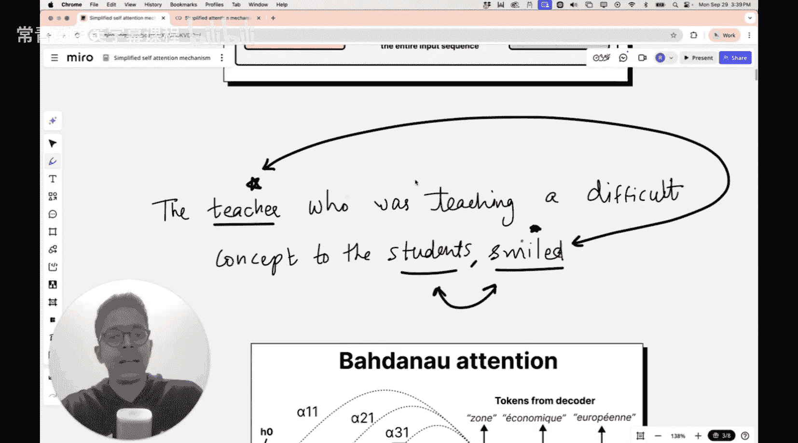

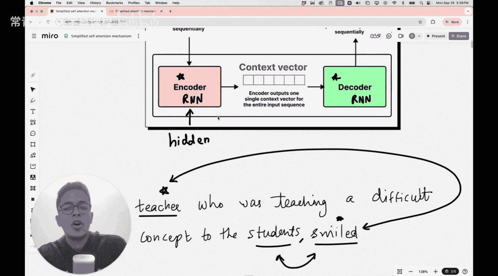

Bahdanau注意力关注的是两个不同序列（编码器输入和解码器输出）之间的关联。其生成的注意力权重矩阵不一定是方阵，因为输入和输出序列的长度可能不同。

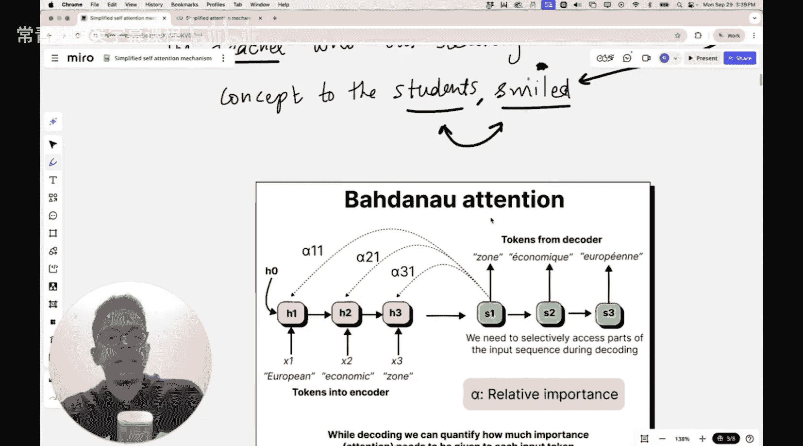

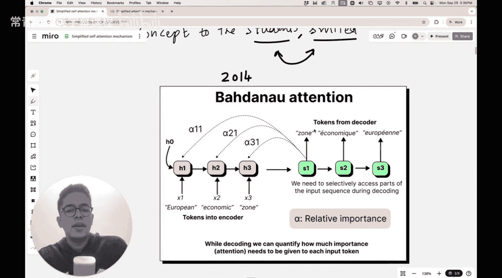

自注意力则泛化了Bahdanau注意力的概念。它不比较输入和输出序列，而是**在同一个序列内部**，计算序列中每个词对其他所有词（包括自身）的关注程度。例如，在句子“Americans speak English”中，自注意力机制可以帮助确定“English”这个词应该对序列中其他词（包括“Americans”和“speak”）赋予多少重要性。自注意力矩阵是一个方阵。

## 本节课重点：简化版自注意力机制

为了理解自注意力的基本原理，本节课我们将重点讨论一个**简化版的自注意力机制**，它不包含任何可训练的参数。

后续课程中，我们将深入讲解GPT等模型中使用的、包含可训练权重的**实际自注意力机制**，以及其衍生概念**掩码自注意力**和**多头注意力**。理解了基础的自注意力，这些高级概念将更容易掌握。

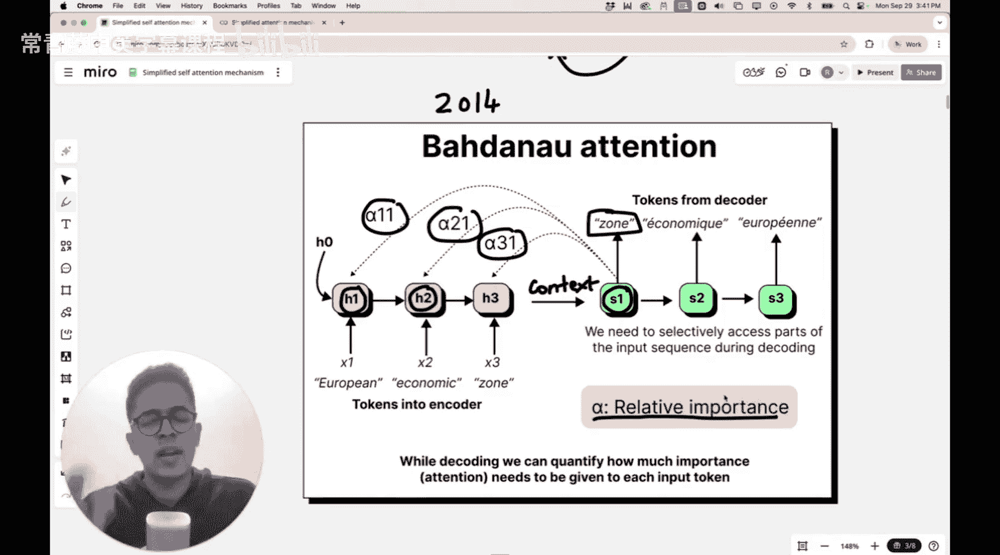

现在，让我们回到自注意力的核心思想。

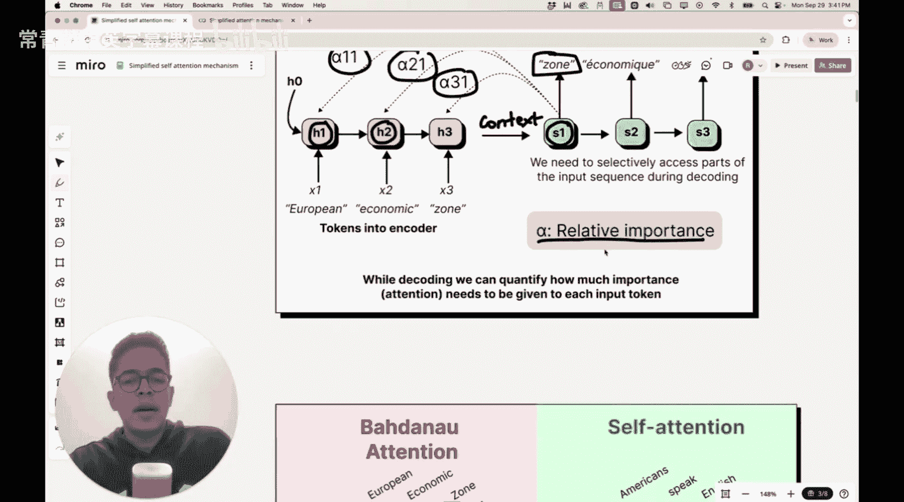

## 自注意力的计算过程

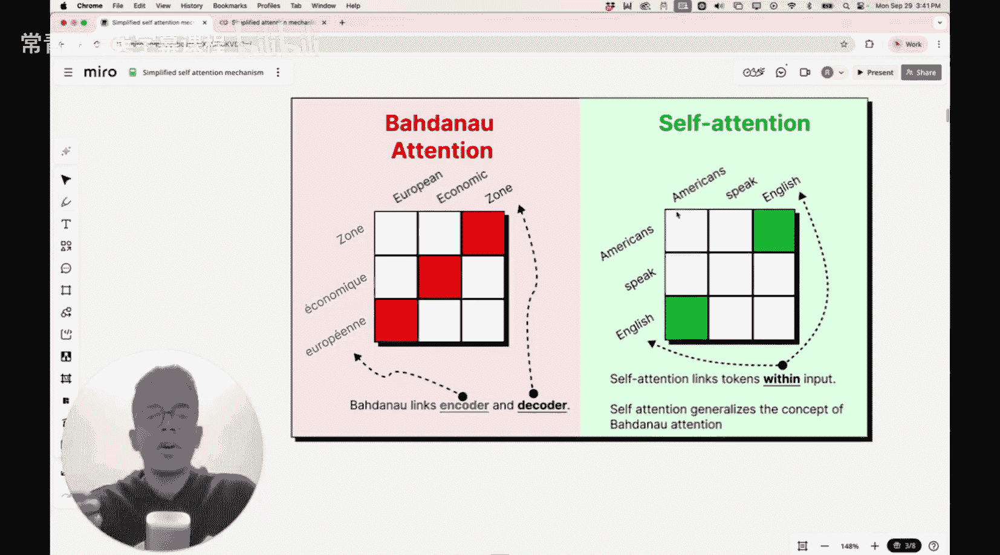

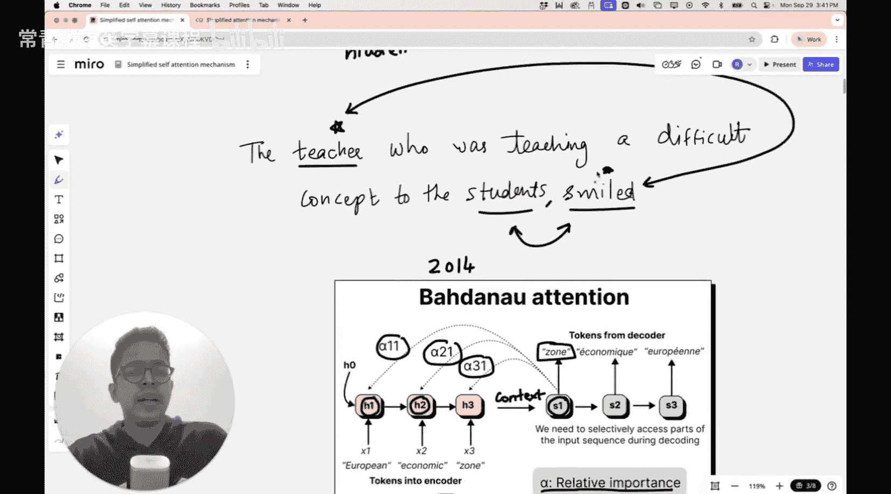

假设我们有一个句子：“Dream big and work for it.”。在自注意力机制中，我们提出的问题是：对于序列中的某一个词（例如“big”），它应该对序列中的**每一个词**（包括它自己）赋予多少注意力或权重？

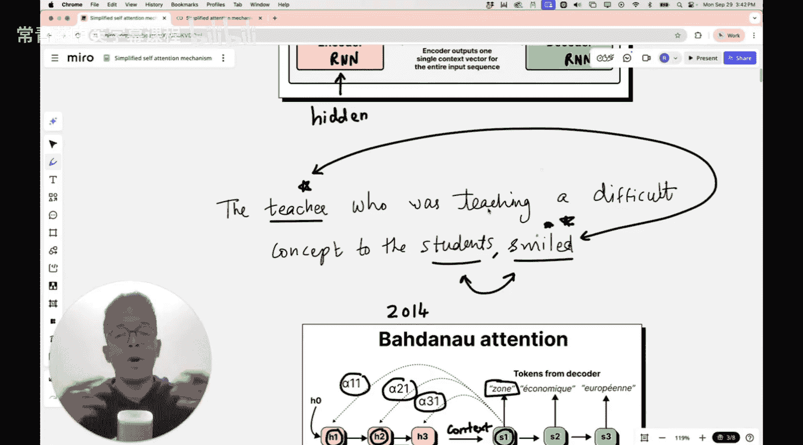

首先，我们需要知道，在自然语言处理中，词语通常被表示为**词向量嵌入**。每个词都被映射到一个高维向量空间中的一个点，这个向量是词语的数学抽象表示，承载了语义信息。语义相近的词，其向量在空间中的位置也相近。

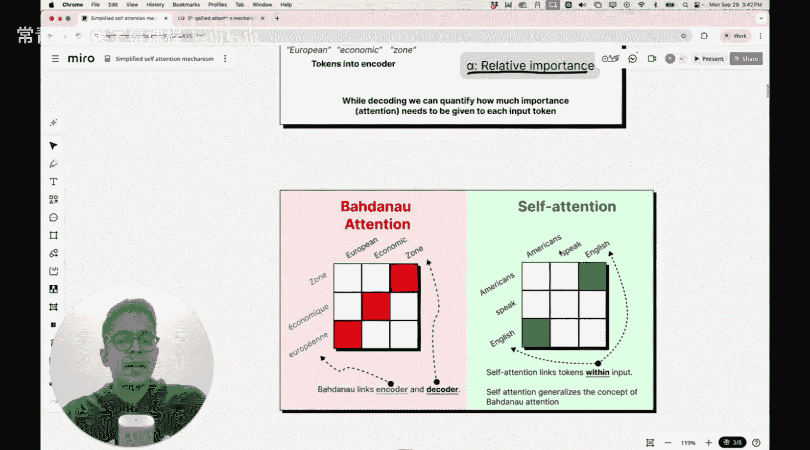

以下是计算简化版自注意力的步骤：

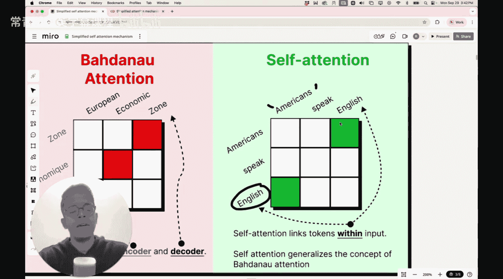

1.  **获取词向量**：将输入序列中的每个词转换为其对应的词向量。假设我们的词向量维度是3。对于句子“Dream big and work for it”，我们得到6个向量。
    ```python
    # 示例：假设的3维词向量
    dream = [1, 0, 1]
    big   = [0, 1, 0]
    and   = [1, 1, 0]
    work  = [0, 0, 1]
    for   = [1, 0, 0]
    it    = [0, 1, 1]
    ```

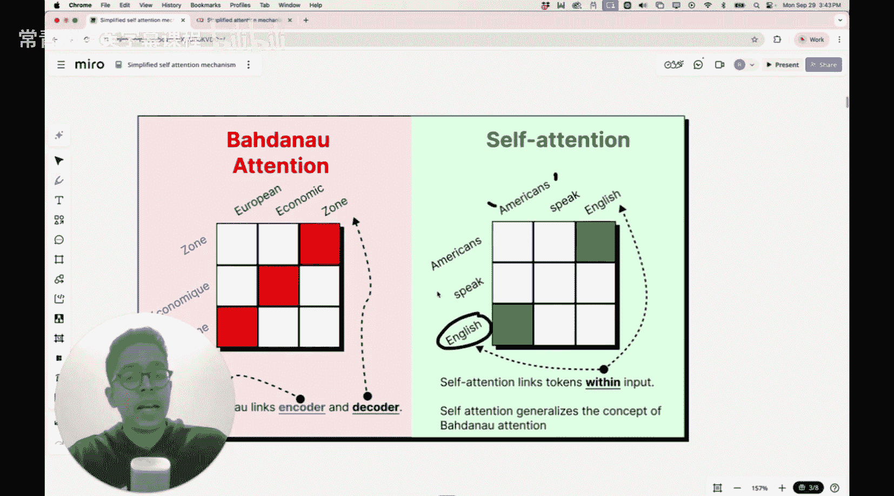


2.  **计算注意力分数**：为了计算词`i`对词`j`的注意力分数，一个简单的方法是计算它们词向量的**点积**。点积值越大，通常表示两个向量在语义上越相关。
    *   公式：`score(i, j) = vector_i · vector_j`（点积）
    *   例如，计算“big”对“dream”的注意力分数：`score(big, dream) = [0,1,0] · [1,0,1] = 0*1 + 1*0 + 0*1 = 0`

3.  **构建注意力分数矩阵**：为序列中每一对词都计算点积，形成一个方阵。这个矩阵就是**注意力分数矩阵**。
    ```
         dream  big   and   work  for   it
    dream   2     0     1     1     1     1
    big     0     1     1     0     0     1
    and     1     1     2     0     1     1
    work    1     0     0     1     0     1
    for     1     0     1     0     1     0
    it      1     1     1     1     0     2
    ```
    *（注：此矩阵数值为示例，非严格由上例向量计算得出）*

4.  **将分数转换为权重**：直接使用点积分数可能数值范围不稳定。为了获得一个概率分布（所有权重之和为1），我们通常对每一行应用**Softmax函数**。
    *   对“big”对应的行 `[0, 1, 1, 0, 0, 1]` 应用Softmax。
    *   Softmax公式：`weight(i, j) = exp(score(i, j)) / sum_k(exp(score(i, k)))`
    *   应用后，我们得到**注意力权重矩阵**。该矩阵中，“big”这一行的数值表示“big”这个词应该分配给序列中每个词的注意力权重。

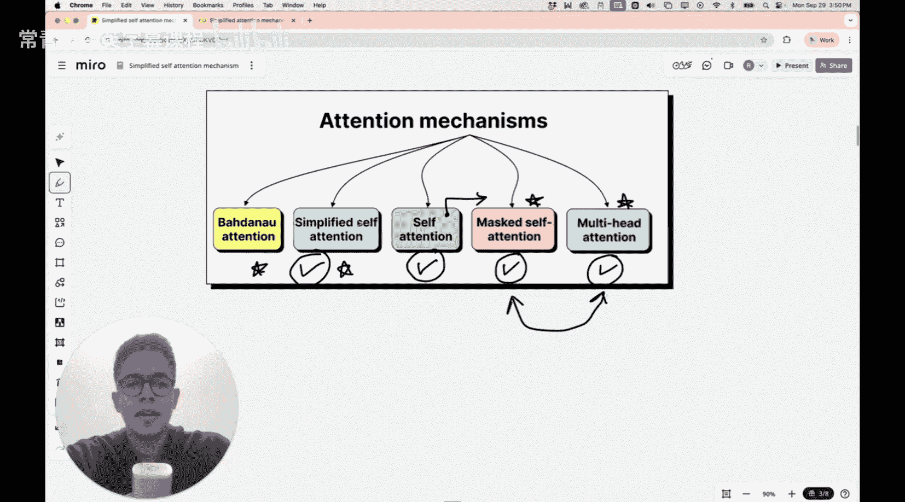

5.  **计算上下文向量**：对于序列中的每一个词（例如“big”），其**上下文向量**是序列中所有词向量的加权和，权重即来自上一步计算出的注意力权重。
    *   公式：`context_vector_i = sum_j(weight(i, j) * vector_j)`
    *   这样，“big”的上下文向量就不再仅仅是它自己的词向量`[0,1,0]`，而是融合了它根据语义关系所关注的“dream”、“and”、“it”等其他词的信息的新向量。

通过这个过程，序列中的每个词都获得了一个新的、富含上下文信息的表示。这个新表示能够捕捉词与词之间的依赖关系，包括长距离依赖。

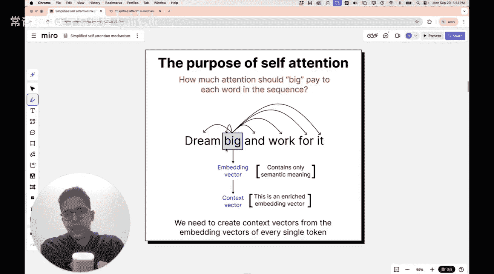

## 总结

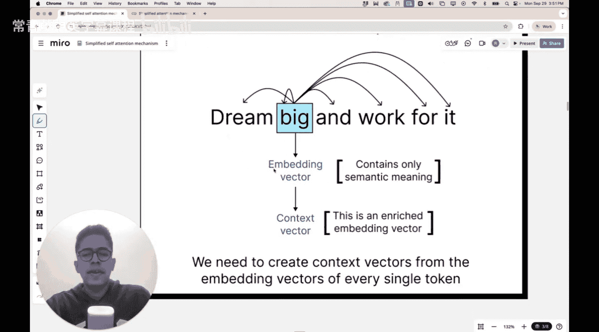

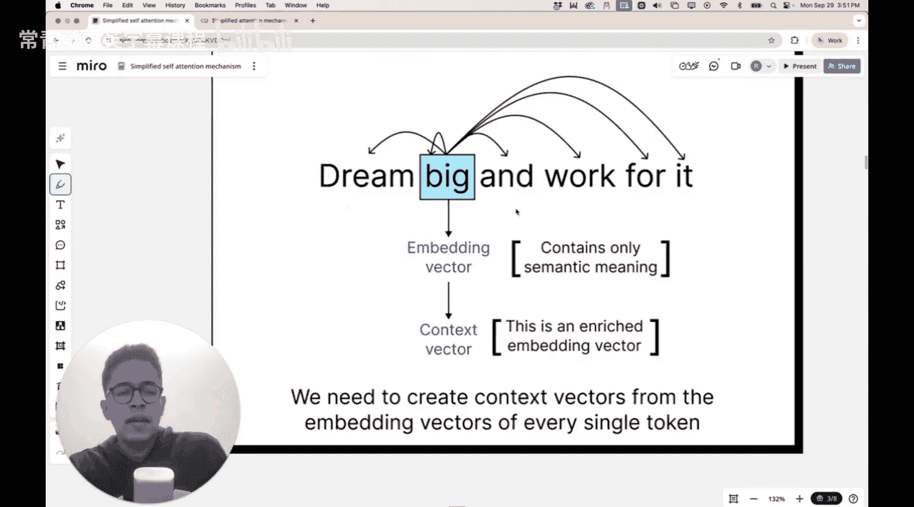

本节课我们一起学习了自注意力机制的基础。我们从RNN处理长距离依赖的局限性出发，回顾了Bahdanau注意力如何连接编码器与解码器。接着，我们引入了**自注意力**的概念，它在一个序列内部计算词与词之间的关联。

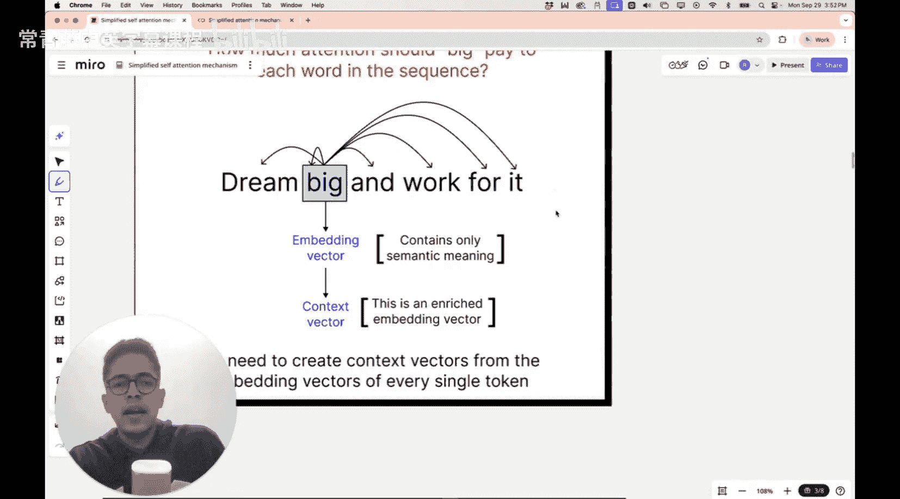

为了理解其核心计算逻辑，我们重点探讨了一个**简化版的自注意力机制**。其关键步骤包括：
1.  将词表示为向量。
2.  通过**点积**计算任意两个词之间的注意力分数。
3.  使用**Softmax函数**将分数归一化为概率分布的注意力权重。
4.  对词向量进行**加权求和**，为每个词生成一个融合了上下文信息的**上下文向量**。

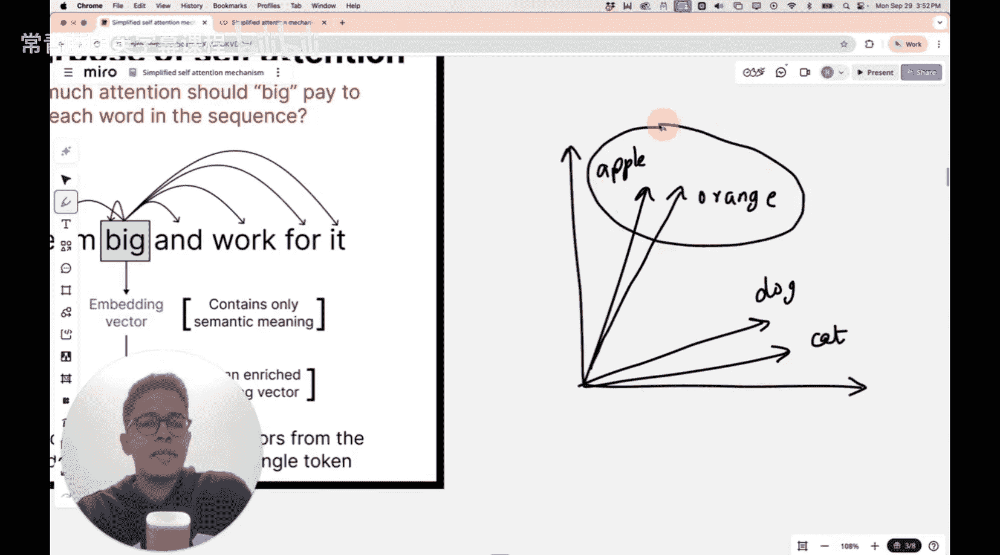

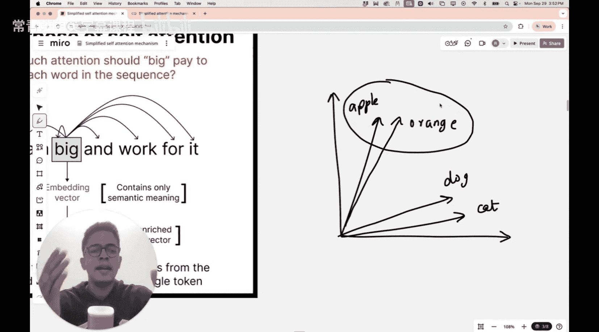

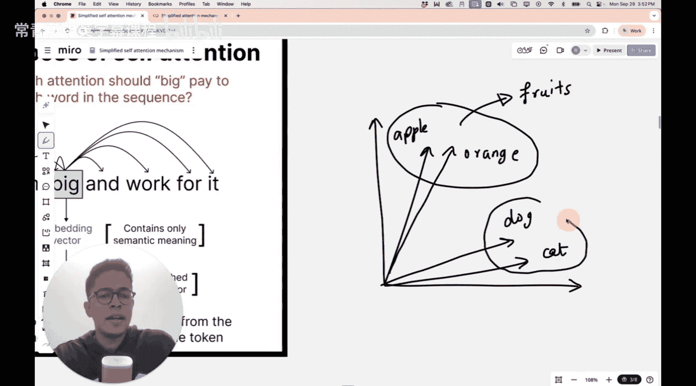

这个简化版本帮助我们清晰地看到了自注意力如何让模型动态地关注输入序列的不同部分。在下一讲中，我们将在此基础上，学习实际Transformer模型中使用的、包含可学习参数`Q`、`K`、`V`矩阵的完整自注意力机制。