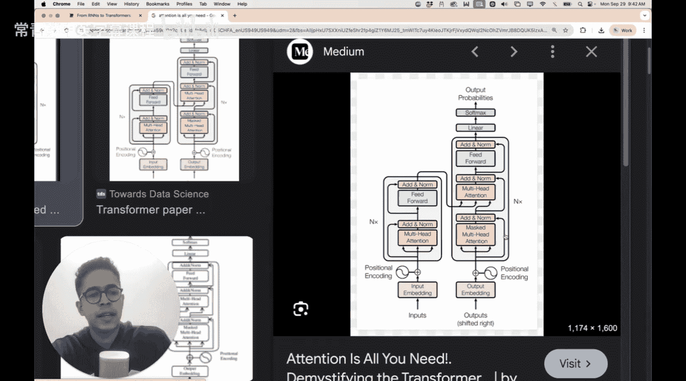
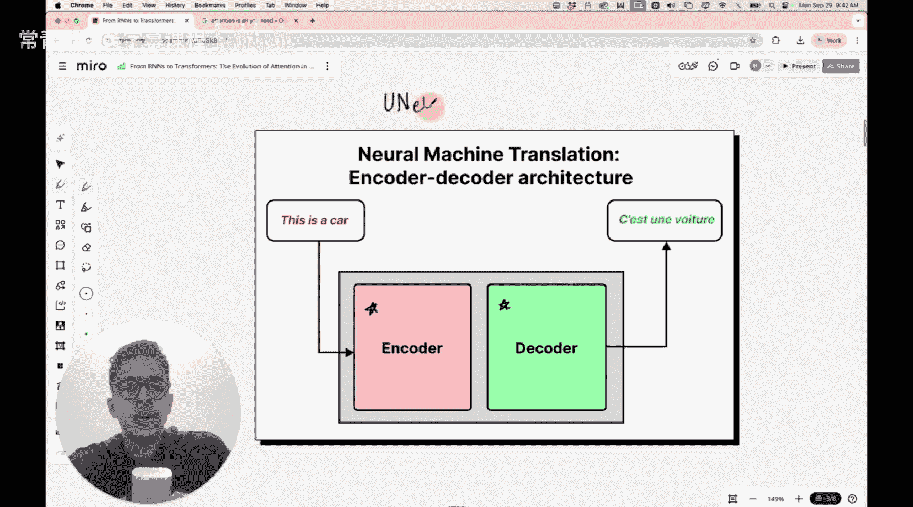
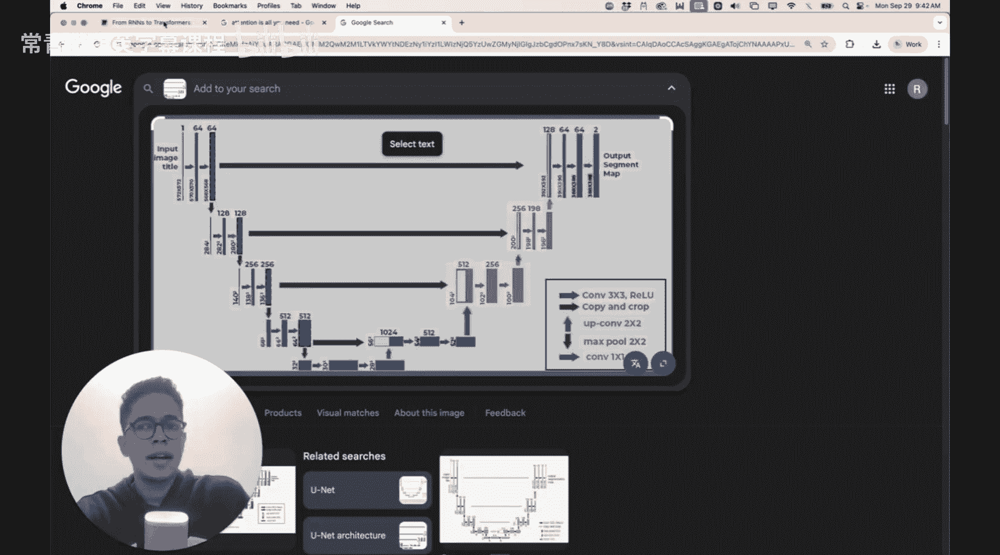
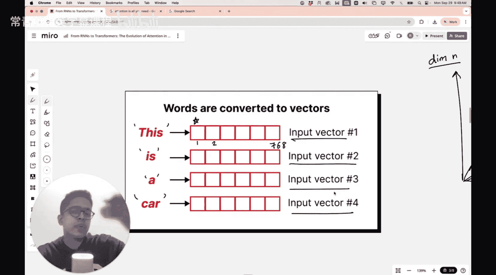

#  022：从RNN到Transformer - 注意力机制导论

在本节课中，我们将学习注意力机制的演进过程。我们将了解循环神经网络中的编码器-解码器机制如何发展到2014年引入的注意力机制，并最终在2017年《Attention Is All You Need》论文中催生了自注意力机制。注意力机制不仅彻底改变了自然语言处理领域，也对计算机视觉产生了深远影响。

上一节我们讨论了在长句子或段落中，注意力机制如何有效捕捉长距离依赖关系。例如，句子中的第一个词和最后一个词可能高度相关，尽管它们相隔很远。同样的情况也发生在图像中，左上角的像素块和右下角的像素块可能高度相关，而注意力机制正是能够为你捕捉这种长距离依赖关系的工具。因此，本节内容在当前课程中具有非常重要的背景意义。

## 序列到序列模型

你或许听说过“序列到序列模型”这个术语。在这种模型中，你可以输入任何类型的序列，例如句子中的单词、单个字母，甚至是图像中的特征，而序列到序列模型能够将其转换为另一个序列。

这种模型最初主要用于机器翻译，因为翻译本质上就是将一种语言的序列转换为另一种语言的序列。例如，将英文句子“This is a car”转换为法文版本。

这种用于神经机器翻译的序列到序列模型非常流行，并且对于短句效果很好。当然，在处理长句时它也存在一些问题，我们稍后会讨论其原因。但首先，让我们理解序列到序列模型的工作原理，以及其内部结构。

## 编码器-解码器架构

这个神经机器翻译器本质上是一个编码器-解码器架构。你也会在Transformer的上下文中遇到这两个术语。《Attention Is All You Need》论文中提出的Transformer架构就采用了编码器-解码器架构。此外，像U-Net这样的语义分割模型也采用了类似的架构，它将输入图像编码为更小的空间维度和更多的通道数，然后在解码器部分进行重建。

编码器-解码器架构的核心思想是：编码器接收输入序列（例如英文句子），并将其编码为一个抽象的表示；解码器则接收这个表示，并将其解码为目标序列（例如法文翻译）。输入和输出都是按顺序处理的。

## 编码器的工作原理

现在，让我们聚焦于编码器部分，暂时忽略解码器。

编码器的任务是接收一个输入序列。我们之所以称之为序列，是因为你可以将一个句子视为一系列单词或标记。以“This is a car”为例，它可以被拆分为四个单词的序列。

这些单词被顺序输入到编码器中。在处理完整个序列后，编码器会输出一个称为“上下文向量”的东西。

这个上下文向量是一个单一的输出向量。它拥有N个维度（例如768维），其目标是捕获输入英文句子中包含的所有上下文信息或全部含义，并将其压缩到这一个向量中。

这个上下文向量作为编码器的输出，随后被馈送到解码器中。输入句子并不直接进入解码器，而是先被编码成上下文向量的格式。然后，解码器尝试将这个上下文向量转换为最终的目标语言（例如法文）。

这些输出单词也是按顺序生成的，就像输入被顺序送入编码器一样。为了生成这三个单词，解码器的输入仅仅是这一个上下文向量。

你可以这样想象这个过程：你有一种语言的输入序列，将其转换为上下文向量形式的抽象表示。你希望这个抽象表示能捕获输入句子的某些含义，但这个表示本身不属于任何人类语言，它属于数学语言，只是一串数字。然后，你尝试从这个抽象表示（即上下文向量）转换回另一种人类语言（法语）。这就是解码器的工作。你可以认为编码器将输入转换到另一个向量空间，而解码器则将该向量空间转换回你的目标语言。

## 从序列到上下文向量

接下来的问题是：如何从英文输入序列得到这个抽象的数学概念——上下文向量？

具体做法是：首先将单词转换为向量。单词“This”、“is”、“a”、“car”被转换为四个输入向量。这些向量是这些单词的数学表示。

通常，这些向量承载着含义。我们可以将其想象成一个特征空间。假设每个向量有768个维度（这个数字只是举例，实际取决于词向量转换方法）。这个想法是，向量的方向承载着特定的语义。

例如，代表“apple”和“orange”的向量可能指向空间中语义相似的区域，这个区域代表“水果”的语义空间。另一方面，代表“dog”和“cat”的向量可能指向代表“动物”的语义空间的另一个方向。

因此，将单词转换为向量的核心思想是：单词对人类来说承载意义，同样地，这些向量也承载意义，它们编码了这些单词的语义含义，而不是随机数字。

一旦你有了这四个输入向量，你就有了编码器的输入基础。

## 总结

本节课中，我们一起学习了注意力机制的演进背景。我们介绍了序列到序列模型及其核心的编码器-解码器架构。我们详细探讨了编码器如何将输入序列（如单词）转换为数学向量，并最终压缩成一个承载整个句子语义的上下文向量。这个过程是理解后续注意力机制如何解决传统编码器-解码器模型（特别是处理长序列时）局限性的重要基础。下一节，我们将深入探讨这种传统架构的短板，以及注意力机制是如何作为其自然演进而出现的。