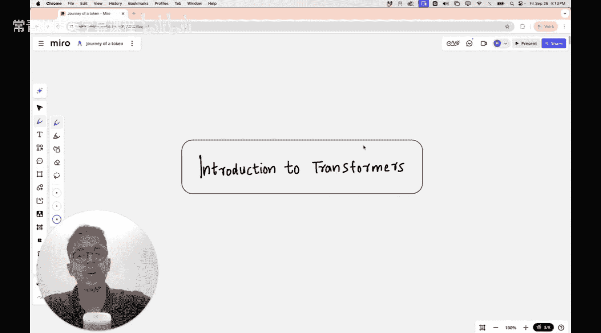
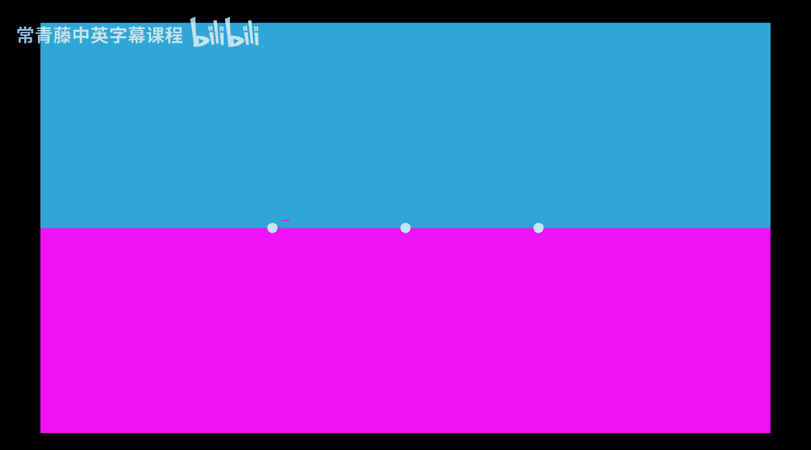
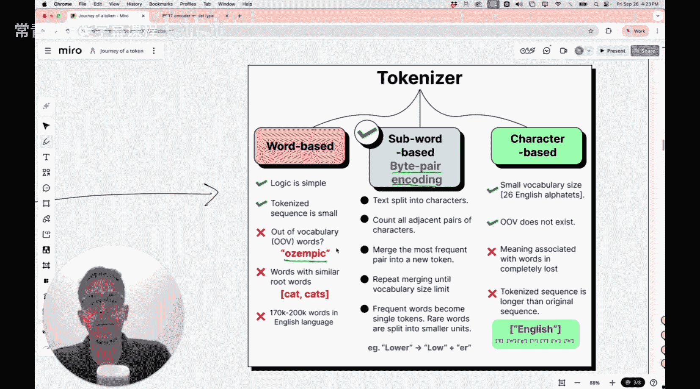

#  023：单个Token的旅程 - LLM入门

在本节课中，我们将深入探讨Transformer架构的核心工作原理。我们将从一个完全初学者的视角出发，通过追踪单个“Token”在模型中的旅程，来理解Transformer如何运作。无论您之前是否了解Transformer，本节课的内容都将为您打下坚实的基础。

---

在上一讲中，我们讨论了为什么需要Transformer来捕捉图像中的长距离依赖关系，这是CNN难以做到的。本节中，我们将首次深入探讨Transformer的实际架构。

我们将从大型语言模型的角度进行讨论，而不是视觉Transformer。然而，我们今天学到的所有知识，在后续讨论视觉Transformer时都将直接适用。

我以完全适合初学者的方式安排了今天的课程。您无需事先了解Transformer。我们将尝试从单个Token的视角来理解Transformer的运作方式。我会定义什么是Token，并通过观察这个Token的旅程来了解Transformer的操作。

我相信大家都熟悉2017年发表的著名论文《Attention Is All You Need》。这篇论文由谷歌发布，彻底改变了人工智能领域。它首次提出了“自注意力”的概念，我们将在本课程中讨论这一点。这改变了人们实现自然语言处理的方式。Transformer是这篇论文的核心部分，其中引入了自注意力机制。后来出现了许多其他变体，如Flash Attention等，但基础模型仍然是那篇论文中提出的。

让我们看看Transformer架构是什么，以及它究竟如何工作。请准备好深入其中，如果需要可以暂停视频并重看某些部分。请保持高度专注，因为我们将实际讨论Transformer中每个模块的具体工作原理。

这可能是互联网上目前最著名的Transformer架构图。我在图像上叠加了两个东西：一个浅红色的框和一些文本符号。但您看到的核心内容，是《Attention Is All You Need》论文中的Transformer架构图。

在今天的课程中，我们不会看整个架构，因为它由两部分组成：编码器和解码器。编码器存在于像BERT这样的模型中，BERT基本上是仅编码器架构。解码器存在于像GPT这样的模型中，GPT是仅解码器架构。因此，如果您理解了解码器的工作原理，您就基本理解了GPT或ChatGPT的工作原理。我们今天课程的重点将放在仅解码器架构上。不过不用担心，如果您理解了这部分的工作原理，您就理解了整个Transformer架构，其余部分非常简单。

这就是我们的起点。现在的问题是，虽然这张图包含了一切，并且对初学者来说是最著名的图，但它并不十分友好，因为其中发生了太多事情，有太多术语和连接不同模块的箭头。除非您有特定的视角或一些先验经验，否则很难读懂图中发生了什么。因此，我将向您展示我构建的同一张图的不同版本，并引导您了解仅解码器模型的不同模块。

大型语言模型是做什么的？大型语言模型简单地预测下一个词。您可以打开ChatGPT并提问，观察它回答的方式：它一次打印一个词。大型语言模型执行的基本任务称为**下一个词预测**。一旦您得到下一个词，您可以将其添加到已有的词序列中，现在您有了另一个输入，然后尝试预测下一个词，再将其添加到现有序列中，并迭代执行此过程以产生长的回答。因此，输入或提示是您给出的句子或序列。模型是大型语言模型，可以是GPT或任何其他模型。输出在某一时刻是预测出的下一个词，这个过程被重复以产生整个段落。

因此，如果我们能理解Transformer架构内部如何进行下一个词预测，我们就能基本理解像ChatGPT或GPT这样的模型是如何工作的。

现在让我们看看这个简化的图在现实中如何运作。这里我向您展示的是一个显示仅解码器架构的简化或修改后的图。当我说仅解码器时，我指的是上图右侧的部分。这个右侧部分有一堆东西，我用稍微不同的方式画了出来。

我知道这里也有一堆事情在进行，这可能对初学者不太友好。因此，我不会要求您一次性看完整张图。我们将分部分查看整个架构。请关注三个主要部分：我们可以将整个架构分为三部分。第一部分是处理输入的部分，基本上是将输入转换为某种格式。输入是序列“The cat sat on the”。第二部分或第二个块称为Transformer块。第三部分是产生输出的地方，即进行下一个词预测的地方。

因此，我们将一次只看这些块中的一个。首先，我们将专注于输入部分。一旦我们完全理解了输入会发生什么，我们将转向Transformer块。然后，一旦我们完全理解了那里发生的事情，我们将转向输出部分。我们将以非常顺序化的方式剖析这个架构。

现在忽略右侧的所有内容，暂时忽略第2和第3部分。让我们只想想一旦您输入了提示，在Transformer的输入部分会发生什么。

现在我们只关注这一部分。您可以看到写了三样东西：第一是输入句子，第二是分词后的文本，然后我写了类似“词嵌入”和“位置嵌入”的东西。这些是什么？什么是Token？我们所说的词嵌入是什么意思？位置嵌入又是什么意思？

这部分您可能知道，这被称为提示或输入：“The cat sat on the”。现在，如果我们分别理解我标记为A、B、C的每一件事，我们就能理解Transformer架构的输入部分在做什么。

让我们先考虑一个输入。这个句子首先被拆分成单词。您可以将每个单词视为一个Token。这是一种简化的说法。在实际的Transformer架构中，您不会像这样将句子拆分成单词，还有子词和其他可以构成Token的字符。但为了简单起见，您可以说这个句子被分成了五个Token：The、cat、sat、on、the。我们将只关注一个Token，以便跟踪它在通过Transformer架构时发生的变化。因此，我们将关注“cat”这个Token，它是这个序列中的第二个Token。

如果您有兴趣了解这种分词具体是如何发生的，这种将输入拆分成Token的过程称为**分词**。分词的一种方法称为**字节对编码**。人们并非随机想出字节对编码，还有其他选择。您可以像我刚才展示的那样，仅基于单词进行分词：The、cat、sat、on、the。这样您就有了简化的Token。逻辑很简单：只要识别出一个单词，就将其转换为一个Token。这样做的问题是，如果词汇表中引入了一些新词，比如某种药物的名称或“Zic”这样的词，模型将无法识别它，因为它从未见过这个Token。因此，字节对编码是一种更复杂的分词方法，它试图将单词分解成更小的单元，以便模型能够处理未知词汇。但为了本课程的目的，我们将假设每个单词都是一个Token。

---

在本节课中，我们一起学习了Transformer架构的入门知识。我们从大型语言模型执行“下一个词预测”的基本任务开始，并引入了“Token”的概念。我们通过追踪单个Token（如“cat”）在模型中的旅程，来理解Transformer的工作流程。我们首先关注了架构的输入部分，介绍了将句子拆分成Token的“分词”过程，并简要提到了“词嵌入”和“位置嵌入”的概念，这些将在后续课程中详细展开。通过这种分步、聚焦于单个元素的方法，我们为深入理解Transformer的核心模块奠定了清晰的基础。在下一讲中，我们将继续探索Token在Transformer块内部的旅程。