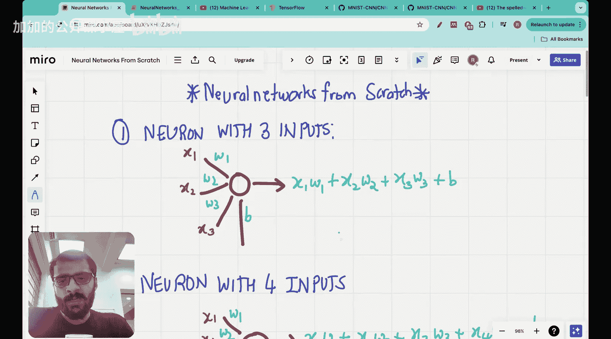

#  001：编码神经元和层 [BV1iEHPzGEpa_p1]

🎼Yeah。大家好。欢迎来到本系列视频的第一集，我们将从头开始构建神经网络。

所以，我已经有一个机器学习教师。

---

## 概述

在本节课中，我们将学习如何从头开始构建神经网络。我们将从编码神经元和层开始。

---

## 编码神经元

### 神经元结构

神经元是神经网络的基本单元。它由以下部分组成：

- 输入：每个输入都通过一个权重与神经元相连接。
- 权重：每个权重都代表输入与神经元之间的连接强度。
- 偏置：偏置是一个常数，它调整神经元的输出。
- 激活函数：激活函数将神经元的线性组合转换为非线性输出。

### 激活函数

激活函数是神经元的关键部分，它将线性组合转换为非线性输出。以下是一些常见的激活函数：

- **Sigmoid函数**：\( f(x) = \frac{1}{1 + e^{-x}} \)
- **ReLU函数**：\( f(x) = \max(0, x) \)
- **Tanh函数**：\( f(x) = \frac{e^x - e^{-x}}{e^x + e^{-x}} \)

---

## 编码层

### 层结构

层是神经网络的另一个基本单元。它由多个神经元组成，每个神经元都连接到前一个层的所有神经元。

### 层数类型

神经网络中的层可以分为以下类型：

- **输入层**：接收输入数据的层。
- **隐藏层**：位于输入层和输出层之间的层。
- **输出层**：产生最终输出的层。

### 层连接

层之间的连接可以通过以下方式实现：

- **全连接层**：每个神经元都连接到前一个层的所有神经元。
- **稀疏连接层**：只有部分神经元连接到前一个层的神经元。

---

## 总结

本节课中，我们一起学习了如何从头开始构建神经网络。我们了解了神经元和层的结构，以及如何使用不同的激活函数。在下一节课中，我们将学习如何训练神经网络。

---

**本节课中我们一起学习了如何从头开始构建神经网络，包括神经元和层的结构以及激活函数的使用。**