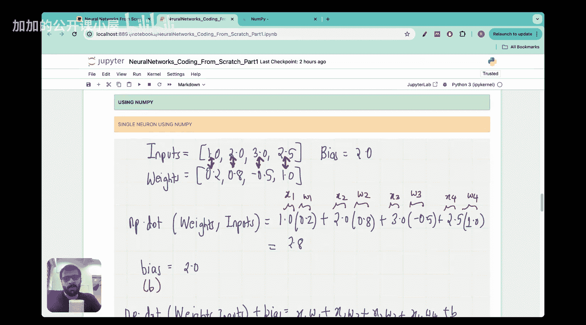

#  002：Vizuara【中英⚡从零开始构建神经网络｜Building Neural Networks from Scratch】 p02 P2 Lecture 2 - The beauty of numpy and dot product in coding neurons and layers [BV1iEHPzGEpa_p2]

## 🎼从零开始构建神经网络：第二课 - numpy与点积在编码神经元和层中的魅力

### 概述
在本节课中，我们将学习如何使用numpy库和点积来在Python中编码神经元和层。

### numpy库的使用
以下是使用numpy库的基本步骤：

1. **导入numpy库**：
   ```python
   import numpy as np
   ```


2. **创建数组**：
   ```python
   arr = np.array([1, 2, 3])
   ```

3. **数组操作**：
   - 访问元素：`arr[0]`
   - 数组形状：`arr.shape`
   - 数组类型：`arr.dtype`

### 点积的计算
点积是两个向量对应元素相乘后求和的结果。以下是计算点积的步骤：

1. **定义两个向量**：
   ```python
   vector_a = np.array([1, 2, 3])
   vector_b = np.array([4, 5, 6])
   ```

2. **计算点积**：
   ```python
   dot_product = np.dot(vector_a, vector_b)
   ```

### 应用到神经元和层
在神经网络中，点积用于计算神经元之间的连接权重。以下是一个简单的例子：



1. **定义权重和输入**：
   ```python
   weights = np.array([0.5, 0.3, 0.2])
   inputs = np.array([1, 2, 3])
   ```

2. **计算点积**：
   ```python
   dot_product = np.dot(weights, inputs)
   ```

### 总结
本节课中，我们学习了如何使用numpy库和点积来在Python中编码神经元和层。通过这些基本概念，我们可以构建更复杂的神经网络模型。