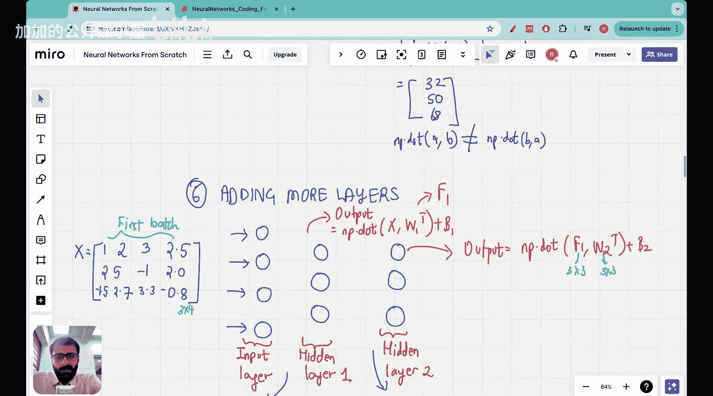

#  003：Vizuara【中英⚡从零开始构建神经网络｜Building Neural Networks from Scratch】 p03 P3 Lecture 3 - Coding multiple neural network layers and stacking them together [BV1iEHPzGEpa_p3]

## 🎼构建神经网络层并堆叠它们

🎼Yeah。Hello， everyone。Welcome to the next lecture of neural Network from Sctch series.

Thank you for sticking with this series for the first two lectures you have already made it.

---

### 概述

在本节课中，我们将学习如何编码多个神经网络层并将它们堆叠在一起。

---


### 编码多个神经网络层

以下是编码多个神经网络层的步骤：

1. **定义层**：首先，我们需要定义每个层的参数，例如输入和输出维度。
2. **创建层**：使用定义的参数创建每个层。
3. **堆叠层**：将创建的层按照顺序堆叠起来。

**公式**：

```python
layer1 = Layer(input_dim=784, output_dim=128)
layer2 = Layer(input_dim=128, output_dim=64)
```

---

### 堆叠层

堆叠层是将多个层按照顺序连接起来。以下是如何堆叠层的示例：

```python
model = Sequential()
model.add(layer1)
model.add(layer2)
```

---

### 总结



本节课中，我们学习了如何编码多个神经网络层并将它们堆叠在一起。在下一节课中，我们将学习如何训练和测试神经网络。

---

🎼Yeah。That's all for this lecture. Thank you for watching. See you in the next one.