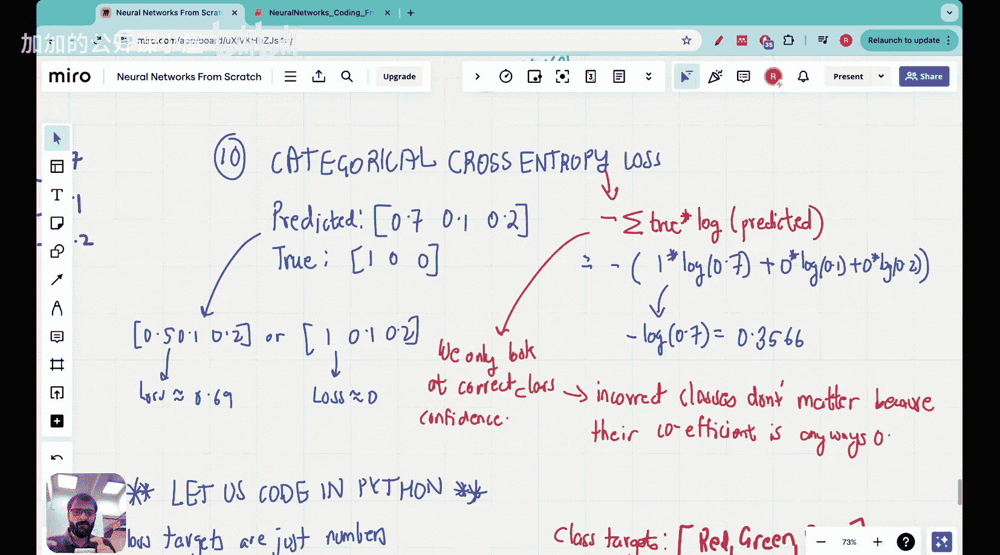

#  008：Vizuara【中英⚡从零开始构建神经网络｜Building Neural Networks from Scratch】 p08 P8 Lecture 8 - Coding the cross entropy loss in Python (from scratch) [BV1iEHPzGEpa_p8]

🎼Yeah。Hello， everyone。Welcome to this lecture in the neuralural Network from Scratch series。

In the last lecture or up till now， rather， we have looked at how to code an entire forward pass in Python.

## 概述

在本节课中，我们将学习如何在Python中从头开始编写交叉熵损失函数。

## 上一节回顾


在上一节中，我们学习了如何使用Python编写整个前向传播过程。

## 交叉熵损失函数

交叉熵损失函数是神经网络中常用的损失函数之一。它用于衡量预测值与真实值之间的差异。

### 交叉熵损失函数公式

**公式**：\[ L = -\frac{1}{N} \sum_{i=1}^{N} (y_i \log(\hat{y}_i)) \]

其中：
- \( L \) 是交叉熵损失。
- \( N \) 是样本数量。
- \( y_i \) 是真实标签。
- \( \hat{y}_i \) 是预测值。

## 编写交叉熵损失函数

以下是使用Python编写交叉熵损失函数的代码示例：

```python
import numpy as np

def cross_entropy_loss(y_true, y_pred):
    """
    计算交叉熵损失
    :param y_true: 真实标签
    :param y_pred: 预测值
    :return: 交叉熵损失
    """
    return -np.sum(y_true * np.log(y_pred)) / len(y_true)
```



## 总结

本节课中，我们一起学习了如何在Python中从头开始编写交叉熵损失函数。希望这对你有所帮助！