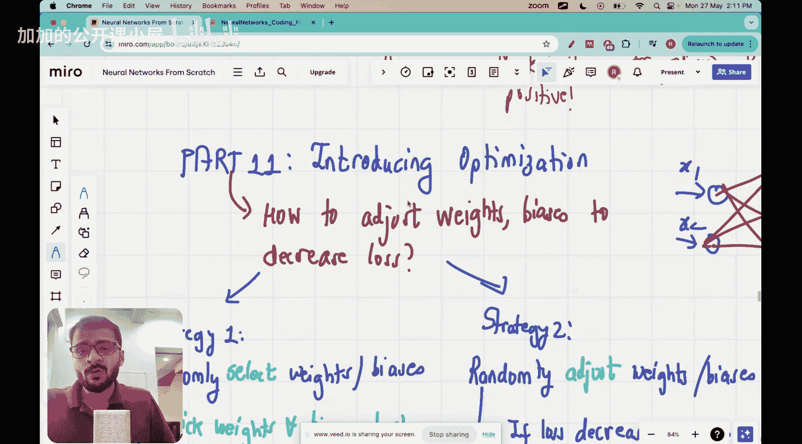

#  009：Vizuara【中英⚡从零开始构建神经网络｜Building Neural Networks from Scratch】 p09 P9 Lecture 9 - 神经网络训练中的优化介绍

🎼大家好，欢迎来到神经网络从零开始的系列课程。今天，我们将讨论一个非常重要的主题，那就是与优化相关的内容。

## 1. 优化的重要性

优化是神经网络训练过程中的关键步骤。它涉及到调整网络中的参数，以最小化预测误差。以下是优化的一些关键点：

- **目标函数**：优化过程的目标是找到一组参数，使得目标函数的值最小。
- **梯度下降**：一种常用的优化算法，通过计算目标函数的梯度来更新参数。

## 2. 目标函数

目标函数是优化过程中的核心。它衡量了模型的预测误差。以下是一些常用的目标函数：

- **均方误差（MSE）**：用于回归问题，计算预测值与真实值之间的平方差的平均值。
  \[
  MSE = \frac{1}{n} \sum_{i=1}^{n} (y_i - \hat{y}_i)^2
  \]
- **交叉熵损失**：用于分类问题，衡量预测概率与真实标签之间的差异。

## 3. 梯度下降

梯度下降是一种优化算法，通过计算目标函数的梯度来更新参数。以下是梯度下降的基本步骤：

1. 初始化参数。
2. 计算目标函数的梯度。
3. 使用梯度更新参数。
4. 重复步骤2和3，直到达到收敛条件。

梯度下降的公式如下：

\[
\theta_{\text{new}} = \theta_{\text{old}} - \alpha \cdot \nabla_{\theta} J(\theta)
\]

其中，$\theta$ 是参数，$\alpha$ 是学习率，$J(\theta)$ 是目标函数。

## 4. 总结

本节课中，我们介绍了神经网络训练中的优化过程。我们学习了目标函数和梯度下降算法，并了解了它们在优化过程中的作用。希望这些内容能够帮助您更好地理解神经网络训练的优化过程。

**本节课中我们一起学习了神经网络训练中的优化过程，包括目标函数和梯度下降算法。**