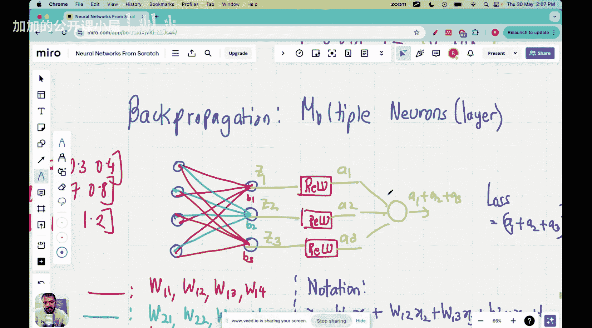

#  013： from scratch

🎼大家好。欢迎来到神经网络从零开始的系列讲座。

在上一讲中，我们探讨了通过单个神经元的反向传播。本讲的主要目标是探讨通过整个神经元层的反向传播。

以下是本讲的主要内容：

## 1. 反向传播概述

反向传播是一种用于训练神经网络的算法。它通过计算损失函数相对于网络参数的梯度来更新网络权重。

**公式**：损失函数 \( L \) 对权重 \( W \) 的梯度 \( \frac{\partial L}{\partial W} \)


## 2. 单层反向传播

在单层神经网络中，反向传播涉及以下步骤：

1. **计算输出层的误差**：误差是实际输出与期望输出之间的差异。
2. **传播误差到输入层**：误差通过反向传播路径传播，直到到达输入层。
3. **更新权重**：根据传播的误差，权重被更新以减少损失。

## 3. 整个层反向传播

在多层神经网络中，反向传播涉及以下步骤：

1. **计算输出层的误差**：与单层相同。
2. **传播误差到下一层**：误差从输出层传播到下一层，直到到达输入层。
3. **更新权重**：根据传播的误差，权重被更新。

**代码示例**：

```python
# 假设有一个简单的神经网络，包含一个输入层、一个隐藏层和一个输出层
# 输入层到隐藏层的权重为 W1，隐藏层到输出层的权重为 W2

# 计算输出层的误差
error_output = actual_output - expected_output

# 传播误差到隐藏层
error_hidden = error_output * W2 * sigmoid_derivative(hidden_layer_output)

# 更新权重
W2 -= learning_rate * error_output * hidden_layer_output
W1 -= learning_rate * error_hidden * input_layer_output
```

## 4. 总结



本节课中，我们学习了反向传播的概念，包括单层和整个层反向传播。通过理解反向传播的原理，我们可以更好地训练神经网络。

本节课中我们一起学习了反向传播的概念及其在神经网络中的应用。