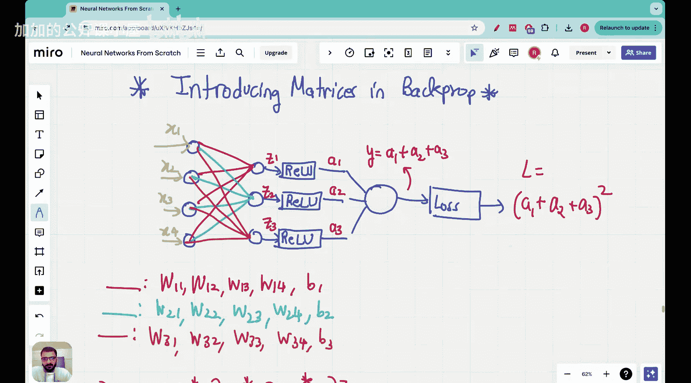

#  014：Vizuara【中英⚡从零开始构建神经网络｜Building Neural Networks from Scratch】 p14 P14 Lecture 14 - 矩阵在反向传播中的作用 [BV1iEHPzGEpa_p14]

大家好。今天在“从零开始构建神经网络”系列中。我们将介绍。

反向传播中的矩阵。

在之前的反向传播讲座中，我们探讨了。

## 概述

在本节课中，我们将学习矩阵在神经网络反向传播中的作用。反向传播是神经网络训练过程中的关键步骤，它通过计算损失函数相对于网络参数的梯度来更新网络权重。

## 矩阵在反向传播中的作用

### 1. 梯度计算

在反向传播中，矩阵用于计算损失函数相对于网络参数的梯度。梯度是一个向量，它指示了损失函数在参数空间中的变化方向。

**公式**： \( \nabla_{\theta} J(\theta) = \frac{\partial J(\theta)}{\partial \theta} \)

其中，\( \nabla_{\theta} J(\theta) \) 是损失函数 \( J(\theta) \) 关于参数 \( \theta \) 的梯度。

### 2. 权重更新

计算梯度后，我们使用矩阵运算来更新网络权重。权重更新公式如下：

**公式**： \( \theta_{new} = \theta_{old} - \alpha \cdot \nabla_{\theta} J(\theta) \)

其中，\( \theta_{new} \) 是新的权重，\( \theta_{old} \) 是旧的权重，\( \alpha \) 是学习率，\( \nabla_{\theta} J(\theta) \) 是梯度。

### 3. 矩阵运算

在反向传播中，矩阵运算用于计算损失函数的梯度。以下是一些常用的矩阵运算：

- **矩阵乘法**：用于计算权重和输入的乘积。
- **矩阵转置**：用于计算梯度的转置。
- **矩阵求和**：用于计算损失函数的梯度。

## 总结

本节课中，我们学习了矩阵在神经网络反向传播中的作用。我们了解了梯度计算和权重更新的过程，并探讨了常用的矩阵运算。这些知识对于理解和实现神经网络训练至关重要。

---

**以下是本节课的主要内容**：

- 矩阵在反向传播中的作用
- 梯度计算
- 权重更新
- 矩阵运算