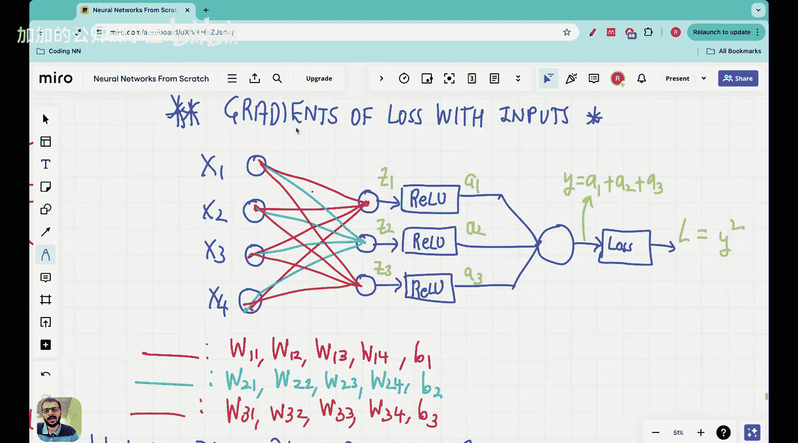

#  015：Vizuara【中英⚡从零开始构建神经网络｜Building Neural Networks from Scratch】 p15 P15 Lecture 15 - Finding derivatives of inputs in backpropagation and why we need them

## 概述
在本节课中，我们将学习如何在反向传播中计算输入的梯度，以及为什么我们需要它们。

## 计算输入的梯度
在反向传播中，我们需要计算损失相对于输入的梯度。这是因为梯度告诉我们如何调整权重以最小化损失。

### 公式
损失相对于输入的梯度可以用以下公式表示：
\[ \frac{\partial L}{\partial x} \]

其中 \( L \) 是损失函数，\( x \) 是输入。

## 为什么我们需要输入的梯度
我们需要输入的梯度来更新权重。通过反向传播，我们可以计算损失相对于每个权重的梯度，并使用这些梯度来调整权重。

### 公式
权重更新公式如下：
\[ w_{new} = w_{old} - \alpha \cdot \frac{\partial L}{\partial w} \]

其中 \( w_{new} \) 是新的权重，\( w_{old} \) 是旧的权重，\( \alpha \) 是学习率，\( \frac{\partial L}{\partial w} \) 是损失相对于权重的梯度。

## 总结
本节课中，我们学习了如何在反向传播中计算输入的梯度，以及为什么我们需要它们。这些梯度对于更新权重和最小化损失至关重要。