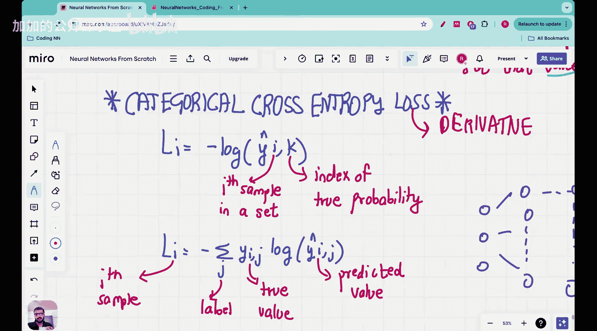

#  018：Vizuara【中英⚡从零开始构建神经网络｜Building Neural Networks from Scratch】 p18 P18 Lecrure 18 - Implementing backpropagation on the cross entropy loss function [BV1iEHPzGEpa_p18]

## 概述

在本节课中，我们将学习如何在交叉熵损失函数上实现反向传播。

## 1. 反向传播概述

反向传播是一种用于训练神经网络的算法。它通过计算损失函数相对于网络参数的梯度来更新这些参数。

**公式**： \( \nabla_{\theta} J(\theta) = \frac{\partial J}{\partial \theta} \)

其中，\( \theta \) 是网络参数，\( J(\theta) \) 是损失函数。

## 2. 交叉熵损失函数

交叉熵损失函数是衡量预测值与真实值之间差异的一种方法。

**公式**： \( J(\theta) = -\frac{1}{m} \sum_{i=1}^{m} [y^{(i)} \log(\hat{y}^{(i)}) + (1 - y^{(i)}) \log(1 - \hat{y}^{(i)})] \)

其中，\( y^{(i)} \) 是真实标签，\( \hat{y}^{(i)} \) 是预测值，\( m \) 是样本数量。

## 3. 实现反向传播

为了实现反向传播，我们需要计算损失函数相对于每个参数的梯度。



以下是计算交叉熵损失函数梯度的代码示例：

```python
def compute_gradient(X, y, y_hat):
    m = len(y)
    grad = np.zeros_like(y_hat)
    for i in range(m):
        grad[i] = - (y[i] - y_hat[i]) / y_hat[i] * (1 - y_hat[i])
    return grad
```

## 4. 总结

本节课中，我们学习了如何在交叉熵损失函数上实现反向传播。通过计算损失函数相对于网络参数的梯度，我们可以更新这些参数以最小化损失。

**本节课中我们一起学习了**：

- 反向传播概述
- 交叉熵损失函数
- 实现反向传播