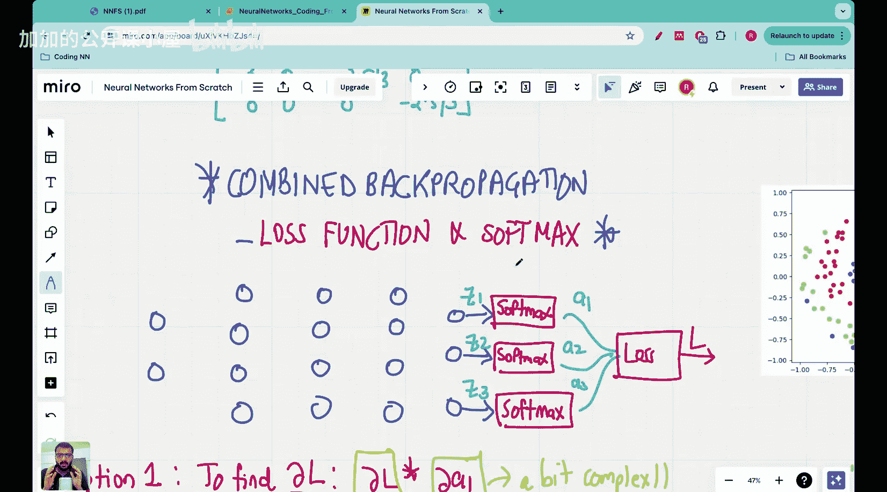

#  019：Vizuara【中英⚡从零开始构建神经网络｜Building Neural Networks from Scratch】 p19 P19 Lecture 19 - Combined backpropagation on softmax activation and cross entrop [BV1iEHPzGEpa_p19]


**🎼Yeah。Hello everyone， welcome to this lecture in the neuralural Network from Sctch series.**

大家好，欢迎来到从零开始构建神经网络系列的这一讲。



**This is another lecture on the topic of back propagation. In the previous lectures, we have looked at back propagating through a layer and**.

这是关于反向传播的又一讲。在前面的课程中，我们学习了如何在单层中进行反向传播。

## 以下是本节课的主要内容：

### 1. 反向传播概述


**反向传播是一种用于训练神经网络的算法，它通过计算损失函数相对于网络参数的梯度来更新这些参数。**

**公式：** \( \nabla_{\theta} J(\theta) = \frac{\partial J}{\partial \theta} \)

### 2. Softmax激活函数

**Softmax激活函数是一种将神经网络输出转换为概率分布的函数。**

**公式：** \( \sigma(z_i) = \frac{e^{z_i}}{\sum_{j=1}^{n} e^{z_j}} \)

### 3. 交叉熵损失函数

**交叉熵损失函数用于衡量预测概率分布与真实概率分布之间的差异。**


**公式：** \( J(\theta) = -\sum_{i=1}^{n} y_i \log(\hat{y}_i) \)

### 4. 结合反向传播

**在本节课中，我们将学习如何将Softmax激活函数和交叉熵损失函数结合使用，以进行反向传播。**

**代码：**

```python
# 假设我们有一个神经网络，其输出层使用Softmax激活函数
# 我们的目标是计算损失函数并更新网络参数

# 计算Softmax输出
softmax_outputs = softmax(z)

# 计算交叉熵损失
loss = -np.sum(y * np.log(softmax_outputs))

# 计算梯度
grad = np.dot((softmax_outputs - y), x.T)

# 更新参数
theta += learning_rate * grad
```

## 总结

本节课中，我们学习了反向传播、Softmax激活函数和交叉熵损失函数，并了解了如何将它们结合起来进行神经网络训练。希望这些内容能够帮助您更好地理解神经网络的基本原理。