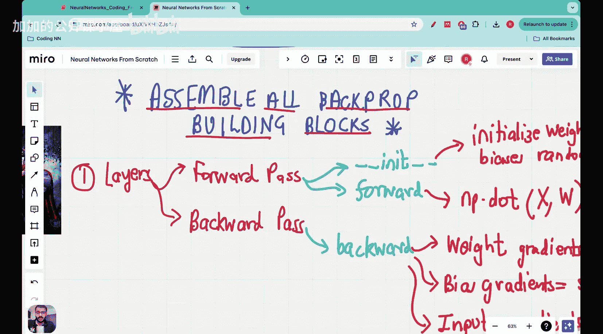

#  020：Vizuara【中英⚡从零开始构建神经网络｜Building Neural Networks from Scratch】 p20 P20 Lecture 20 - 构建神经网络反向传播管道的完整过程｜[BV1iEHPzGEpa_p20]

🎼是的。大家好，欢迎来到神经网络从零开始的系列课程中这个非常重要的讲座。

这将是反向传播部分的最后一讲，在本讲中，我们将组装所有构建模块。

## 概述

在本节课中，我们将学习如何构建神经网络反向传播管道的完整过程。

## 反向传播管道的构建

以下是构建神经网络反向传播管道的步骤：

### 1. 前向传播

在前向传播阶段，数据从输入层流向输出层。这个过程包括以下步骤：

- **输入层到隐藏层**：将输入数据传递到隐藏层。
- **隐藏层到输出层**：将隐藏层的输出传递到输出层。

**公式**：

\[ z = W \cdot x + b \]

其中，\( z \) 是激活函数的输入，\( W \) 是权重，\( x \) 是输入数据，\( b \) 是偏置。

### 2. 计算损失

在输出层，我们需要计算损失，即预测值与真实值之间的差异。

**公式**：

\[ L = \frac{1}{2} \sum_{i=1}^{n} (y_i - \hat{y}_i)^2 \]

其中，\( L \) 是损失，\( y_i \) 是真实值，\( \hat{y}_i \) 是预测值。

### 3. 反向传播

在反向传播阶段，我们计算损失对每个参数的梯度，并更新参数以最小化损失。

**公式**：

\[ \frac{\partial L}{\partial W} = \sum_{i=1}^{n} (y_i - \hat{y}_i) \cdot x_i \]

\[ \frac{\partial L}{\partial b} = \sum_{i=1}^{n} (y_i - \hat{y}_i) \]

### 4. 更新参数

使用梯度下降算法更新参数：

\[ W_{new} = W_{old} - \alpha \cdot \frac{\partial L}{\partial W} \]

\[ b_{new} = b_{old} - \alpha \cdot \frac{\partial L}{\partial b} \]

其中，\( \alpha \) 是学习率。

## 总结

本节课中，我们一起学习了如何构建神经网络反向传播管道的完整过程。通过理解前向传播、计算损失、反向传播和更新参数的步骤，我们可以更好地理解神经网络的工作原理。