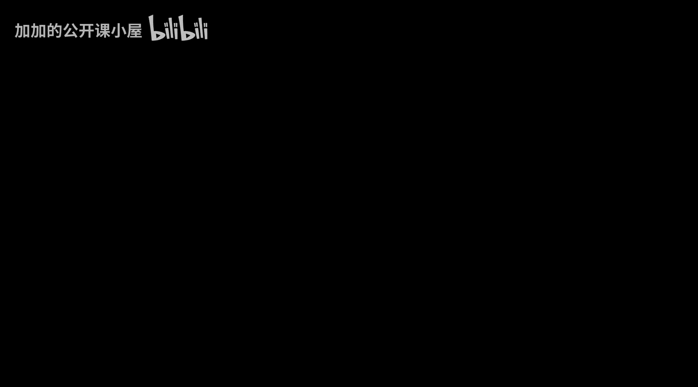

#  022：Gradient Descent [BV1iEHPzGEpa_p22]

## 🎼构建神经网络：梯度下降算法

### 概述
在本节课中，我们将学习如何使用梯度下降算法来优化神经网络中的参数。

### 前向传播与反向传播
1. **前向传播**：将输入数据通过神经网络，计算输出结果。
2. **反向传播**：计算输出结果与真实值之间的误差，并更新网络参数以减少误差。



### 梯度下降算法
梯度下降是一种优化算法，用于找到函数的最小值。在神经网络中，我们使用梯度下降来最小化损失函数。

#### 公式
损失函数：\( L(\theta) = \frac{1}{2} \sum_{i=1}^{n} (y_i - \hat{y}_i)^2 \)

梯度：\( \nabla L(\theta) = \frac{\partial L}{\partial \theta} \)

#### 代码
```python
def gradient_descent(loss_function, theta, learning_rate):
    gradient = compute_gradient(loss_function, theta)
    theta -= learning_rate * gradient
    return theta
```

### 步骤
1. 初始化参数 \( \theta \)。
2. 计算损失函数 \( L(\theta) \)。
3. 计算梯度 \( \nabla L(\theta) \)。
4. 更新参数 \( \theta \)：\( \theta = \theta - learning_rate \cdot \nabla L(\theta) \)。
5. 重复步骤 2-4，直到损失函数 \( L(\theta) \) 达到最小值。

### 总结
本节课中，我们学习了如何使用梯度下降算法来优化神经网络中的参数。通过不断更新参数，我们可以使网络输出更接近真实值。