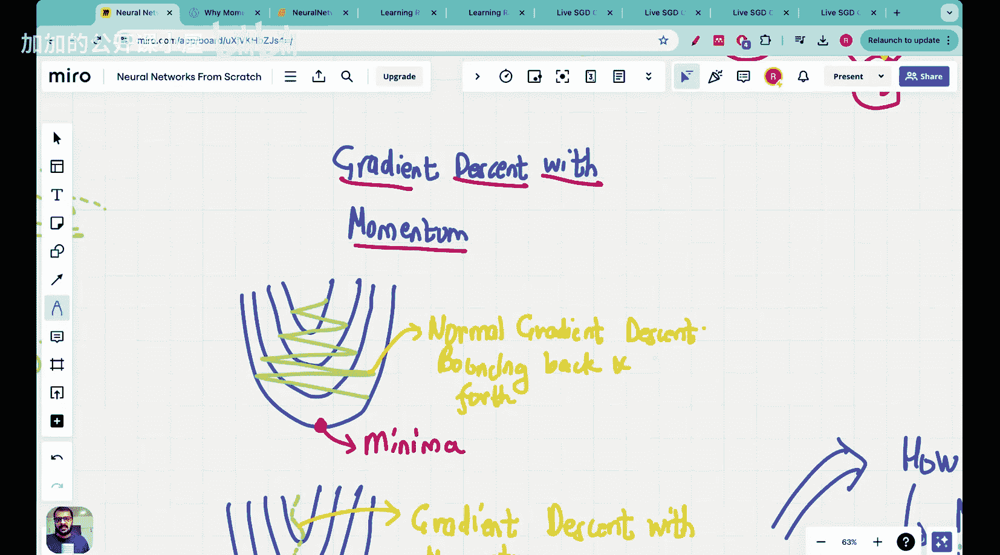

#  024：Vizuara【中英⚡从零开始构建神经网络｜Building Neural Networks from Scratch】 p24 P24 Lecture 24 - Momentum in training neural networks [BV1iEHPzGEpa_p24]


**🎼Yeah. Hello， everyone. Welcome to this lecture in the neural networks from Sctch series. Today, we are going to be looking at gradient descent with momentum.**

在之前的课程中，我们学习了。



以下是本节课的主要内容：

### 1. 动量（Momentum）

**动量是一种加速梯度下降的方法，它通过考虑之前梯度的方向来增加更新步长。** 


**公式描述：**

```python
v = α * v + η * ∇J(W)
W = W - v
```

其中，`v` 是动量项，`α` 是动量系数，`η` 是学习率，`∇J(W)` 是损失函数对权重 `W` 的梯度。

### 2. 动量优势

**动量可以帮助模型更快地收敛，尤其是在有多个局部最小值的情况下。**

### 3. 实现动量

**在实现动量时，我们需要维护一个额外的变量来存储动量项。**

```python
v = α * v + η * ∇J(W)
W = W - v
```

### 4. 动量参数

**动量参数包括动量系数 `α` 和学习率 `η`。**

**以下是动量参数的设置示例：**

```python
momentum_coefficient = 0.9
learning_rate = 0.01
```

### 5. 动量与Nesterov动量

**Nesterov动量是一种改进的动量方法，它在计算动量项时考虑了当前梯度的方向。**


**公式描述：**

```python
v = α * v + η * ∇J(W - η * ∇J(W))
W = W - v
```

### 总结

**本节课中，我们学习了动量在训练神经网络中的应用。动量可以帮助模型更快地收敛，尤其是在有多个局部最小值的情况下。**

**本节课中我们一起学习了：**

- 动量的概念和优势
- 动量的实现方法
- 动量参数的设置
- Nesterov动量的介绍