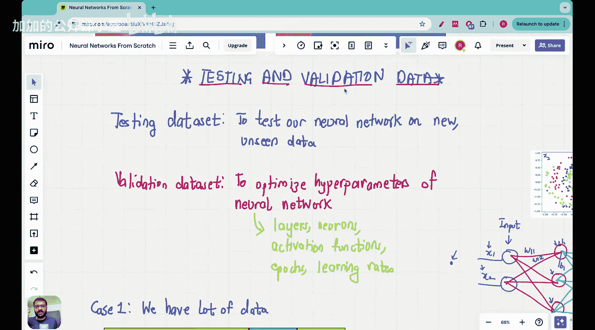

#  030：Vizuara【中英⚡从零开始构建神经网络｜Building Neural Networks from Scratch】 p30 P30 Lecture 29 - K-fold cross validation in Neural Networks

🎼大家好，欢迎来到神经网络从零开始的系列课程中的这一讲。

今天我们将探讨测试数据和验证数据之间的区别。在前面的课程中，我们讨论了测试数据的重要性。

以下是本节课的主要内容：

## 1. K折交叉验证简介

K折交叉验证是一种常用的机器学习模型评估方法。它将数据集分成K个子集，其中K-1个子集用于训练模型，剩下的一个子集用于验证模型。


**公式**：将数据集分为K个子集，其中K-1个子集用于训练，1个子集用于验证。

## 2. K折交叉验证在神经网络中的应用

在神经网络中，K折交叉验证可以帮助我们评估模型的泛化能力。具体步骤如下：

1. 将数据集分为K个子集。
2. 对每个子集进行以下操作：
   - 使用K-1个子集进行训练。
   - 使用剩下的一个子集进行验证。
3. 计算所有K次验证的平均准确率。

**代码**：

```python
from sklearn.model_selection import KFold

# 创建K折交叉验证对象
kf = KFold(n_splits=5)

# 遍历每个子集
for train_index, val_index in kf.split(X):
    # 训练模型
    model.fit(X[train_index], y[train_index])
    
    # 验证模型
    score = model.score(X[val_index], y[val_index])
    print(f"Validation score: {score}")
```

## 3. K折交叉验证的优势

1. 减少过拟合风险。
2. 提高模型泛化能力。
3. 更准确地评估模型性能。

## 4. 总结

本节课中，我们学习了K折交叉验证在神经网络中的应用。通过K折交叉验证，我们可以更准确地评估模型的性能，并提高模型的泛化能力。



**本节课中我们一起学习了**：

- K折交叉验证简介
- K折交叉验证在神经网络中的应用
- K折交叉验证的优势