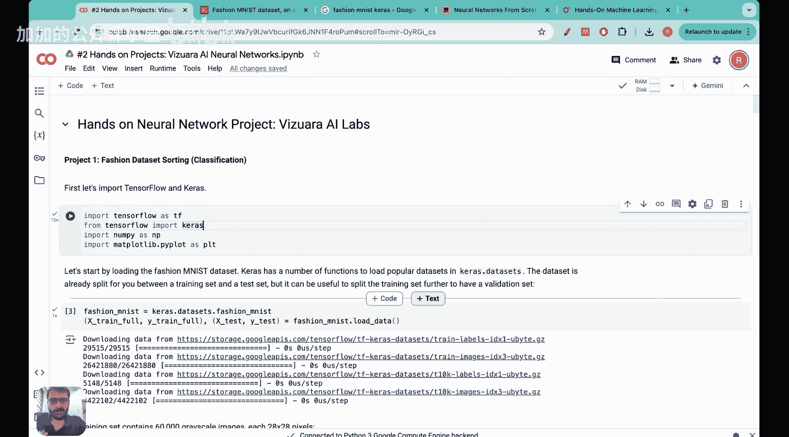

#  033： MNIST Fashion Dataset

🎼Yeah。Hello everyone， welcome to this Vijura AI Labs lecture.

Today we are going to build a hands on neural network project.

## 概述

在本节课中，我们将学习如何从零开始构建一个神经网络，并使用MNIST时尚数据集进行实践。

## 项目介绍

以下是MNIST时尚数据集的简要介绍：

- MNIST时尚数据集包含10个类别的时尚产品图片，每个类别有6000张图片。
- 图片尺寸为28x28像素。

## 神经网络构建

### 神经网络结构

神经网络由多个层组成，包括输入层、隐藏层和输出层。

- **输入层**：接收输入数据。
- **隐藏层**：对输入数据进行处理。
- **输出层**：输出最终结果。

### 神经网络公式

神经网络的核心公式如下：

\[ y = \sigma(W \cdot x + b) \]

其中，\( y \) 是输出，\( W \) 是权重，\( x \) 是输入，\( b \) 是偏置，\( \sigma \) 是激活函数。

### 激活函数

激活函数用于将线性组合转换为非线性输出。

常用的激活函数有：

- **Sigmoid函数**：\( \sigma(x) = \frac{1}{1 + e^{-x}} \)
- **ReLU函数**：\( \sigma(x) = \max(0, x) \)

## 实践项目

在本节课中，我们将使用MNIST时尚数据集构建一个神经网络，并对其进行训练和测试。

### 数据预处理

1. 读取MNIST时尚数据集。
2. 将图片转换为灰度图。
3. 将图片尺寸调整为28x28像素。

### 神经网络训练

1. 初始化权重和偏置。
2. 使用训练数据对神经网络进行训练。
3. 使用反向传播算法更新权重和偏置。

### 神经网络测试

1. 使用测试数据对神经网络进行测试。
2. 计算神经网络的准确率。

## 总结

本节课中，我们一起学习了如何从零开始构建一个神经网络，并使用MNIST时尚数据集进行实践。希望这个教程能够帮助你更好地理解神经网络的基本原理和应用。