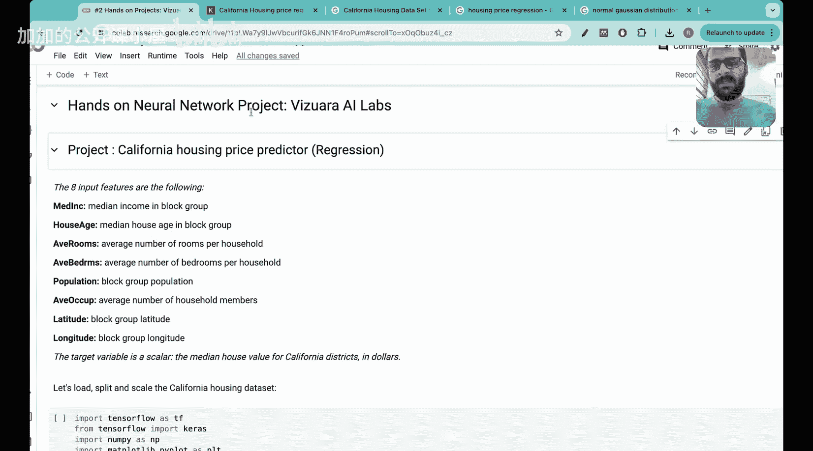

#  034：加利福尼亚住房数据集 [BV1iEHPzGEpa_p34]

🎼大家好，欢迎来到Wijara AI Labs的这堂课。

今天我们将进行一个实战神经网络项目。

以下是项目的主要步骤：

1. **导入数据集**：首先，我们需要导入加利福尼亚住房数据集。

```python
import pandas as pd


data = pd.read_csv('california_housing.csv')
```

2. **数据预处理**：接下来，我们需要对数据进行预处理，包括处理缺失值、标准化等。

```python
from sklearn.preprocessing import StandardScaler

scaler = StandardScaler()
data_scaled = scaler.fit_transform(data)
```

3. **构建神经网络模型**：现在，我们可以开始构建神经网络模型。

```python
import numpy as np
from sklearn.neural_network import MLPRegressor

model = MLPRegressor(hidden_layer_sizes=(100,), max_iter=1000, random_state=0)
```

4. **训练模型**：使用预处理后的数据训练模型。



```python
model.fit(data_scaled[:, :-1], data_scaled[:, -1])
```

5. **评估模型**：最后，我们需要评估模型的性能。

```python
score = model.score(data_scaled[:, :-1], data_scaled[:, -1])
print('Model Score:', score)
```

通过以上步骤，我们成功构建了一个神经网络模型，并对其性能进行了评估。

## 总结

本节课中，我们一起学习了如何使用神经网络模型对加利福尼亚住房数据集进行预测。通过导入数据集、数据预处理、构建模型、训练模型和评估模型等步骤，我们成功构建了一个神经网络模型，并对其性能进行了评估。希望这节课对大家有所帮助！