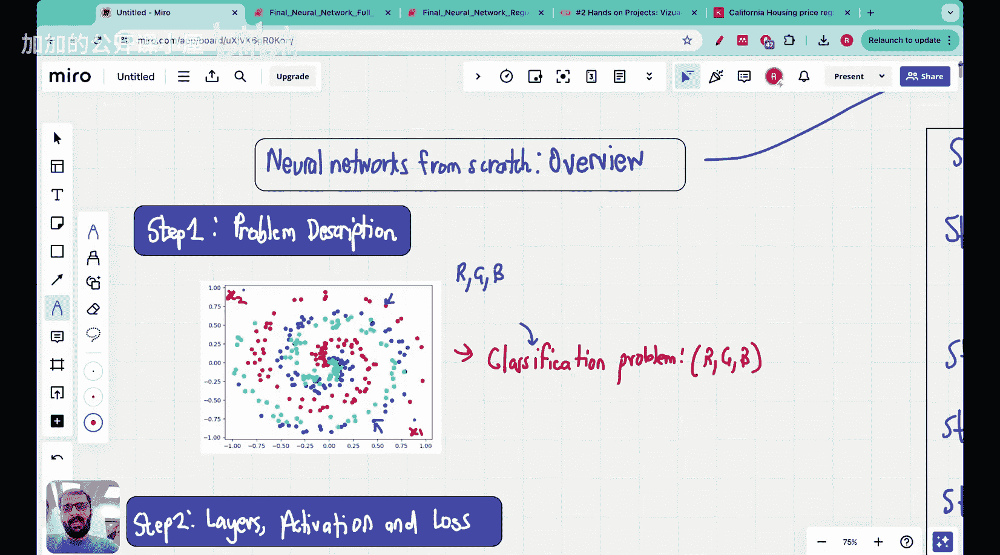

#  035：从零开始构建、训练和测试神经网络

## 概述
在本节课中，我们将学习如何从零开始构建神经网络，包括其构建、训练和测试过程。

## 构建神经网络
以下是构建神经网络的基本步骤：

1. **定义网络结构**：确定网络的层数和每层的神经元数量。
2. **初始化权重**：随机分配权重值。
3. **选择激活函数**：例如ReLU、Sigmoid或Tanh。
4. **构建前向传播函数**：计算网络输出。
5. **构建反向传播函数**：计算梯度并更新权重。

### 核心概念
**公式**：神经网络输出 \( y = f(W \cdot x + b) \)


其中，\( W \) 是权重，\( x \) 是输入，\( b \) 是偏置，\( f \) 是激活函数。

## 训练神经网络
训练神经网络包括以下步骤：

1. **选择损失函数**：例如均方误差（MSE）或交叉熵。
2. **选择优化器**：例如随机梯度下降（SGD）或Adam。
3. **迭代训练**：通过反向传播更新权重。

### 核心概念
**代码**：
```python
# 假设我们有一个简单的神经网络
import numpy as np

# 初始化权重和偏置
W = np.random.randn(3, 2)
b = np.random.randn(2)

# 定义激活函数
def sigmoid(x):
    return 1 / (1 + np.exp(-x))

# 计算输出
output = sigmoid(W.dot(x) + b)
```

## 测试神经网络
测试神经网络包括以下步骤：



1. **准备测试数据**：将数据集分为训练集和测试集。
2. **评估模型性能**：计算准确率、召回率等指标。

### 核心概念
**公式**：准确率 \( \text{Accuracy} = \frac{\text{正确预测的数量}}{\text{总预测的数量}} \)

## 总结
本节课中我们一起学习了如何从零开始构建、训练和测试神经网络。希望这些知识能帮助你更好地理解神经网络的工作原理。