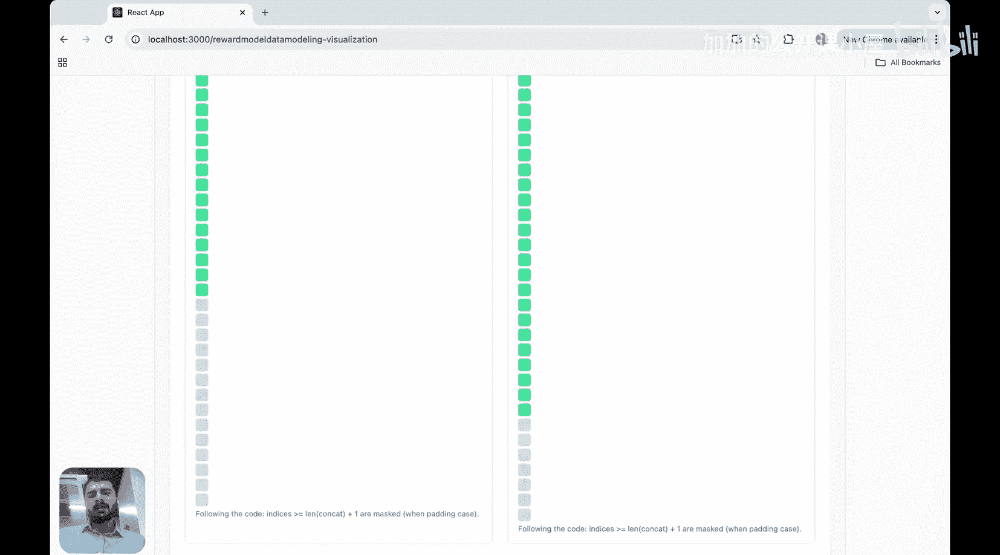
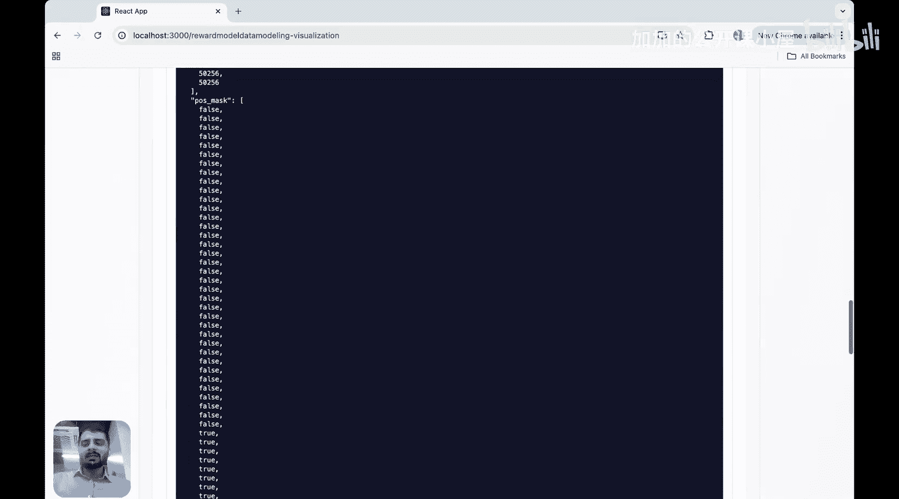
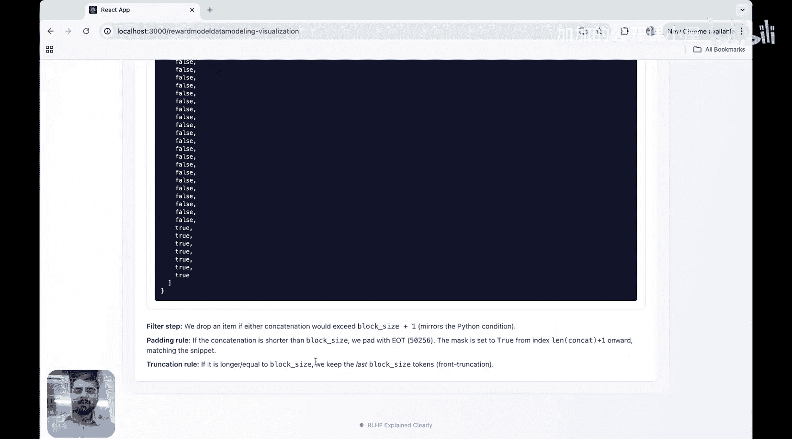
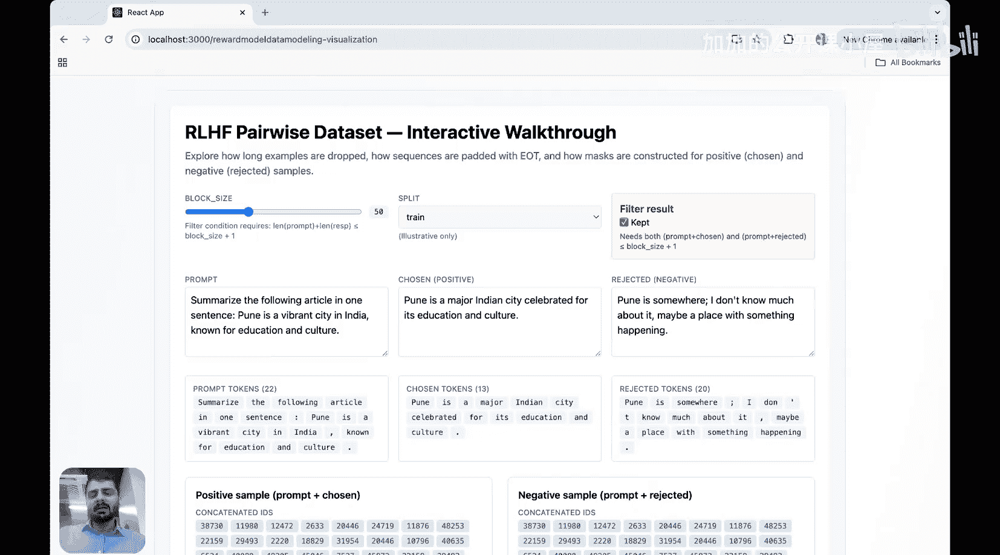

#  001：RLHF流程可视化教程 🎬

在本节课中，我们将学习一种全新的方式来可视化RLHF（人类反馈强化学习）流程。我们将通过直观的视觉工具，理解数据在RLHF管道中是如何被处理和转换的，而无需深入复杂的数学推导。课程分为两部分：第一部分讲解奖励模型的构建，第二部分介绍核心的PPO训练循环。

## 奖励模型构建 🏆

上一节我们概述了课程目标，本节中我们来看看RLHF流程的第一步：奖励模型的构建。奖励模型的目标是学习人类的偏好，为“被选中的”回答给出高分，为“被拒绝的”回答给出低分。

### 数据集的构建与处理

首先，我们需要一个包含人类偏好的数据集。这个数据集通常包含以下元素：
*   **提示**：用户提出的问题或指令。
*   **被选中的回答**：人类标注者更偏好的回答。
*   **被拒绝的回答**：人类标注者认为较差的回答。

以下是数据处理的核心步骤：

**第一步：组合样本**
我们将提示分别与被选中的回答、被拒绝的回答组合，形成两个样本。
*   **正样本** = `提示` + `被选中的回答`
*   **负样本** = `提示` + `被拒绝的回答`

**第二步：分词与序列化**
使用分词器将正样本和负样本中的文本转换为一系列数字ID，即**令牌**序列。

**第三步：填充与截断**
模型有一个固定的输入长度限制，称为**块大小**。我们需要确保所有样本的长度一致。
*   如果样本长度**超过**块大小，我们会从**序列开头**移除多余的令牌。这是因为模型对句子结尾部分通常更敏感。
*   如果样本长度**小于**块大小，我们会在序列末尾添加特殊的**填充令牌**，直到达到块大小。

**第四步：创建注意力掩码**
为了让模型区分真实令牌和填充令牌，我们需要创建一个**注意力掩码**。
*   对于真实令牌，掩码值为 `1`（或`True`），表示模型需要关注它们。
*   对于填充令牌，掩码值为 `0`（或`False`），指示模型忽略它们。

```python
# 伪代码示例：数据处理步骤
positive_sample = tokenizer(prompt + chosen_response)
negative_sample = tokenizer(prompt + rejected_response)

# 填充/截断到固定长度 block_size
positive_padded = pad_or_truncate(positive_sample, block_size, from_start=True)
negative_padded = pad_or_truncate(negative_sample, block_size, from_start=True)

# 创建注意力掩码 (1代表真实令牌，0代表填充令牌)
attention_mask_positive = [1] * len(real_tokens) + [0] * (block_size - len(real_tokens))
```

经过以上步骤，我们就得到了可以用于训练奖励模型的标准化数据批次。

### 奖励模型训练

现在，我们有了处理好的正样本和负样本。奖励模型（通常是一个语言模型）会分别处理它们，并为每个样本的**最后一个非填充令牌**输出一个标量分数。

训练的目标是最大化正样本分数与负样本分数之间的差距。常用的损失函数是**对比损失**，例如：







**损失函数公式**：
`loss = -log(sigmoid(reward_chosen - reward_rejected))`

这个公式鼓励 `reward_chosen` 显著大于 `reward_rejected`。通过在这种成对偏好数据上进行训练，模型逐渐学会根据人类偏好来评分。

---



本节课中我们一起学习了RLHF流程中奖励模型构建的部分。我们了解了如何从人类偏好数据构建数据集，并详细拆解了数据处理的四个关键步骤：组合样本、分词、填充/截断以及创建注意力掩码。最后，我们介绍了奖励模型的训练目标。下一节，我们将利用训练好的奖励模型，进入RLHF的核心——PPO训练循环。