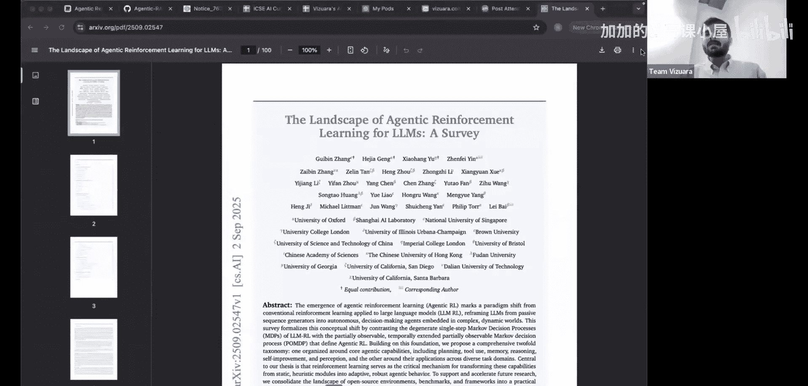

#  002：智能体强化学习 🚀

在本节课中，我们将学习强化学习（RL）在大型语言模型（LLM）领域的最新发展，特别是从经典RL到智能体强化学习（Agentic RL）的演进历程。我们将探讨关键算法、技术转折点以及未来的发展方向。

## 从经典强化学习到深度强化学习

上一节我们回顾了强化学习的基础。本节中，我们来看看RL在过去几十年的演变。

我们最初接触的是**经典强化学习**，其核心算法包括蒙特卡洛方法、时序差分学习和动态规划。这些方法通常将策略或价值函数表示为表格。

2014至2015年间，随着Atari论文的发表，我们进入了**深度强化学习**时代。这一阶段的主要变化是能够使用神经网络来表示策略，而不再局限于表格形式。在2014年深度Q网络论文之前，已有研究（如TD-Gammon）证明了深度神经网络可以用于表示策略。

## 强化学习与大型语言模型的结合

深度强化学习的发展为RL在机器人学和视频游戏等任务中的应用铺平了道路。然而，RL与LLM的真正结合发生在2017年**近端策略优化**算法被提出之后。

PPO算法被发现非常适合于在LLM中应用RL。与此同时，Transformer架构（“Attention Is All You Need”论文）的研究也在并行发展。RL在LLM中最好的应用体现是**基于人类反馈的强化学习**。

RLHF确保了一个预训练的基础模型能够与人类偏好对齐，使其行为更像人类交互的聊天机器人。这个过程被称为后训练，其中对齐是关键组成部分。2022年12月发布的第一个ChatGPT，其核心就离不开RLHF，而RLHF的核心正是五年前（2017年）提出的PPO算法。

## RLHF的流程与挑战

在RLHF流程中，一个关键步骤是使用**奖励模型**。该模型接收任何提示和补全结果，并输出一个评分，以衡量补全结果的好坏。

以下是训练奖励模型的核心步骤：
1.  收集人类对成对选项的偏好数据。
2.  基于这些偏好数据构建奖励模型。

然而，RLHF过程成本高昂，涉及大量人力，只有预算充足的大型AI实验室能够承担。这使得初创公司等无法接触RLHF流程。

## 从RLHF到RLAIF：可访问性的革命

第一个让RLHF变得大众可及的论文引入了**使用LLM作为评判者**的概念。这意味着不再需要人类标注员来提供偏好，而是可以将任务交给一个LLM。

具体做法是，通过提示工程让LLM扮演法官角色，对两个答案进行评分。首个在此任务中表现良好的LLM是GPT-4。这彻底改变了RLHF的工作流程，因为它突然让所有人都能使用这项技术，即使是小型AI实验室现在也能使用LLM作为法官来对齐他们的模型。

这种方法也被称为**基于AI反馈的强化学习**，因为循环中不再需要人类参与。

## GRPO：简化RL流程

进入2025年，**分组相对策略优化**被提出。PPO的主要问题在于需要一个非常庞大、占用大量内存的评论家模型。

GRPO的核心创新是：
*   **移除评论家模型**：完全从流程中移除评论家模型。
*   **使用相对优势**：通过采样多个响应，并根据这些响应获得的相对奖励来计算优势函数。

这确保了在RLHF流程中不再需要庞大的评论家模型。GRPO还引入了**基于可验证奖励的强化学习**的概念，即使用具有客观答案（如数学、编码任务）的补全结果，这些任务不需要人类或AI提供反馈。

因此，GRPO将流程中所需的模型数量从四个减少到两个：只需要正在训练的主要策略（基础模型）和一个用于防止模型偏离太远的参考模型。

## 智能体强化学习：新的前沿

在上一讲中，我们实际探讨了整个GRPO流程。现在，我们来看看最新的前沿领域——**智能体强化学习**，这是一个在过去三、四个月才兴起的新方向。

Agentic RL的目标是使用强化学习来操作一系列工具并执行某些任务。如果你观察ChatGPT、Gemini等，它们现在都有一个深度研究面板，当你提出问题时，LLM有时会花费10到15分钟浏览大量文档并给出通常非常全面的答案。这背后实现的正是智能体强化学习。

本节内容主要参考了一篇于本月早些时候发布的论文。这篇论文概述了LLM中强化学习的现状，并详细阐述了什么是智能体强化学习。我选择将这节课作为训练营的最后一讲，正是因为我坚信智能体强化学习是未来，而我的这一观点深受这篇论文的影响。

## 总结

本节课中，我们一起学习了强化学习在LLM领域的发展脉络：
1.  从**经典RL**到**深度RL**的过渡，核心是使用神经网络表示策略。
2.  **PPO算法**的出现使得RL与LLM结合成为可能，催生了**RLHF**。
3.  **使用LLM作为评判者**（RLAIF）极大降低了对齐模型的成本和门槛。
4.  **GRPO**通过移除评论家模型和使用可验证奖励，进一步简化了RL流程。
5.  最新的前沿是**智能体强化学习**，旨在让LLM使用工具自主完成任务，这代表了该领域未来的发展方向。