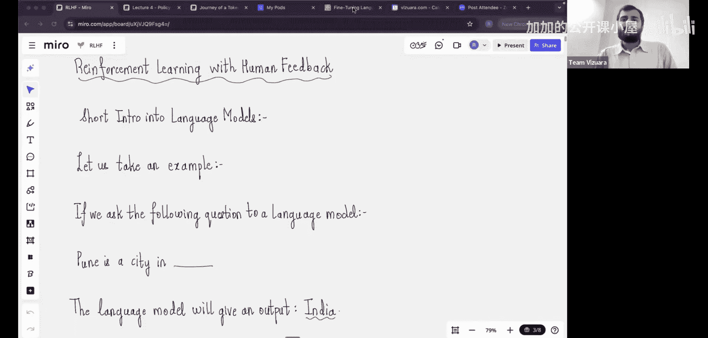
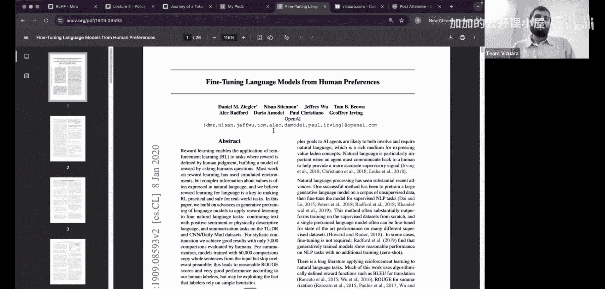
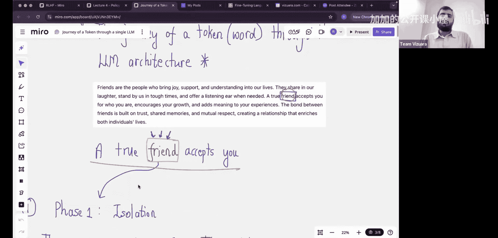
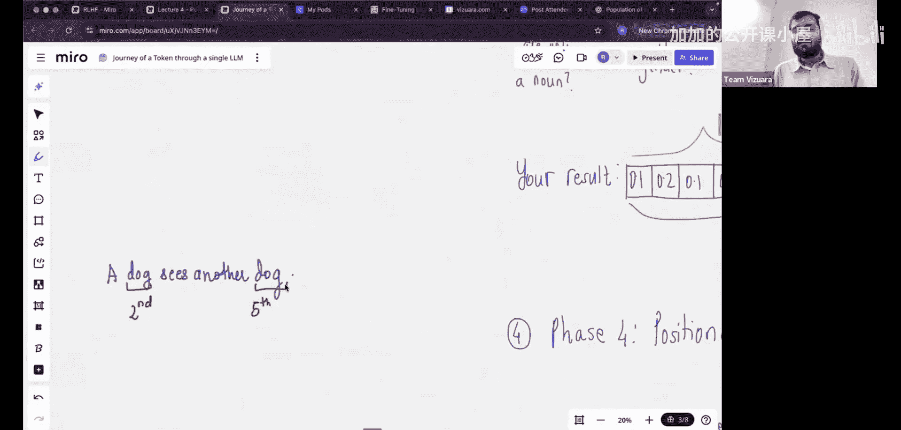

#  003：从零开始的RLHF

在本节课中，我们将从零开始学习基于人类反馈的强化学习的完整理论。课程内容分为五个主要部分：首先介绍大语言模型的基础知识，然后探讨如何将LLM建模为智能体-环境交互问题，接着复习策略梯度和广义优势估计，之后深入讲解奖励模型和完整的RLHF流程，最后通过一个实际例子学习如何引导LLM符合人类偏好。

---

## 强化学习实践：P03-1：大语言模型基础

上一节我们概述了课程内容，本节中我们来看看理解RLHF所必需的大语言模型基础知识。理解LLM的工作原理对于后续学习至关重要。

大语言模型的发展过程中，RLHF已成为标准组件。例如，在ChatGPT的开发末期加入RLHF步骤后，模型生成的回答就能更好地与人类偏好对齐。相比之下，仅经过预训练的较小模型可能会对不当问题给出直接且不妥当的答案。

强化学习作为一个独立领域已发展数十年，而将其应用于大语言模型则是一个有趣的交叉。为了深入理解这种结合，我们需要先简要了解语言模型的架构。

接下来的20-25分钟，我们将讨论LLM的架构，目标是让每个人都能理解LLM如何工作。我们将使用一些术语，这些术语对理解RL如何应用于语言模型至关重要。

本节标题是“一个词元在LLM架构中的旅程”。请大家想象自己现在是一个词元。词元可以是一个单词或单词的一部分。

考虑一个简单的段落，其中包含许多单词。第一步是隔离出词元或单词。这里我们以单词“friend”为例，并理解当这个词元通过LLM时会发生什么。

例如，当你向ChatGPT提问“印度的人口是多少？”时，它会以某种方式回答。我们的问题是，当所有这些词元通过LLM时，究竟发生了什么？通过设身处地地思考这个词元的经历，我们最终将理解LLM本身的架构。

以下是处理一个词元的具体步骤：

**第一步：分配词元ID**
首先，我们从其上下文中隔离出这个词元。接下来，我们为每个词元分配一个ID或徽章号码。可以将其想象为一本词元之书，每个词元都有一个关联的ID。这个ID被称为**词元ID**。

我们可以用一个类比来帮助理解：你是一名学生，想要进入霍格沃茨学校。第一步是让你从群体中独立出来，然后从词元ID之书中为你分配一个徽章号码或词元ID。词元的数量等于我的教科书词汇表的大小。例如，“friend”这个词元可能被分配了徽章号码2012。

**第二步：创建个性图表**
仅仅有徽章号码还不够。通常每个人有不同的个性，所以我们会问一系列问题，例如你是内向还是外向，是否喜欢运动等。在我们的类比中，这被称为个性图表。

每个词元首先获得一个徽章号码，然后获得一个与之关联的个性图表。这个图表包含768个问题。你可能会问为什么需要768个问题？原因是这些问题是为了理解该特定词元的含义或情感，因此我们需要768个问题。

在技术术语中，这个768也被称为**嵌入维度**、**隐藏大小**或**隐藏维度**。这个赋值过程发生在每个词元上。我们以词元“friend”为例，它是一个单一的单词，但我们将其分解为768个组成部分，也就是个性图表。

然而，分配了徽章号码和个性图表后，工作还没有完成。考虑这个提示：“一只狗看到另一只狗”。现在，这两个“狗”词元将获得相同的词元ID和相同的个性图表。

---

## 强化学习实践：P03-2：LLM作为智能体-环境接口

上一节我们介绍了词元在LLM中的处理过程，本节中我们来看看如何将LLM建模为强化学习问题中典型的智能体-环境接口。

在强化学习中，智能体通过与环境交互来学习策略。将LLM视为智能体，其生成文本的过程视为与环境的交互，是应用RLHF的关键一步。这种视角使我们能够利用强化学习算法来优化LLM的行为，使其输出更符合人类的期望和偏好。

通过这种建模，我们可以定义状态（当前的文本上下文）、动作（生成的下一个词元）和奖励（基于人类反馈的评估）。这为后续应用策略梯度等强化学习方法奠定了基础。

---

## 强化学习实践：P03-3：策略梯度与广义优势估计

上一节我们探讨了将LLM建模为智能体-环境接口，本节中我们来复习策略梯度和广义优势估计的核心概念。上节课的同学可能已经熟悉，但我们将从头开始复习。

策略梯度是强化学习中直接优化策略的一类方法。其核心思想是沿着能够增加累积奖励的方向调整策略参数。策略 `π(a|s; θ)` 的参数 `θ` 的更新公式通常表示为：

**公式：`∇θ J(θ) ≈ E[∇θ log π(a|s; θ) * A(s, a)]`**

其中，`A(s, a)` 是优势函数，用于衡量在状态 `s` 下采取动作 `a` 相对于平均情况的好坏。

广义优势估计是一种有效估计优势函数 `A(s, a)` 的方法，它平衡了估计的偏差和方差，使得策略学习更加稳定和高效。

理解这些概念对于后续将RL应用于LLM的微调至关重要，因为RLHF的核心就是使用策略梯度方法来优化语言模型的生成策略。

---

## 强化学习实践：P03-4：奖励模型与RLHF全流程

上一节我们复习了策略梯度方法，本节中我们将深入探讨奖励模型以及完整的基于人类反馈的强化学习流程。

RLHF流程通常包含三个主要阶段：

以下是具体步骤：

1.  **监督微调**：使用高质量的指令-回答对数据，对预训练的基础语言模型进行有监督的微调，使其初步学会遵循指令。
2.  **奖励模型训练**：收集人类对模型多个输出进行排序的数据。训练一个独立的奖励模型 `R_φ(x, y)`，使其能够预测人类对给定提示 `x` 和模型回答 `y` 的偏好评分。
3.  **强化学习微调**：将SFT后的模型作为策略 `π_θ`，利用训练好的奖励模型 `R_φ` 提供奖励信号，使用策略梯度算法（如PPO）对模型进行进一步优化。其目标是最大化期望奖励，同时通过KL散度惩罚防止策略偏离原始SFT模型太远。

**目标函数示例：**
`max_θ E_(x∼D, y∼π_θ(.|x)) [R_φ(x, y) - β * KL(π_θ(.|x) || π_ref(.|x))]`

其中，`π_ref` 通常是SFT后的模型，`β` 是控制偏离程度的系数。

通过这个流程，我们可以系统地引导LLM生成更安全、更有帮助且符合人类价值观的文本。

---

## 强化学习实践：P03-5：实践案例：引导LLM符合人类偏好

上一节我们介绍了RLHF的理论流程，本节中我们将通过一个实际例子，学习如何具体操作以引导LLM的行为朝向人类偏好。

我们将选择一个具体的任务，例如让模型生成更无害、更客观的回复。实践步骤可能包括：

以下是关键步骤：

1.  准备一个经过基础预训练或SFT的较小语言模型作为初始策略。
2.  收集针对特定场景（如避免生成有害建议）的人类偏好数据，并训练一个奖励模型。
3.  使用PPO等算法，结合奖励模型和KL惩罚，对初始策略模型进行微调。
4.  评估微调后的模型，观察其在避免有害输出、遵循指令格式等方面的改进。

通过这个动手实践，你将直观地理解RLHF如何将人类的主观偏好转化为可优化的目标，并切实改变LLM的生成行为。

---

本节课中我们一起学习了基于人类反馈的强化学习的完整路径。我们从理解大语言模型的基础架构开始，探讨了将其建模为智能体-环境交互的方法，复习了策略梯度与优势估计的核心算法，深入剖析了奖励模型的训练与RLHF的全流程，最后通过一个实践案例展望了如何具体引导LLM。掌握这些知识，是深入理解并应用现代大语言模型对齐技术的关键一步。