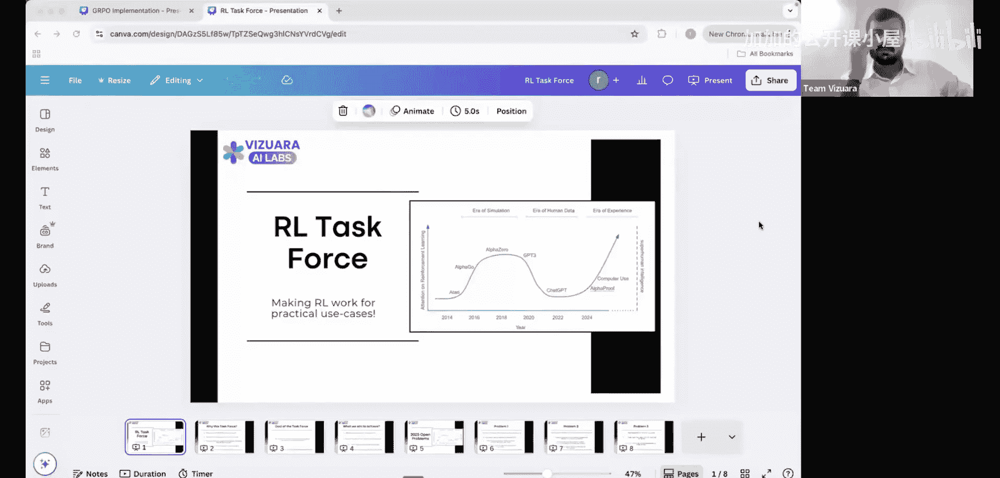
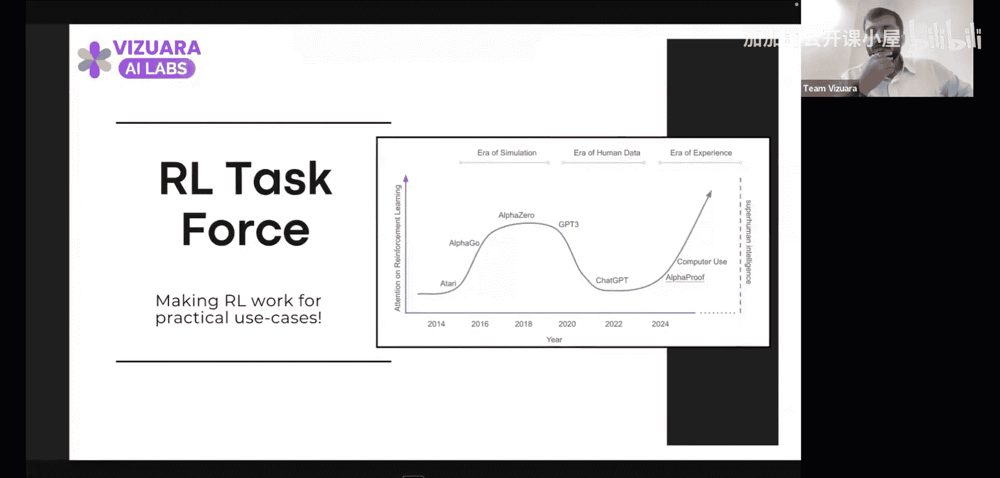
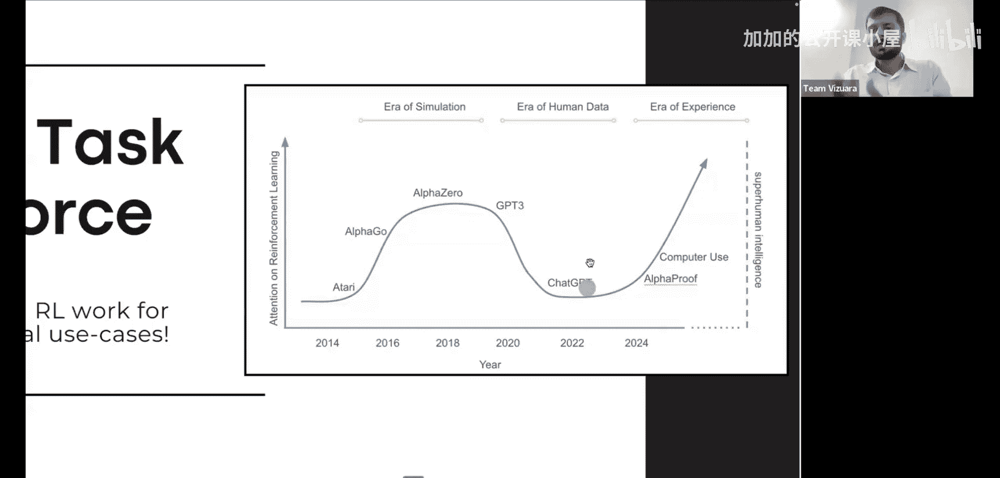
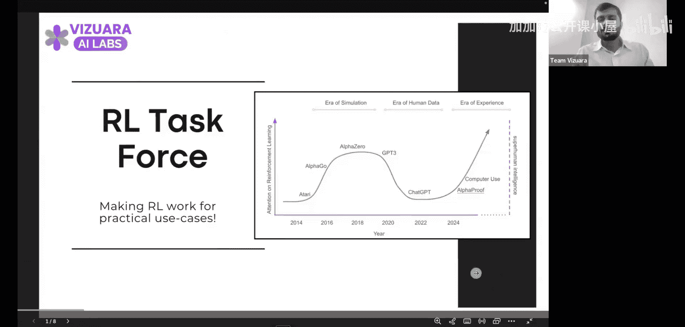
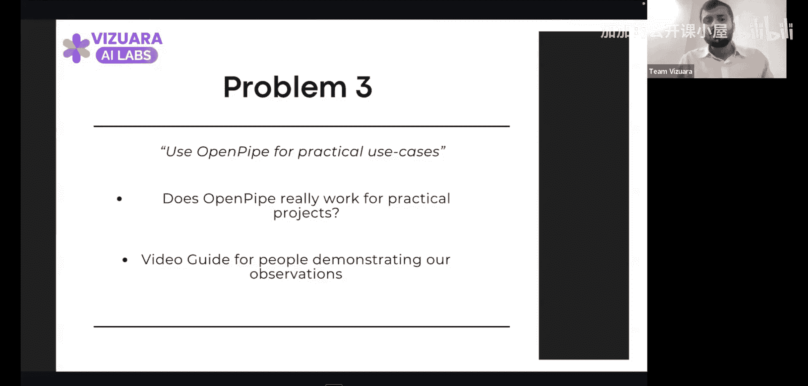

#  004：从零实现GRPO 🚀

在本节课中，我们将学习一个非常重要的主题：**分组强化策略优化**。我们将从宏观趋势开始，了解强化学习为何变得日益重要，然后深入探讨GRPO算法的核心概念与实现细节。

## 概述：强化学习的时代浪潮

上一节我们介绍了强化学习的基础，本节中我们来看看推动其发展的宏观背景。从2014年到2018年，我们处于**模拟时代**。随后，我们进入了**人类数据时代**，见证了由海量数据驱动的大型语言模型的崛起。

然而，数据的总量是有限的。因此，未来的AI智能体将进入**经验时代**，通过与环境互动、尝试不同策略并积累经验来不断进化。强化学习正是这一过程的核心技术。

为了应对这一趋势，我们启动了**RL任务小组**。其目标是让强化学习在实际用例中真正发挥作用，消除其神秘感，并向所有人展示生产级RL的可行性。

## 强化学习为何变得触手可及？🔓

过去，强化学习被视为一个只有专家才能涉足的领域。但自2021年以来，情况发生了巨大变化。以下是几个关键原因：

以下是推动强化学习普及的几个关键因素：
1.  **转向更简单的算法**：例如GRPO。
2.  **消除昂贵的人类偏好数据收集**：通过**RL-AIF**等技术，可以使用LLM作为评判者，替代昂贵的人工标注。
3.  **开源工具的出现**：例如OpenPipe发布的库，它简化了在特定任务上训练强化学习智能体的过程。

这些发展使得没有庞大预算的研究者和实践者也能进行强化学习实验。特别是，我们看到强化学习开始被应用于**智能体任务**，而不仅仅是模型微调，这大大扩展了其应用场景。

## GRPO：分组强化策略优化 🧠

现在，让我们进入今天的核心主题：GRPO。在深入细节之前，我们需要理解其解决的问题背景。

### 从PPO到GRPO的演进

传统的策略优化算法，如**近端策略优化**，在训练稳定性方面取得了巨大成功。其核心思想是约束策略更新的幅度，避免破坏性的巨大更新。PPO的目标函数可以表示为：

**L^CLIP(θ) = E_t [ min( r_t(θ) * A_t, clip(r_t(θ), 1-ε, 1+ε) * A_t ) ]**

其中，`r_t(θ)`是新旧策略的概率比，`A_t`是优势函数，`ε`是一个超参数。

然而，PPO在扩展到非常大型的模型（如LLM）时，面临计算和内存的挑战。GRPO通过引入**分组**的概念来解决这个问题。

### GRPO的核心机制

GRPO的核心创新在于，它将模型的输出（例如文本生成）划分为多个**组**或**片段**。优化过程不再直接作用于整个输出的概率分布，而是作用于这些组上。

以下是GRPO工作流程的关键步骤：
1.  **分组**：将模型的一次完整输出（如生成的句子）划分为多个逻辑组。
2.  **独立评估**：对每个组的输出进行独立的奖励评估。
3.  **分组优化**：基于每个组的奖励信号，分别计算策略梯度并更新模型参数，但更新被限制在组内。

这种方法带来了显著优势：
*   **降低方差**：对局部片段的奖励估计通常比对整个长序列的奖励估计方差更小。
*   **提升效率**：可以并行计算多个组的奖励和梯度。
*   **增强稳定性**：局部更新有助于防止策略在优化过程中发生剧烈漂移。

简而言之，GRPO通过将全局的、困难的优化问题，分解为多个局部的、更易处理的优化问题，从而实现了更高效、更稳定的大模型强化学习训练。

## 总结与展望

本节课中，我们一起学习了强化学习向经验时代演进的大趋势，探讨了其变得日益普及的关键原因，并深入剖析了**GRPO**算法的核心思想与优势。

我们从PPO的公式出发，了解到GRPO通过引入**分组优化**机制，有效解决了大模型强化学习中的计算与稳定性挑战。这为我们在实际任务中，尤其是在资源有限的情况下应用强化学习提供了强大的新工具。

记住，理解这些基础原理是构建有效RL应用的第一步。在接下来的课程中，我们将动手实践，探索如何利用像OpenPipe这样的工具，将GRPO等算法应用到具体的智能体任务中去。